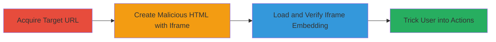

---
tags:
  - clickjacking
  - ui-redressing
  - x-frame-options
  - web-vulnerability
type: attack_chain
tools: []
tactics:
  - '[[Initial Access]]'
verified: false
platforms:
  - Web
submitted: true
complexity: low
created_at: '2024-01-01T00:00:00Z'
procedures:
  - '[[procedures/Acquire-Target-URL-for-Clickjacking-Test]]'
  - '[[procedures/Create-HTML-Page-with-Embedded-Iframe]]'
  - '[[procedures/Verify-Site-Loading-in-Iframe]]'
step_count: 3
techniques:
  - '[[Drive-by Compromise]]'
updated_at: '2025-12-14T17:28:05.249Z'
description: >-
  Demonstrates a clickjacking vulnerability on sifchain.finance by embedding the
  site in an iframe due to absent X-Frame-Options header, enabling UI redressing
  to trick users into unauthorized actions.
skill_level: beginner
impact_level: high
id: e16c5911-59fa-4625-a91f-bf514685df13
validated: true
mitre_tactics:
  - '[[Initial Access]]'
mitre_techniques:
  - '[[Drive-by Compromise]]'
---
# Clickjacking Attack on sifchain.finance via Missing X-Frame-Options Header

Multi-stage attack chain demonstrating a complete attack workflow for exploiting clickjacking on a web application.

## Chain Metrics Dashboard

| Metric | Value |
|--------|-------|
| Chain Status | Unverified |
| Total Steps | 3 |
| Execution Time | ~2 minutes |
| Skill Level | Beginner |
| Complexity | Low |
| Impact Level | High |

## Attack Flow Visualization



## Prerequisites & Requirements

### Required Tools

- Web browser (e.g., Chrome, Firefox)
- Text editor (e.g., Notepad, VS Code)

### Target Environment

- Web platform
- No specific services/ports required beyond HTTP/HTTPS access
- Publicly accessible website

### Initial Access Requirements

- Internet access
- No credentials or prior access needed

## Detailed Attack Procedures

### Step 1: Acquire Target URL
procedure: [[procedures/Acquire-Target-URL-for-Clickjacking-Test]]

**Objective**: Identify and obtain the URL of the vulnerable website to target for clickjacking exploitation.

**Instructions**: Manually note or copy the target URL from documentation or reconnaissance. For this attack, use https://sifchain.finance/.

**Expected Output**: The full URL string: https://sifchain.finance/.

**Success Indicators**:
- URL is valid and accessible via browser
- Site loads without errors

### Step 2: Create HTML Page with Embedded Iframe
procedure: [[procedures/Create-HTML-Page-with-Embedded-Iframe]]

**Objective**: Construct a malicious HTML page that embeds the target site in an iframe, allowing overlay for UI redressing.

**Instructions**: Use a text editor to create an HTML file with an iframe sourcing the target URL. Save as clickjack_test.html.

```html
<html>
<head>
<title>Clickjack test page</title>
</head>
<body>
<p>Website is vulnerable to clickjacking!</p>
<iframe src="https://sifchain.finance/" width="1000" height="600"></iframe>
</body>
</html>
```

**Expected Output**: A local HTML file ready to load in a browser.

**Success Indicators**:
- HTML file created without syntax errors
- Iframe src attribute points to target URL

### Step 3: Verify Site Loading in Iframe
procedure: [[procedures/Verify-Site-Loading-in-Iframe]]

**Objective**: Confirm the vulnerability by loading the HTML page and observing unrestricted embedding of the target site.

**Instructions**: Open the clickjack_test.html file in a web browser and inspect if the sifchain.finance site renders fully within the iframe without frame-busting restrictions.

**Expected Output**: The target website displays completely inside the iframe, confirming lack of X-Frame-Options protection.

**Success Indicators**:
- Site loads in iframe without errors or redirects
- No console warnings about framing restrictions

## Attack Chain Summary

### Key Achievements

1. Identified missing X-Frame-Options header via header inspection
2. Successfully embedded target site in iframe on a test page
3. Demonstrated potential for UI redressing to trick users into unauthorized actions like credential entry or transaction authorization

## Technique & Tactic Coverage

### MITRE ATT&CK Techniques

- [[Drive-by Compromise]]

### MITRE ATT&CK Tactics

- [[Initial Access]]

---
*Last updated: 2024-01-01T00:00:00Z*
