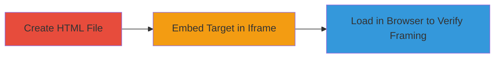

---
tags:
  - clickjacking
  - ui-redressing
  - x-frame-options
  - iframe
type: attack_chain
tools: []
tactics:
  - '[[Initial Access]]'
commands: []
platforms:
  - Web
complexity: low
procedures:
  - '[[procedures/Demonstrate-Clickjacking-with-Local-HTML-Iframe]]'
step_count: 3
techniques:
  - '[[Drive-by Compromise]]'
description: >-
  Demonstrates a Clickjacking vulnerability by embedding the Legal Robot website
  in an iframe without X-Frame-Options protection, allowing UI redressing to
  trick users into unauthorized actions.
skill_level: beginner
impact_level: high
id: 98f70f46-df58-41c2-86ce-56bacd3a5ec1
created_at: '2025-12-14T17:28:05.312Z'
updated_at: '2025-12-14T17:28:05.312Z'
verified: false
validated: true
submitted: true
mitre_tactics:
  - '[[Initial Access]]'
mitre_techniques:
  - '[[Drive-by Compromise]]'
---
# Clickjacking Attack via Missing X-Frame-Options Header on Legal Robot

Multi-stage attack chain demonstrating a complete attack workflow.

## Chain Metrics Dashboard

| Metric | Value |
|--------|-------|
| Chain Status | Unverified |
| Total Steps | 3 |
| Execution Time | ~2 minutes |
| Skill Level | Beginner |
| Complexity | Low |
| Impact Level | High |

## Attack Flow Visualization



## Prerequisites & Requirements

### Required Tools

- Text editor (e.g., Notepad, VS Code)
- Web browser (e.g., Chrome, Firefox)

### Target Environment

- Web platform
- No specific services or ports required; local file execution
- Internet access to load the target URL

### Initial Access Requirements

- No credentials needed
- Local machine access
- No prior access to target

## Detailed Attack Procedures

### Step 1: Create HTML File
procedure: [[procedures/Demonstrate-Clickjacking-with-Local-HTML-Iframe]]

**Objective**: Set up a basic HTML file to host the iframe for embedding the target site.

**Instructions**: Use a text editor to create a new file with a .html extension. This file will serve as the malicious page that frames the vulnerable site.

**Expected Output**: An empty HTML file ready for content.

**Success Indicators**:
- File created successfully without errors.
- File saved with .html extension.

### Step 2: Embed Target in Iframe
procedure: [[procedures/Demonstrate-Clickjacking-with-Local-HTML-Iframe]]

**Objective**: Insert iframe code to load the Legal Robot website, simulating a malicious site that can overlay or disguise elements.

**Instructions**: Open the HTML file in your text editor and paste the following code:

```html
<!DOCTYPE html>
<html>
<head>
    <title>Clickjacking Demo</title>
</head>
<body>
    <h1>This is a malicious page!</h1>
    <p>If you can see the Legal Robot site below, it's vulnerable to clickjacking.</p>
    <iframe src="https://www.legalrobot.com/" width="500" height="500"></iframe>
</body>
</html>
```
Save the file.

**Expected Output**: HTML file containing the iframe element pointing to the target URL.

**Success Indicators**:
- Code pasted and file saved without syntax errors.
- Iframe src attribute correctly set to https://www.legalrobot.com/.

### Step 3: Load in Browser to Verify Framing
procedure: [[procedures/Demonstrate-Clickjacking-with-Local-HTML-Iframe]]

**Objective**: Confirm the vulnerability by loading the HTML file and observing the target site embedded without restrictions.

**Instructions**: Double-click the HTML file or open it via your web browser's file menu. The Legal Robot site should load fully within the iframe.

**Expected Output**: The Legal Robot website displays inside the iframe on the local page, with no framing errors or blocks.

**Success Indicators**:
- Target site loads completely in the iframe.
- No browser warnings about X-Frame-Options denying the frame.
- Ability to interact with the framed content, indicating potential for UI redressing.

## Attack Chain Summary

### Key Achievements

1. Confirmed absence of X-Frame-Options header on https://www.legalrobot.com/.
2. Demonstrated embedding capability, enabling attacks like tricking users into clicking disguised elements.
3. Highlighted impact: unauthorized actions, data disclosure, or browser control via UI manipulation.

## Technique & Tactic Coverage

### MITRE ATT&CK Techniques

- [[Drive-by Compromise]]

### MITRE ATT&CK Tactics

- [[Initial Access]]

---
*Last updated: 2023-10-01*
