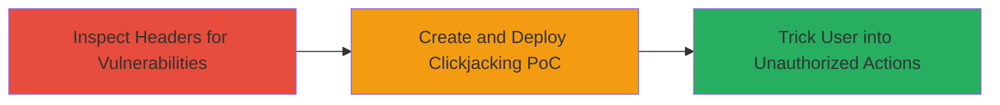

# Clickjacking Attack via Missing X-Frame-Options Header on Localize Website

Multi-stage attack chain demonstrating a complete attack workflow exploiting clickjacking on the Localize website.

## Chain Metrics Dashboard

| Metric | Value |
|--------|-------|
| Chain Status | Unverified |
| Total Steps | 2 |
| Execution Time | ~5 minutes |
| Skill Level | Intermediate |
| Complexity | Medium |
| Impact Level | High |

## Attack Flow Visualization



## Prerequisites & Requirements

### Required Tools

- Web browser with developer tools (e.g., Chrome DevTools)
- Text editor for creating HTML PoC

### Target Environment

- Target: Localize website (https://localizejs.com or similar)
- Required services/ports: HTTP/HTTPS on port 80/443
- Network access requirements: Public internet access to the target site

### Initial Access Requirements

- No credentials required
- Attacker must host a malicious page accessible to victims
- Victim must be a logged-in user of the Localize platform

## Detailed Attack Procedures

### Step 1: Inspect Headers for Framing Protection
procedure: [[procedures/Inspect-HTTP-Headers-for-Framing-Protection]]

**Objective**: Identify the absence of X-Frame-Options header, confirming clickjacking vulnerability across pages.

**Instructions**: Use a web browser's developer tools or [[commands/curl-check-headers]] to inspect HTTP responses from target pages. Navigate to multiple pages on the Localize site and check the response headers for the presence of X-Frame-Options.

For example, using curl:

```bash
curl -I https://localizejs.com/
```

Look for lines like "X-Frame-Options: DENY" or "SAMEORIGIN"; absence indicates vulnerability.

**Expected Output**: HTTP response headers without X-Frame-Options on almost all pages.

**Success Indicators**:
- No X-Frame-Options header found
- Confirmation that content can be framed externally

### Step 2: Demonstrate Clickjacking with Proof-of-Concept
procedure: [[procedures/Demonstrate-Clickjacking-with-Proof-of-Concept]]

**Objective**: Create and test a malicious HTML page that embeds the target site in an invisible iframe, overlaying decoy elements to trick users into performing actions like adding tasks.

**Instructions**: Develop an HTML file (e.g., bug_-_Copy.html) that loads the Localize site in a 0x0 pixel iframe positioned behind a visible button or image. Host this page on an attacker-controlled server and lure victims to interact with it while logged into Localize.

Example PoC structure:

```html
<!DOCTYPE html>
<html>
<head><title>Click to Win!</title></head>
<body>
  <iframe src="https://localizejs.com/target-page" style="opacity:0.5; position:absolute; top:0; left:0; width:100%; height:100%;"></iframe>
  <button style="position:absolute; top:100px; left:100px;">Click Here to Add Task</button>
</body>
</html>
```

The button overlays the iframe's add-task button, tricking clicks.

**Expected Output**: Victim's browser performs unauthorized action (e.g., task added) without visible intent.

**Success Indicators**:
- Iframe loads target without framing errors
- Clicks on decoy trigger actions in the hidden iframe
- Unauthorized task or action completed on Localize

## Attack Chain Summary

### Key Achievements

1. Confirmed clickjacking vulnerability due to missing headers
2. Developed functional PoC demonstrating UI manipulation
3. Enabled potential unauthorized actions like task addition

## Technique & Tactic Coverage

### MITRE ATT&CK Techniques

- [[Drive-by Compromise]]
- [[Exploitation for Client Execution]]

### MITRE ATT&CK Tactics

- [[Initial Access]]

---
*Last updated: 2023-10-01T00:00:00Z*
