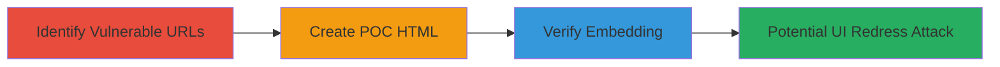

---
tags:
  - clickjacking
  - x-frame-options
  - web-vulnerability
  - ui-redress
type: attack_chain
tools: []
tactics:
  - '[[Initial Access]]'
verified: false
platforms:
  - Web
submitted: true
complexity: low
created_at: '2023-10-01T00:00:00Z'
procedures:
  - '[[procedures/Identify-Clickjacking-Vulnerable-URLs]]'
  - '[[procedures/Create-Clickjacking-Proof-of-Concept-HTML]]'
  - '[[procedures/Verify-Clickjacking-Embedding-in-Browser]]'
step_count: 3
techniques:
  - '[[Exploit Public-Facing Application]]'
updated_at: '2025-12-14T17:28:05.402Z'
description: >-
  Demonstrates a clickjacking vulnerability by exploiting the absence of
  X-Frame-Options header, allowing embedding of Sifchain pages in iframes for UI
  redress attacks.
skill_level: beginner
impact_level: medium
id: c6b3ca23-1ff3-47d8-b07a-d952a4c5689c
validated: true
mitre_tactics:
  - '[[Initial Access]]'
mitre_techniques:
  - '[[Exploit Public-Facing Application]]'
---
# Clickjacking Attack via Missing X-Frame-Options Header on Sifchain Website

Multi-stage attack chain demonstrating a complete clickjacking workflow on the Sifchain website.

## Chain Metrics Dashboard

| Metric | Value |
|--------|-------|
| Chain Status | Unverified |
| Total Steps | 3 |
| Execution Time | ~5 minutes |
| Skill Level | Beginner |
| Complexity | Low |
| Impact Level | Medium |

## Attack Flow Visualization

## Prerequisites & Requirements

### Required Tools

- Web browser (e.g., Chrome)
- Text editor for HTML

### Target Environment

- Web platform
- Publicly accessible Sifchain URLs (e.g., https://docs.sifchain.finance)
- No special services or ports required

### Initial Access Requirements

- Internet access
- No credentials needed
- Ability to host or locally serve HTML files

## Detailed Attack Procedures

### Step 1: Identify Vulnerable URLs
procedure: [[procedures/Identify-Clickjacking-Vulnerable-URLs]]

**Objective**: Scan target URLs for missing X-Frame-Options header to confirm clickjacking susceptibility.

**Instructions**: Manually inspect HTTP response headers of in-scope URLs using browser developer tools or curl. For example, load https://docs.sifchain.finance and check the Network tab for headers.

**Expected Output**: Response headers without X-Frame-Options (e.g., DENY, SAMEORIGIN).

**Success Indicators**:
- No X-Frame-Options header present
- Multiple URLs confirmed vulnerable

### Step 2: Create Proof-of-Concept HTML
procedure: [[procedures/Create-Clickjacking-Proof-of-Concept-HTML]]

**Objective**: Build an HTML page that embeds the vulnerable Sifchain URL in an iframe to demonstrate framing capability.

**Instructions**: Use a text editor to create an HTML file with an iframe pointing to the target URL. Set dimensions to make it interactive, e.g., height 550px and width 700px.

**Expected Output**: A local HTML file ready for testing.

**Success Indicators**:
- HTML file created successfully
- Iframe src set to vulnerable URL

### Step 3: Verify Embedding in Browser
procedure: [[procedures/Verify-Clickjacking-Embedding-in-Browser]]

**Objective**: Load the POC in a browser to confirm the Sifchain site renders and is interactive within the iframe.

**Instructions**: Open the HTML file in a web browser like Chrome and observe if the embedded content loads without restrictions.

**Expected Output**: Sifchain page visible and clickable inside the iframe.

**Success Indicators**:
- Site embeds without errors
- Interactions (e.g., clicks) possible on embedded content

## Attack Chain Summary

### Key Achievements

1. Identified missing security header on Sifchain URLs
2. Created a functional POC for clickjacking demonstration
3. Verified vulnerability through browser testing, enabling potential UI redress attacks

## Technique & Tactic Coverage

### MITRE ATT&CK Techniques

- [[Exploit Public-Facing Application]]

### MITRE ATT&CK Tactics

- [[Initial Access]]

---
*Last updated: 2023-10-01T00:00:00Z*
