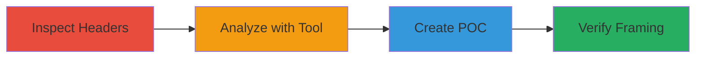

---
tags:
  - clickjacking
  - csp
  - x-frame-options
  - web-security
  - ui-redressing
type: attack_chain
tools:
  - '[[tools/Mozilla-Observatory]]'
tactics:
  - '[[Initial Access]]'
verified: false
platforms:
  - Web
submitted: true
complexity: low
created_at: '2023-10-01T00:00:00Z'
procedures:
  - '[[procedures/Inspect-Web-Security-Headers]]'
  - '[[procedures/Analyze-Site-with-Mozilla-Observatory]]'
  - '[[procedures/Create-Clickjacking-POC]]'
step_count: 3
techniques:
  - '[[Drive-by Compromise]]'
updated_at: '2025-12-14T17:28:12.643Z'
description: >-
  A multi-step process to identify and demonstrate clickjacking vulnerability on
  a web application due to absent frame protection headers, enabling UI
  redressing attacks.
skill_level: beginner
impact_level: medium
id: cb5204d5-a375-4141-a551-17d12803d881
validated: true
mitre_tactics:
  - '[[Initial Access]]'
mitre_techniques:
  - '[[Drive-by Compromise]]'
---
# Clickjacking Demonstration via Missing CSP Frame-Ancestors and X-Frame-Options

## Overview

This attack chain outlines the discovery and proof-of-concept exploitation of a clickjacking vulnerability on the etherscamdb.info domain. The absence of Content Security Policy (CSP) headers with the frame-ancestors directive and X-Frame-Options allows malicious sites to embed the target in an iframe, overlaying invisible elements to trick users into performing unintended actions, such as clicking buttons or submitting forms. This leads to phishing risks, unauthorized interactions, and erosion of user trust. The chain was demonstrated by inspecting headers, using an analysis tool, and creating a simple HTML POC.

## Chain Metrics Dashboard

| Metric | Value |
|--------|-------|
| Chain Status | Unverified |
| Total Steps | 3 |
| Execution Time | ~5 minutes |
| Skill Level | Beginner |
| Complexity | Low |
| Impact Level | Medium |

## Attack Flow Visualization

## Prerequisites & Requirements

### Required Tools

- [[tools/Mozilla-Observatory]]
- Web browser with developer tools

### Target Environment

- Web application (e.g., https://etherscamdb.info)
- No specific ports or services required beyond HTTP/HTTPS access

### Initial Access Requirements

- Public internet access to the target URL
- No credentials needed

## Detailed Attack Procedures

### Step 1: Inspect Security Headers

procedure: [[procedures/Inspect-Web-Security-Headers]]

**Objective**: Identify missing frame protection headers on the target site to confirm potential for clickjacking.

**Instructions**: Open the target URL in a web browser and use developer tools to examine HTTP response headers. Look specifically for CSP (with frame-ancestors) and X-Frame-Options.

**Expected Output**: Response headers without CSP or X-Frame-Options, indicating framing is allowed.

**Success Indicators**:
- No CSP header present
- No X-Frame-Options header detected

### Step 2: Analyze Site with Mozilla Observatory

procedure: [[procedures/Analyze-Site-with-Mozilla-Observatory]]

**Objective**: Use an external security scanner to validate the absence of CSP and other protections.

**Instructions**: Visit the Mozilla Observatory website and input the target domain for analysis.

**Expected Output**: Scan report showing zero score for CSP implementation and warnings about clickjacking risks.

**Success Indicators**:
- Confirmation of no CSP header
- Recommendations for frame-ancestors directive

### Step 3: Create Clickjacking POC

procedure: [[procedures/Create-Clickjacking-POC]]

**Objective**: Demonstrate the vulnerability by embedding the target in an iframe on a malicious page.

**Instructions**: Create an HTML file with an iframe sourcing the target URL and open it in a browser to verify framing works without restrictions.

**Expected Output**: Target site loads inside the iframe, allowing overlay of deceptive elements.

**Success Indicators**:
- Site embeds successfully in iframe
- No browser blocking or errors on framing

## Attack Chain Summary

### Key Achievements

1. Identified missing security headers enabling clickjacking
2. Validated vulnerability using automated analysis
3. Demonstrated exploit via simple POC, highlighting reputation risks

## Technique & Tactic Coverage

### MITRE ATT&CK Techniques

- [[Drive-by Compromise]]

### MITRE ATT&CK Tactics

- [[Initial Access]]

---
*Last updated: 2023-10-01T00:00:00Z*
