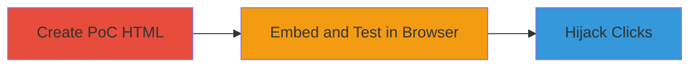

# Clickjacking Exploitation on Nextcloud Website via Iframe Embedding

Multi-stage attack chain demonstrating a complete attack workflow for exploiting clickjacking on the Nextcloud website.

## Chain Metrics Dashboard

| Metric | Value |
|--------|-------|
| Chain Status | Unverified |
| Total Steps | 2 |
| Execution Time | ~2 minutes |
| Skill Level | Beginner |
| Complexity | Low |
| Impact Level | Medium |

## Attack Flow Visualization

## Prerequisites & Requirements

### Required Tools

- Text editor (e.g., Notepad, VS Code)
- Web browser (e.g., Chrome, Firefox)

### Target Environment

- Target: https://www.nextcloud.com/
- Required services/ports: HTTP/HTTPS on port 80/443
- Network access requirements: Internet access to load the target site

### Initial Access Requirements

- No credentials required
- No prior access needed; performed from any external network

## Detailed Attack Procedures

### Step 1: Create Clickjacking PoC HTML
procedure: [[procedures/Demonstrate-Clickjacking-with-Iframe-Embedding]]

**Objective**: Construct an HTML page that embeds the vulnerable Nextcloud site in an iframe to bypass frame-busting protections.

**Instructions**: Use a text editor to create an HTML file with an iframe sourcing the Nextcloud website. Position the iframe to overlay clickable elements for hijacking.

**Expected Output**: A local HTML file that loads without errors.

**Success Indicators**:
- HTML file saves successfully
- Iframe content loads the Nextcloud site when previewed

### Step 2: Load and Demonstrate in Browser
procedure: [[procedures/Demonstrate-Clickjacking-with-Iframe-Embedding]]

**Objective**: Open the HTML file in a browser to verify the site embeds without restrictions, enabling click hijacking.

**Instructions**: Save the file as `clickjacking-poc.html` and open it in a web browser. Observe the Nextcloud site loading inside the iframe, confirming no X-Frame-Options header blocks it. Add invisible overlays in the HTML to simulate click redirection.

**Expected Output**: Nextcloud website visible and interactive within the iframe.

**Success Indicators**:
- Site embeds without frame-busting errors
- Clicks on overlaid elements can be hijacked to unintended actions on the site

## Attack Chain Summary

### Key Achievements

1. Successfully embedded Nextcloud site in an external iframe
2. Demonstrated lack of X-Frame-Options protection
3. Enabled potential for user click hijacking to perform malicious actions

## Technique & Tactic Coverage

### MITRE ATT&CK Techniques

- [[Exploit Public-Facing Application]]

### MITRE ATT&CK Tactics

- [[Initial Access]]

---
*Last updated: 2023-10-01T00:00:00Z*
