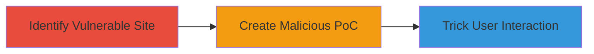

---
tags:
  - clickjacking
  - ui-redressing
  - web-vulnerability
type: attack_chain
tools: []
tactics:
  - '[[Initial Access]]'
verified: false
platforms:
  - Web
submitted: true
complexity: low
created_at: '2023-10-01T00:00:00Z'
procedures:
  - '[[procedures/Identify-Clickjacking-Vulnerable-URLs]]'
  - '[[procedures/Create-Clickjacking-Proof-of-Concept]]'
step_count: 2
techniques:
  - '[[Exploit Public-Facing Application]]'
updated_at: '2025-12-14T17:28:04.477Z'
description: >-
  A multi-stage demonstration of exploiting clickjacking on the Sifchain Finance
  website by embedding it in an iframe without X-Frame-Options protections,
  allowing UI manipulation and user deception.
skill_level: beginner
impact_level: medium
id: c412c88a-53b5-437b-bfe6-5f858207d36f
validated: true
mitre_tactics:
  - '[[Initial Access]]'
mitre_techniques:
  - '[[Exploit Public-Facing Application]]'
---
# Clickjacking Exploitation on Sifchain Finance via Missing Frame Protections

Multi-stage attack chain demonstrating a complete attack workflow for exploiting clickjacking on the Sifchain Finance website.

## Chain Metrics Dashboard

| Metric | Value |
|--------|-------|
| Chain Status | Unverified |
| Total Steps | 2 |
| Execution Time | ~5 minutes |
| Skill Level | Beginner |
| Complexity | Low |
| Impact Level | Medium |

## Attack Flow Visualization



## Prerequisites & Requirements

### Required Tools

- Web browser (e.g., Chrome, Firefox)
- Text editor for HTML

### Target Environment

- Web platform
- Publicly accessible website (https://sifchain.finance)
- No special services or ports required beyond HTTP/HTTPS

### Initial Access Requirements

- Internet access
- No credentials needed
- Ability to host or load local HTML files

## Detailed Attack Procedures

### Step 1: Identify Vulnerable URL
procedure: [[procedures/Identify-Clickjacking-Vulnerable-URLs]]

**Objective**: Locate URLs on the target site that lack frame-busting protections, confirming susceptibility to clickjacking.

**Instructions**: Open a web browser and navigate to https://sifchain.finance. Use developer tools to inspect network requests or manually test multiple pages. Note that the site does not set X-Frame-Options headers, making it vulnerable.

**Expected Output**: Confirmation that the site loads without frame restrictions.

**Success Indicators**:
- Site content visible in browser
- No errors or blocks when attempting to iframe (tested in next step)

### Step 2: Create Proof-of-Concept
procedure: [[procedures/Create-Clickjacking-Proof-of-Concept]]

**Objective**: Build and test a malicious HTML page that embeds the target site in an iframe, demonstrating potential for user deception.

**Instructions**: Create an HTML file with the following code and open it in a browser:

```html
<html><body><h1>hai</h1><iframe src="https://sifchain.finance"></iframe></body></html>
```

Observe that the Sifchain site loads fully visible and interactive within the iframe.

**Expected Output**: Target site embedded and clickable inside the iframe on the local page.

**Success Indicators**:
- Iframe loads without restrictions
- User interactions (e.g., clicks) propagate to the embedded site

## Attack Chain Summary

### Key Achievements

1. Identified lack of X-Frame-Options on Sifchain Finance, confirming clickjacking risk.
2. Demonstrated exploitation via simple iframe embedding, enabling UI overlay attacks.
3. Highlighted potential for phishing, credential theft, or action hijacking.

## Technique & Tactic Coverage

### MITRE ATT&CK Techniques

- [[Exploit Public-Facing Application]]

### MITRE ATT&CK Tactics

- [[Initial Access]]

---
*Last updated: 2023-10-01T00:00:00Z*
