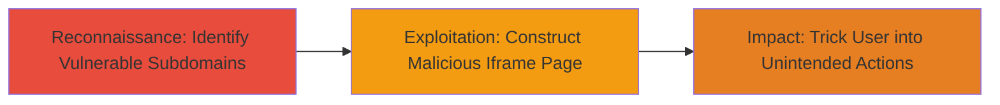

---
tags:
  - clickjacking
  - x-frame-options
  - web-vulnerability
  - ui-redressing
type: attack_chain
tools: []
tactics:
  - '[[Initial Access]]'
verified: false
platforms:
  - Web
submitted: true
complexity: low
created_at: '2024-01-01T00:00:00Z'
procedures:
  - '[[procedures/Construct-and-Test-Clickjacking-Proof-of-Concept]]'
step_count: 1
techniques:
  - '[[Drive-by Compromise]]'
updated_at: '2025-12-14T17:28:13.023Z'
description: >-
  Demonstrates exploitation of a clickjacking vulnerability on Periscope
  subdomains by embedding them in iframes due to unsupported X-Frame-Options
  header, enabling UI redressing attacks to trick users into unintended actions
  like account deactivation.
skill_level: beginner
impact_level: medium
id: 3aea1449-7f37-4461-a8ea-a43821cba7d7
validated: true
mitre_tactics:
  - '[[Initial Access]]'
mitre_techniques:
  - '[[Drive-by Compromise]]'
---
# Clickjacking Exploitation on Twitter Periscope Subdomains via Deprecated X-Frame-Options

Multi-stage attack chain demonstrating a complete attack workflow for exploiting clickjacking on vulnerable Periscope subdomains.

## Chain Metrics Dashboard

| Metric | Value |
|--------|-------|
| Chain Status | Unverified |
| Total Steps | 1 |
| Execution Time | ~5 minutes |
| Skill Level | Beginner |
| Complexity | Low |
| Impact Level | Medium |

## Attack Flow Visualization

## Prerequisites & Requirements

### Required Tools

- Text editor (e.g., Notepad, VS Code)
- Web browser (e.g., Chrome, Firefox)

### Target Environment

- Web platform
- Access to vulnerable subdomains: https://canary-web.pscp.tv or https://canary-web.periscope.tv
- No special services or ports required; public web access

### Initial Access Requirements

- No credentials needed
- Public internet access
- Ability to host or locally serve the malicious HTML (local file sufficient for PoC)

## Detailed Attack Procedures

### Step 1: Construct and Test Clickjacking Proof-of-Concept
procedure: [[procedures/Construct-and-Test-Clickjacking-Proof-of-Concept]]

**Objective**: Create a local HTML file that embeds the vulnerable Periscope subdomain in an iframe, demonstrating unrestricted framing due to the deprecated X-Frame-Options header, and test it to confirm clickjacking potential for overlaying malicious elements.

**Instructions**: Follow the procedure to build and load the HTML file. Examine security headers first using browser dev tools or curl to confirm the X-Frame-Options is set to ALLOW-FROM https://twitter.com/, which modern browsers ignore. Then construct the iframe-based page and open it locally to verify embedding works without restrictions.

**Expected Output**: The vulnerable page loads inside the iframe without frame-busting, allowing potential overlay of invisible buttons or elements to hijack clicks (e.g., for account deactivation).

**Success Indicators**:
- Iframe embeds the subdomain without errors or restrictions
- Page content is visible and interactive within the frame
- No X-Frame-Options enforcement blocks the embedding

## Attack Chain Summary

### Key Achievements

1. Identified clickjacking vulnerability on Periscope subdomains via header analysis
2. Demonstrated exploitation through local HTML iframe embedding
3. Enabled potential for UI redressing attacks to perform unauthorized user actions

## Technique & Tactic Coverage

### MITRE ATT&CK Techniques

- [[Drive-by Compromise]]

### MITRE ATT&CK Tactics

- [[Initial Access]]

---

*Last updated: 2024-01-01T00:00:00Z*
