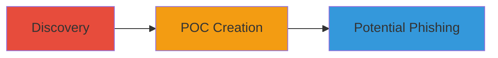

# Clickjacking Exploitation via Iframe Embedding on Staging Website

Multi-stage attack chain demonstrating the discovery and proof-of-concept exploitation of a clickjacking vulnerability on the staging website https://staging.uzbey.com/, where the absence of X-Frame-Options allows embedding in an external iframe to overlay and trick user interactions.

## Chain Metrics Dashboard

| Metric | Value |
|--------|-------|
| Chain Status | Unverified |
| Total Steps | 2 |
| Execution Time | ~5 minutes |
| Skill Level | Beginner |
| Complexity | Low |
| Impact Level | Medium |

## Attack Flow Visualization

## Prerequisites & Requirements

### Required Tools

- Web browser for testing iframes
- Text editor for creating HTML PoC

### Target Environment

- Web platform
- Publicly accessible staging website without frame protections
- No specific services or ports required beyond HTTP/HTTPS

### Initial Access Requirements

- No credentials needed
- Direct internet access to the target site
- No prior access required

## Detailed Attack Procedures

### Step 1: Discovery
procedure: [[procedures/Test-for-Clickjacking-Vulnerability]]

**Objective**: Verify if the target website can be embedded in an iframe without restrictions, indicating a lack of clickjacking protections.

**Instructions**: Open a web browser and attempt to embed the target URL in a simple HTML iframe. Create a basic test page with an iframe pointing to https://staging.uzbey.com/ and load it locally or on a test server. Observe if the site loads fully without errors or blocks.

**Expected Output**: The target site renders inside the iframe with partial visibility, confirming embeddability.

**Success Indicators**:
- Target site loads in iframe without frame-busting scripts or headers blocking it
- No console errors related to X-Frame-Options or Content-Security-Policy

### Step 2: POC Creation
procedure: [[procedures/Create-Clickjacking-POC]]

**Objective**: Build a proof-of-concept HTML page that embeds the vulnerable site in a semi-transparent iframe, overlaying it to simulate tricking users into interactions like login attempts.

**Instructions**: Use a text editor to create an HTML file with an iframe sourcing the target site, apply CSS for opacity and positioning to obscure parts of the page, and add a JavaScript onbeforeunload event to alert on exit. Include an overlay message warning about the vulnerability. Save as index.html and open in a browser or serve via a local server.

**Expected Output**: A webpage where the target site is iframed with reduced opacity (e.g., 0.5), positioned absolutely, and a warning message displayed, demonstrating potential for user deception.

**Success Indicators**:
- Iframe loads and is manipulable with CSS
- User interactions on the overlay could inadvertently click elements in the hidden frame
- onbeforeunload script triggers an alert when attempting to leave the page

## Attack Chain Summary

### Key Achievements

1. Identified lack of X-Frame-Options on staging site, enabling iframe embedding
2. Created a functional PoC demonstrating UI redressing for potential phishing
3. Highlighted risks of credential theft via tricked interactions, though limited by same-origin policy

## Technique & Tactic Coverage

### MITRE ATT&CK Techniques

- [[Exploit Public-Facing Application]]

### MITRE ATT&CK Tactics

- [[Initial Access]]

---
*Last updated: 2023-10-01T00:00:00Z*
