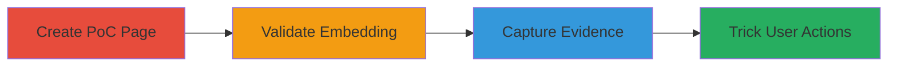

---
tags:
  - clickjacking
  - iframe
  - x-frame-options
  - ui-redressing
type: attack_chain
tools: []
tactics:
  - '[[Initial Access]]'
verified: false
platforms:
  - Web
submitted: true
complexity: low
created_at: '2023-10-01T00:00:00Z'
procedures:
  - '[[procedures/Create-Clickjacking-Proof-of-Concept]]'
  - '[[procedures/Validate-Clickjacking-Vulnerability]]'
  - '[[procedures/Capture-Clickjacking-Evidence]]'
step_count: 3
techniques:
  - '[[Drive-by Compromise]]'
updated_at: '2025-12-14T17:28:12.566Z'
description: >-
  Demonstrates a site-wide clickjacking vulnerability on sifchain.finance by
  embedding the site in an iframe without frame-busting protections, enabling UI
  redressing attacks to trick users into unintended actions.
skill_level: beginner
impact_level: high
id: 011c6ff4-f825-4ab1-9716-5e461e90a906
validated: true
mitre_tactics:
  - '[[Initial Access]]'
mitre_techniques:
  - '[[Drive-by Compromise]]'
---
# Clickjacking Exploitation via Missing X-Frame-Options on sifchain.finance

Multi-stage attack chain demonstrating a complete clickjacking workflow on the sifchain.finance website, which lacks essential frame-busting headers like X-Frame-Options or Content-Security-Policy frame-ancestors. This allows arbitrary embedding in iframes, enabling attackers to overlay deceptive elements and trick users into performing actions like submitting sensitive data to malicious forms.

## Chain Metrics Dashboard

| Metric | Value |
|--------|-------|
| Chain Status | Unverified |
| Total Steps | 3 |
| Execution Time | ~5 minutes |
| Skill Level | Beginner |
| Complexity | Low |
| Impact Level | High |

## Attack Flow Visualization

## Prerequisites & Requirements

### Required Tools

- Web browser (e.g., Chrome, Firefox)
- Text editor (e.g., VS Code, Notepad)

### Target Environment

- Target: sifchain.finance (all pages)
- Required services/ports: HTTP/HTTPS on port 80/443
- Network access requirements: Internet access to load the target site

### Initial Access Requirements

- No credentials required
- Attacker controls a web server or local file access for hosting the PoC
- No prior access to the target needed

## Detailed Attack Procedures

### Step 1: Create Proof-of-Concept HTML Page
procedure: [[procedures/Create-Clickjacking-Proof-of-Concept]]

**Objective**: Develop an HTML page that embeds the target site in an iframe with overlaid deceptive elements to simulate clickjacking.

**Instructions**: Use a text editor to create an HTML file with an iframe sourcing sifchain.finance and transparent overlays positioned over sensitive UI elements like login buttons.

**Expected Output**: A functional HTML file (e.g., clickjack-poc.html) that loads the target site when opened.

**Success Indicators**:
- HTML file saved without errors
- Iframe src points to https://sifchain.finance

### Step 2: Validate Vulnerability by Loading PoC
procedure: [[procedures/Validate-Clickjacking-Vulnerability]]

**Objective**: Confirm the target site embeds successfully in the iframe without restrictions, verifying the vulnerability across multiple pages.

**Instructions**: Open the PoC HTML file in a web browser and inspect if the sifchain.finance site loads fully. Test by changing the iframe src to subpages (e.g., /wallet) to ensure site-wide impact.

**Expected Output**: Target site renders inside the iframe with no blocking errors or warnings.

**Success Indicators**:
- Site loads without frame-busting
- Subpages also embed successfully
- Overlaid elements can be positioned over UI without interference

### Step 3: Capture Evidence of the Attack
procedure: [[procedures/Capture-Clickjacking-Evidence]]

**Objective**: Document the successful embedding and overlay setup for proof of vulnerability.

**Instructions**: Use browser developer tools or screenshot tools to capture the PoC in action, highlighting the iframe and deceptive overlays.

**Expected Output**: Screenshot image showing the embedded site with overlaid elements.

**Success Indicators**:
- Clear visual evidence of clickjacking setup
- No console errors indicating frame protections

## Attack Chain Summary

### Key Achievements

1. Successfully embedded sifchain.finance in an external iframe
2. Demonstrated site-wide vulnerability affecting all pages
3. Showed potential for UI redressing to steal user interactions or data

## Technique & Tactic Coverage

### MITRE ATT&CK Techniques

- [[Drive-by Compromise]]

### MITRE ATT&CK Tactics

- [[Initial Access]]

---
*Last updated: 2023-10-01T00:00:00Z*
