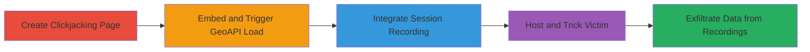

# Clickjacking GeoAPI Endpoint to Exfiltrate User IP and Geolocation Using Inspectlet

Multi-stage attack chain demonstrating a complete workflow to exploit the lack of frame-busting protections on Acronis' geoapi.acronis.com endpoint, allowing attackers to trick users into revealing their IP and geolocation data via an invisible iframe and captured session recordings.

## Chain Metrics Dashboard

| Metric | Value |
|--------|-------|
| Chain Status | Unverified |
| Total Steps | 4 |
| Execution Time | ~10 minutes |
| Skill Level | Intermediate |
| Complexity | Medium |
| Impact Level | High |

## Attack Flow Visualization

## Prerequisites & Requirements

### Required Tools

- [[tools/Inspectlet]]

### Target Environment

- Web platform
- Publicly accessible geoapi.acronis.com service
- No authentication required for the endpoint

### Initial Access Requirements

- Ability to host HTML pages on a web server
- Inspectlet account for session recording
- Social engineering to trick victims into visiting the malicious page

## Detailed Attack Procedures

### Step 1: Create Clickjacking HTML Page
procedure: [[procedures/Create-Clickjacking-HTML-to-Embed-GeoAPI]]

**Objective**: Build an HTML page that embeds the vulnerable GeoAPI endpoint in an invisible iframe to force the loading of geolocation data.

**Instructions**: Develop a simple HTML file named Clickjacking.html that uses CSS to make the iframe transparent and positioned off-screen. The iframe src points to https://geoapi.acronis.com/?q=admin/views/ajax/autocomplete/user/a to trigger the geolocation request based on the visitor's IP.

**Expected Output**: An HTML file ready for hosting that, when loaded, invisibly fetches JSON geolocation data.

**Success Indicators**:
- Iframe loads without visible content
- Network tab in browser dev tools shows request to geoapi.acronis.com

### Step 2: Observe Geolocation Data Fetch
procedure: [[procedures/Observe-Geolocation-Data-Fetch-in-Iframe]]

**Objective**: Verify that the embedded iframe successfully retrieves the victim's IP and geolocation details without user interaction.

**Instructions**: Load the Clickjacking.html file locally in a browser. Use developer tools to inspect the network requests and confirm the JSON response from geoapi.acronis.com, which includes fields like city, country, latitude, longitude, and IP.

**Expected Output**: JSON response example: {"city":"Abu Kabir","country":{"name":"Egypt","code":"EG"},"location":{"accuracy_radius":1000,"latitude":30.7251,"longitude":31.6715,"time_zone":"Africa\/Cairo"},"region":{"name":"Sharqia","code":"SHR"},"ip":"154.237.109.156"}

**Success Indicators**:
- Geolocation JSON fetched automatically
- Data matches the testing IP's location

### Step 3: Integrate Inspectlet Tracking
procedure: [[procedures/Integrate-Inspectlet-Tracking-into-Clickjacking-Page]]

**Objective**: Add session recording capabilities to capture the geolocation data from the iframe request during victim visits.

**Instructions**: Register an Inspectlet account at https://www.inspectlet.com/, obtain a widget ID (e.g., wid=2060137667), and insert the asynchronous tracking script into the <head> of Clickjacking.html. This enables recording of all network activity, including the iframe's JSON response.

**Expected Output**: Updated HTML with Inspectlet script; test load shows session starting in Inspectlet dashboard.

**Success Indicators**:
- Script loads without errors
- Inspectlet dashboard records the session with network requests visible

### Step 4: Host Page and Retrieve Data
procedure: [[procedures/Host-Page-and-Retrieve-Data-from-Session-Recordings]]

**Objective**: Deploy the page to lure victims and extract their geolocation data from recorded sessions.

**Instructions**: Upload Clickjacking.html to a web host. Use social engineering (e.g., phishing links) to direct victims to the page. Monitor the Inspectlet dashboard's Session Recordings tab to replay sessions and extract IP and geo details from the captured network responses.

**Expected Output**: List of victim sessions with replayable videos showing geolocation JSON in network logs.

**Success Indicators**:
- Victim visits trigger a new recording
- Geo data visible in session replay network tab

## Attack Chain Summary

### Key Achievements

1. Bypassed frame-busting absence to embed GeoAPI in iframes
2. Captured sensitive IP and location data invisibly
3. Exfiltrated data via third-party session recording without direct access

## Technique & Tactic Coverage

### MITRE ATT&CK Techniques

- [[Drive-by Compromise]]
- [[Automated Collection]]
- [[Hardware]]

### MITRE ATT&CK Tactics

- [[Initial Access]]
- [[Collection]]

---

*Last updated: 2023-10-01T00:00:00Z*
