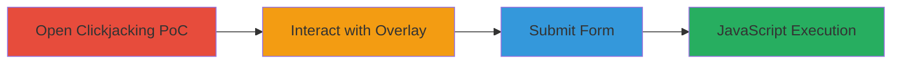

# Clickjacking-Induced DOM XSS Exploitation in edoverflow.com Respond Tool

Multi-stage attack chain demonstrating a complete attack workflow for exploiting a DOM-based XSS vulnerability through clickjacking on the edoverflow.com/tools/respond page. The attack tricks a victim into interacting with a hidden iframe overlay, submitting unsanitized input that injects and executes JavaScript, such as an alert box. Impact is limited due to the public nature of the site without authentication.

## Chain Metrics Dashboard

| Metric | Value |
|--------|-------|
| Chain Status | Unverified |
| Total Steps | 3 |
| Execution Time | ~2 minutes |
| Skill Level | Intermediate |
| Complexity | Medium |
| Impact Level | Low |

## Attack Flow Visualization

## Prerequisites & Requirements

### Required Tools

- [[tools/Firefox]]

### Target Environment

- Web platform
- Access to https://edoverflow.com/tools/respond/
- Local HTML file for clickjacking PoC

### Initial Access Requirements

- Victim's browser access
- No credentials required (public site)
- Network access to the target URL

## Detailed Attack Procedures

### Step 1: Open Clickjacking PoC
procedure: [[procedures/Open-Clickjacking-POC-in-Browser]]

**Objective**: Load the clickjacking proof-of-concept HTML file to embed and overlay the vulnerable page in an iframe, positioning it to hide form elements behind visual decoys.

**Instructions**: Use [[tools/Firefox]] to open the local HTML PoC file that iframes the target site at https://edoverflow.com/tools/respond/, overlaying frog images to mask the form inputs for triager and hacker fields.

**Expected Output**: The PoC loads with visible frog elements obscuring the hidden iframe form.

**Success Indicators**:
- Iframe loads without errors
- Overlay elements (frogs) are visible and interactive

### Step 2: Interact with Overlaid Form Elements
procedure: [[procedures/Interact-with-Overlaid-Form-Elements]]

**Objective**: Trick the user into providing malicious input by simulating interaction with decoy elements, which actually populates the hidden form fields with a JavaScript payload (e.g., alert('XSS')).

**Instructions**: Drag the frog elements in the PoC to align them, which corresponds to entering values in the hidden triager and hacker input fields via the overlaid positioning.

**Expected Output**: Form fields in the iframe are populated with the injected payload without the user noticing the underlying form.

**Success Indicators**:
- Frogs are repositioned successfully
- Hidden form inputs contain the payload (verifiable via browser dev tools)

### Step 3: Submit Malicious Payload via Form
procedure: [[procedures/Submit-Malicious-Payload-via-Form]]

**Objective**: Submit the form to trigger the vulnerable JavaScript handler, replacing placeholders in innerHTML with unsanitized input, executing the injected JavaScript.

**Instructions**: Click the 'Make friends!' button in the PoC, which submits the overlaid form and invokes the site's JavaScript that uses document.body.innerHTML.replace() on the tainted inputs.

**Expected Output**: An alert box pops up with 'XSS' or the injected message in the victim's browser.

**Success Indicators**:
- Alert box executes
- No errors in console; payload runs in the site's context

## Attack Chain Summary

### Key Achievements

1. Successful clickjacking to bypass user awareness of form submission
2. Injection and execution of arbitrary JavaScript via DOM XSS
3. Demonstration of low-impact exploitation on a public tool without auth

## Technique & Tactic Coverage

### MITRE ATT&CK Techniques

- [[JavaScript]]
- [[Exploit Public-Facing Application]]

### MITRE ATT&CK Tactics

- [[Initial Access]]
- [[Execution]]

---

*Last updated: 2023-10-01T00:00:00Z*
