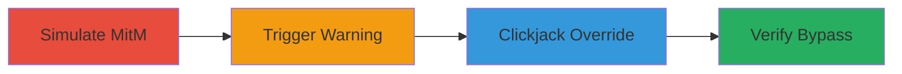

# Clickjacking Kaspersky Certificate Warnings to Bypass SSL Protections

Multi-stage attack chain demonstrating how to exploit clickjacking vulnerabilities in Kaspersky Internet Security's certificate warning pages, Safe Money prompts, and phishing alerts. By simulating a MitM attack and using a malicious iframe to overlay fake UI elements, attackers can trick users into overriding security warnings, disabling protections, and hijacking secure sessions on public networks.

## Chain Metrics Dashboard

| Metric | Value |
|--------|-------|
| Chain Status | Unverified |
| Total Steps | 4 |
| Execution Time | ~5 minutes |
| Skill Level | Intermediate |
| Complexity | Medium |
| Impact Level | High |

## Attack Flow Visualization



## Prerequisites & Requirements

### Required Tools

- [[tools/Firefox]]
- [[tools/Internet-Explorer]]
- [[tools/Microsoft-Edge]]
- [[tools/certerror-clickjacking-html]]

### Target Environment

- Windows OS with Kaspersky Internet Security installed (English version tested)
- Administrative privileges for hosts file modification
- Browsers: Firefox 64, Internet Explorer 11, Microsoft Edge
- Network: Public WiFi or simulated MitM scenario

### Initial Access Requirements

- Local access to target machine for hosts file edit
- User interaction required (tricking victim to open malicious HTML and click)
- No prior credentials needed beyond admin for simulation

## Detailed Attack Procedures

### Step 1: Simulate MitM Attack
procedure: [[procedures/Simulate-MitM-via-Hosts-File-Modification]]

**Objective**: Redirect a legitimate site like Google to a mismatched IP to trigger certificate errors, simulating a MitM attack.

**Instructions**: Edit the hosts file using [[commands/edit-hosts-file]] to map www.google.com to 93.184.216.34 (IP of example.com):

```bash
# Run as administrator: Edit %WINDIR%\sysnative\drivers\etc\hosts
# Add line: 93.184.216.34 www.google.com
```

**Expected Output**: Hosts file updated; DNS for www.google.com resolves to 93.184.216.34.

**Success Indicators**:
- Ping www.google.com confirms redirection to 93.184.216.34
- No network changes required beyond local simulation

### Step 2: Trigger Certificate Error
procedure: [[procedures/Trigger-Certificate-Error-in-Browser]]

**Objective**: Access the redirected site to invoke Kaspersky's certificate warning page.

**Instructions**: Open a supported browser and navigate to https://www.google.com/ using [[tools/Firefox]] or alternatives.

```bash
# In browser: Navigate to https://www.google.com/
```

**Expected Output**: Kaspersky displays certificate mismatch warning due to domain-IP discrepancy.

**Success Indicators**:
- Certificate error page appears with override option
- Warning mentions mismatched certificate for www.google.com

### Step 3: Execute Clickjacking Override
procedure: [[procedures/Execute-Clickjacking-Override]]

**Objective**: Use malicious HTML to iframe the warning and trick user into clicking the override disguised as a network protection alert.

**Instructions**: Download and open certerror_clickjacking.html in the browser, then click the fake 'I understand the risks and wish to continue' link. Confirm the popup dialog.

```bash
# Open file: certerror_clickjacking.html (from file system)
# Click overlaid link; confirm 'Continue' on popup
```

**Expected Output**: Certificate override executed without user awareness of the real target.

**Success Indicators**:
- No additional confirmation beyond generic popup
- Click aligns with iframe's override button

### Step 4: Verify Certificate Bypass
procedure: [[procedures/Verify-Certificate-Bypass]]

**Objective**: Confirm the bypass by reloading the site and checking for successful load despite mismatch.

**Instructions**: Re-navigate to https://www.google.com/ in the browser.

```bash
# In browser: Reload https://www.google.com/
```

**Expected Output**: Site loads (e.g., 'Not Found' from example.com) without certificate warning.

**Success Indicators**:
- Secure connection established to mismatched IP
- Kaspersky protections bypassed for the session

## Attack Chain Summary

### Key Achievements

1. Simulated MitM to trigger security UI without real network compromise
2. Exploited lack of X-Frame-Options to iframe warnings
3. Bypassed SSL for high-profile sites like Google, enabling session hijacking
4. Extended to Safe Money and phishing alerts for broader defense evasion

## Technique & Tactic Coverage

### MITRE ATT&CK Techniques

- [[Drive-by Compromise]] Drive-by Compromise
- [[Adversary-in-the-Middle]] Adversary-in-the-Middle
- [[Disable Cloud Logs]] Impair Defenses: Disable or Modify Tools

### MITRE ATT&CK Tactics

- [[Initial Access]] Initial Access
- [[Defense Evasion]] Defense Evasion

---

*Last updated: 2023-10-01T00:00:00Z*
