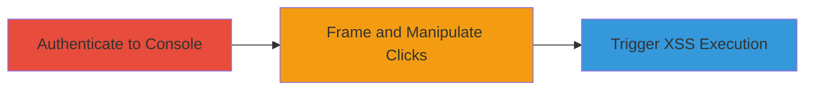

---
tags:
  - clickjacking
  - dom-xss
  - xss
  - tumblr
  - api
  - web
type: attack_chain
tools: []
tactics:
  - '[[Initial Access]]'
  - '[[Execution]]'
verified: false
platforms:
  - Web
submitted: true
complexity: medium
created_at: '2023-10-01T00:00:00Z'
procedures:
  - '[[procedures/Authenticate-to-Tumblr-API-Console]]'
  - '[[procedures/Exploit-Clickjacking-for-DOM-XSS]]'
step_count: 2
techniques:
  - '[[Drive-by Compromise]]'
  - '[[JavaScript]]'
updated_at: '2025-12-14T17:28:12.849Z'
description: >-
  A multi-stage attack exploiting clickjacking on the Tumblr API console to
  trigger a self DOM-based XSS via unsanitized URL injection in follow/unfollow
  endpoints.
skill_level: intermediate
impact_level: low
id: 37c24c80-c720-4103-af8d-ffed235d6a83
validated: true
mitre_tactics:
  - '[[Initial Access]]'
  - '[[Execution]]'
mitre_techniques:
  - '[[Drive-by Compromise]]'
  - '[[JavaScript]]'
---
# Clickjacking Leading to DOM-based XSS in Tumblr API Console

Multi-stage attack chain demonstrating a complete attack workflow exploiting the lack of X-Frame-Options on the Tumblr API console to frame it in an attacker-controlled page, combined with DOM-based XSS in follow/unfollow endpoints due to unsanitized URL insertion in console.js.

## Chain Metrics Dashboard

| Metric | Value |
|--------|-------|
| Chain Status | Unverified |
| Total Steps | 2 |
| Execution Time | ~5 minutes |
| Skill Level | Intermediate |
| Complexity | Medium |
| Impact Level | Low |

## Attack Flow Visualization

## Prerequisites & Requirements

### Required Tools

- Browser (e.g., Chrome)
- Local web server to host PoC HTML

### Target Environment

- Web platform
- Tumblr API Console accessible
- No specific ports; standard HTTPS

### Initial Access Requirements

- Valid Tumblr credentials for authentication
- Victim must be tricked into interacting with the attacker's page
- Network access to https://api.tumblr.com/

## Detailed Attack Procedures

### Step 1: Authenticate to Tumblr API Console
procedure: [[procedures/Authenticate-to-Tumblr-API-Console]]

**Objective**: Gain access to the authenticated Tumblr API console interface to enable framing and interaction.

**Instructions**: Navigate to the Tumblr API console login page and authenticate using valid credentials. Once logged in, ensure the console interface at https://api.tumblr.com/console/calls/user/info is accessible, which displays the user info endpoint.

**Expected Output**: Authenticated session with access to console endpoints like follow/unfollow.

**Success Indicators**:
- Successful login confirmation
- Console dashboard loads without errors

### Step 2: Exploit Clickjacking for DOM-XSS
procedure: [[procedures/Exploit-Clickjacking-for-DOM-XSS]]

**Objective**: Frame the console in an attacker-controlled page to trick the victim into clicking elements that inject a malicious URL payload, triggering DOM-based XSS.

**Instructions**: Host a malicious PoC HTML file locally (e.g., poc.html) that embeds the Tumblr console in an iframe. The PoC manipulates clicks to direct the victim to follow/unfollow endpoints with a payload like 'https://www.'. Load the PoC in the victim's browser (e.g., Chrome) and instruct them to interact as if performing normal actions, leading to payload injection at console.js line 1309.

**Expected Output**: Alert box pops up in the browser, confirming XSS execution in the console's context.

**Success Indicators**:
- Iframe loads without blocking (no X-Frame-Options)
- Malicious URL processed, triggering onerror handler
- Arbitrary JavaScript executes (e.g., alert())

## Attack Chain Summary

### Key Achievements

1. Successful framing of the API console via clickjacking due to missing X-Frame-Options.
2. Injection of HTML-breaking payload into follow/unfollow URL display, exploiting DOM XSS.
3. Script execution in the authenticated victim's browser context, potentially enabling session hijacking.

## Technique & Tactic Coverage

### MITRE ATT&CK Techniques

- [[Drive-by Compromise]]
- [[JavaScript]]

### MITRE ATT&CK Tactics

- [[Initial Access]]
- [[Execution]]

---
*Last updated: 2023-10-01T00:00:00Z*
