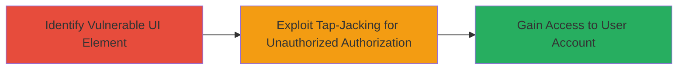

---
tags:
  - clickjacking
  - tapjacking
  - oauth
  - android
  - mobile
  - ui-redressing
type: attack_chain
tools: []
tactics:
  - '[[Initial Access]]'
verified: false
platforms:
  - Mobile
  - Android
submitted: true
complexity: medium
created_at: '2023-10-01T00:00:00Z'
procedures:
  - '[[procedures/Identify-OAuth-Authorize-Button-in-Android-App]]'
  - '[[procedures/Exploit-Missing-FilterTouchesWhenObscured-for-Tapjacking]]'
step_count: 2
techniques:
  - '[[Drive-by Compromise]]'
  - '[[Phishing]]'
updated_at: '2025-12-14T17:24:35.179Z'
description: >-
  A multi-stage attack exploiting clickjacking (tap-jacking) in the Coinbase
  Android App's OAuth flow to trick users into authorizing malicious
  applications without awareness.
skill_level: intermediate
impact_level: high
id: b7607de0-822e-4eaf-9148-ca91709473f2
validated: true
mitre_tactics:
  - '[[Initial Access]]'
mitre_techniques:
  - '[[Drive-by Compromise]]'
  - '[[Phishing]]'
---
# Clickjacking OAuth Authorization in Coinbase Android App to Authorize Malicious Applications

Multi-stage attack chain demonstrating a complete attack workflow exploiting UI redressing in the Coinbase Android App's OAuth process to authorize malicious apps on behalf of users.

## Chain Metrics Dashboard

| Metric | Value |
|--------|-------|
| Chain Status | Unverified |
| Total Steps | 2 |
| Execution Time | ~10 minutes |
| Skill Level | Intermediate |
| Complexity | Medium |
| Impact Level | High |

## Attack Flow Visualization

## Prerequisites & Requirements

### Required Tools

- Android development environment (e.g., Android Studio for creating overlay apps)
- ADB (Android Debug Bridge) for testing on emulators or devices

### Target Environment

- Target OS/Platform: Android (Coinbase App version vulnerable to this issue)
- Required services/ports: OAuth authorization flow within the app
- Network access requirements: Local device access or user interaction on the target device

### Initial Access Requirements

- Credential requirements: None (relies on user interaction with the app)
- Network position: On-device attack, no remote network needed
- Prior access needed: Ability to install a malicious overlay app or have physical access to the device

## Detailed Attack Procedures

### Step 1: Identify OAuth Authorize Button
procedure: [[procedures/Identify-OAuth-Authorize-Button-in-Android-App]]

**Objective**: Locate the OAuth authorization button in the Coinbase Android App to assess vulnerability.

**Instructions**: Decompile or inspect the app's UI elements using tools like APKTool or Android Studio's layout inspector to find the authorize button in the OAuth flow.

**Expected Output**: Identification of the button element lacking protective attributes.

**Success Indicators**:
- Button located in OAuth UI
- Confirmation of missing android:filterTouchesWhenObscured attribute

### Step 2: Exploit Missing FilterTouchesWhenObscured for Tapjacking
procedure: [[procedures/Exploit-Missing-FilterTouchesWhenObscured-for-Tapjacking]]

**Objective**: Create an overlay to trick the user into tapping the hidden authorize button, granting permissions to a malicious app.

**Instructions**: Develop a malicious Android app that draws a transparent overlay over the Coinbase app. When the user interacts with the overlay (e.g., tapping a visible fake button), it redirects the touch to the obscured OAuth authorize button. Use Android's WindowManager to create the overlay and simulate the tap.

**Expected Output**: Successful authorization of the malicious app without user noticing the real action.

**Success Indicators**:
- Malicious app receives OAuth permissions
- User account access granted to attacker-controlled app

## Attack Chain Summary

### Key Achievements

1. Identified vulnerable UI element in OAuth flow
2. Demonstrated tap-jacking to bypass user awareness
3. Achieved unauthorized app authorization leading to potential account compromise

## Technique & Tactic Coverage

### MITRE ATT&CK Techniques

- [[Drive-by Compromise]] Drive-by Compromise
- [[Phishing]] Phishing

### MITRE ATT&CK Tactics

- [[Initial Access]] Initial Access

---
*Last updated: 2023-10-01T00:00:00Z*
