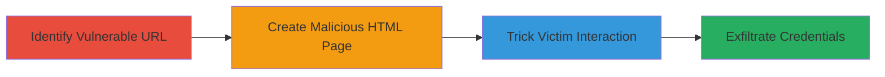

---
tags:
  - clickjacking
  - ui-redressing
  - twitter
  - email-theft
  - credential-access
type: attack_chain
tools: []
tactics:
  - '[[Initial Access]]'
  - '[[Collection]]'
verified: false
platforms:
  - Web
submitted: true
complexity: medium
created_at: '2024-10-01T00:00:00Z'
procedures:
  - '[[procedures/Identify-Vulnerable-Twitter-Card-URL-for-Clickjacking]]'
  - '[[procedures/Create-Clickjacking-HTML-Page-with-Embedded-Twitter-Card]]'
  - '[[procedures/Execute-Clickjacking-Attack-by-Tricking-Victim-Interaction]]'
step_count: 3
techniques:
  - '[[Exploit Public-Facing Application]]'
  - '[[Drive-by Compromise]]'
updated_at: '2025-12-14T17:28:12.878Z'
description: >-
  A multi-stage clickjacking attack exploiting the absence of X-Frame-Options
  headers on Twitter's card creation pages to steal victims' emails and
  usernames by tricking them into interacting with embedded iframes.
skill_level: intermediate
impact_level: high
id: a9145726-b3cb-46ec-8747-d5c717032c71
validated: true
mitre_tactics:
  - '[[Initial Access]]'
  - '[[Collection]]'
mitre_techniques:
  - '[[Exploit Public-Facing Application]]'
  - '[[Drive-by Compromise]]'
---
# Clickjacking Twitter Card Pages to Steal User Emails and Usernames

Multi-stage attack chain demonstrating a complete attack workflow exploiting clickjacking on Twitter's card pages to exfiltrate user credentials.

## Chain Metrics Dashboard

| Metric | Value |
|--------|-------|
| Chain Status | Unverified |
| Total Steps | 3 |
| Execution Time | ~5 minutes |
| Skill Level | Intermediate |
| Complexity | Medium |
| Impact Level | High |

## Attack Flow Visualization

## Prerequisites & Requirements

### Required Tools

- None (uses basic HTML and web hosting)

### Target Environment

- Web platform
- Access to Twitter card URLs without X-Frame-Options headers
- Ability to host a malicious HTML page

### Initial Access Requirements

- No credentials required
- Public access to Twitter services
- Social engineering to lure victims

## Detailed Attack Procedures

### Step 1: Identify Vulnerable Twitter Card URL
procedure: [[procedures/Identify-Vulnerable-Twitter-Card-URL-for-Clickjacking]]

**Objective**: Locate a Twitter card URL that lacks frame-busting protections and submits user data to an external endpoint upon interaction.

**Instructions**: Review Twitter's card creation endpoints for missing X-Frame-Options headers. Test URLs like https://twitter.com/i/cards/tfw/v1/759046372544741376?cardname=promotion&autoplay_disabled=true&earned=true&lang=en&card_height=357 by attempting to embed them in an iframe and observing if button clicks send data externally.

**Expected Output**: Confirmation that the page can be iframed and that interactions trigger data submission to a controllable domain.

**Success Indicators**:
- Page embeds without restrictions
- Button click submits email and username to attacker's server

### Step 2: Create Clickjacking HTML Page
procedure: [[procedures/Create-Clickjacking-HTML-Page-with-Embedded-Twitter-Card]]

**Objective**: Build a malicious webpage that invisibly embeds the vulnerable Twitter card to overlay deceptive elements.

**Instructions**: Author an HTML file with an iframe sourcing the vulnerable Twitter card URL. Host this page on a domain under attacker control, ensuring the iframe is positioned to trick clicks.

**Expected Output**: A hosted HTML page where the iframe loads the Twitter content seamlessly.

**Success Indicators**:
- Iframe loads without errors
- Page is accessible via a URL that can be shared with victims

### Step 3: Trick Victim into Clicking
procedure: [[procedures/Execute-Clickjacking-Attack-by-Tricking-Victim-Interaction]]

**Objective**: Lure the victim to the malicious page and induce them to click the embedded button, triggering credential theft.

**Instructions**: Distribute the malicious HTML page URL via phishing, social media, or other means. Design the page to make the iframe click appear as a legitimate action, such as "Click to verify your account."

**Expected Output**: Victim's email and username posted to the attacker's server upon click.

**Success Indicators**:
- Server logs show incoming POST requests with stolen data
- Victim unaware of the interaction due to UI redressing

## Attack Chain Summary

### Key Achievements

1. Exploited missing X-Frame-Options to enable iframing of sensitive Twitter pages
2. Created a drive-by compromise vector for credential theft
3. Demonstrated high-impact data exfiltration without direct authentication bypass

## Technique & Tactic Coverage

### MITRE ATT&CK Techniques

- [[Exploit Public-Facing Application]] Exploit Public-Facing Application
- [[Drive-by Compromise]] Drive-by Compromise

### MITRE ATT&CK Tactics

- [[Initial Access]] Initial Access
- [[Collection]] Collection

---
*Last updated: 2024-10-01T00:00:00Z*
