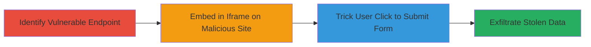

---
tags:
  - clickjacking
  - web
  - ui-manipulation
  - phishing
type: attack_chain
tools: []
tactics:
  - '[[Initial Access]]'
  - '[[Collection]]'
verified: false
platforms:
  - Web
submitted: true
complexity: medium
created_at: '2023-10-01T00:00:00Z'
procedures:
  - '[[procedures/Identify-Vulnerable-Lead-Forms-Page]]'
  - '[[procedures/Embed-Page-in-Malicious-Iframe]]'
  - '[[procedures/Exfiltrate-User-Information-via-Clickjacking]]'
step_count: 3
techniques:
  - '[[Drive-by Compromise]]'
  - '[[JavaScript]]'
updated_at: '2025-12-14T17:28:12.550Z'
description: >-
  Multi-stage attack exploiting clickjacking vulnerability in VK.com's lead
  forms application to trick users into submitting personal information via a
  malicious iframe overlay.
skill_level: intermediate
impact_level: high
id: a72022eb-64bb-4bd2-9db1-2746e2a3cdab
validated: true
mitre_tactics:
  - '[[Initial Access]]'
  - '[[Collection]]'
mitre_techniques:
  - '[[Drive-by Compromise]]'
  - '[[JavaScript]]'
---
# Clickjacking VK.com Lead Forms to Steal User Phone and Email

Multi-stage attack chain demonstrating a complete attack workflow exploiting the lack of frame-busting protections in VK.com's /lead_forms_app.php endpoint to steal authenticated users' phone numbers and emails.

## Chain Metrics Dashboard

| Metric | Value |
|--------|-------|
| Chain Status | Unverified |
| Total Steps | 3 |
| Execution Time | ~5 minutes |
| Skill Level | Intermediate |
| Complexity | Medium |
| Impact Level | High |

## Attack Flow Visualization

## Prerequisites & Requirements

### Required Tools

- None (manual HTML setup required)

### Target Environment

- Web platform
- Access to host a malicious external website
- Target: VK.com authenticated users

### Initial Access Requirements

- No prior credentials needed for attacker
- Users must be authenticated on VK.com
- Network access to external malicious site

## Detailed Attack Procedures

### Step 1: Identify Vulnerable Endpoint
procedure: [[procedures/Identify-Vulnerable-Lead-Forms-Page]]

**Objective**: Locate the lead forms application page lacking frame protections to confirm clickjacking feasibility.

**Instructions**: Manually inspect VK.com's 'Form for collecting applications' feature by navigating to potential endpoints like /lead_forms_app.php. Verify if the page can be loaded in an iframe by creating a simple test HTML file with an iframe src pointing to the endpoint and checking if it renders without errors.

**Expected Output**: The VK.com page loads successfully within the test iframe, confirming no X-Frame-Options or frame-busting JavaScript is present.

**Success Indicators**:
- Page embeds without blocking
- Form elements (e.g., phone and email fields) are accessible in the iframe

### Step 2: Setup Malicious Iframe Overlay
procedure: [[procedures/Embed-Page-in-Malicious-Iframe]]

**Objective**: Create a malicious external site that embeds the vulnerable VK.com page in a hidden or overlaid iframe, disguising the submission action.

**Instructions**: Host a fake website (e.g., mimicking a poll or survey) and embed /lead_forms_app.php in an iframe positioned off-screen or under a transparent overlay. Add a visible fake button (e.g., "Confirm Poll Vote") that aligns with the hidden form's submit button in the iframe. Use CSS to position the iframe precisely so a click on the fake button triggers the real submission.

**Expected Output**: Malicious page loads with the VK.com form hidden; clicking the fake button submits the form invisibly.

**Success Indicators**:
- Iframe embeds without restrictions
- Fake button click maps to form submission coordinates

### Step 3: Execute and Exfiltrate Data
procedure: [[procedures/Exfiltrate-User-Information-via-Clickjacking]]

**Objective**: Trick an authenticated VK.com user into clicking the disguised button, causing their personal details to be submitted and captured by the attacker.

**Instructions**: Lure the victim to the malicious site via phishing or social engineering. When the user (already logged into VK.com) clicks the fake button, the browser submits the lead form in the iframe, sending their phone and email to the attacker's controlled endpoint. Capture the submitted data server-side on the malicious site or via VK's response if redirected.

**Expected Output**: Victim's phone number and email are submitted to the lead form and can be retrieved by the attacker monitoring the form handler or VK's application.

**Success Indicators**:
- Form submission occurs on button click
- Attacker receives the exfiltrated personal information

## Attack Chain Summary

### Key Achievements

1. Confirmed clickjacking vulnerability in VK.com's lead forms without frame protections
2. Demonstrated iframe embedding to overlay malicious UI elements
3. Enabled theft of sensitive user data (phone and email) through disguised interactions

## Technique & Tactic Coverage

### MITRE ATT&CK Techniques

- [[Drive-by Compromise]]
- [[JavaScript]]

### MITRE ATT&CK Tactics

- [[Initial Access]]
- [[Collection]]

---
*Last updated: 2023-10-01T00:00:00Z*
