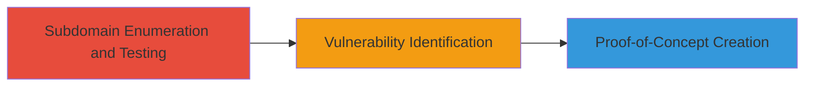

# Clickjacking Vulnerability Discovery on WordPress IRC Logs Subdomain

Multi-stage attack chain demonstrating a complete vulnerability discovery workflow for identifying clickjacking on public-facing web applications.

## Chain Metrics Dashboard

| Metric | Value |
|--------|-------|
| Chain Status | Unverified |
| Total Steps | 3 |
| Execution Time | ~15 minutes |
| Skill Level | Beginner |
| Complexity | Low |
| Impact Level | Low |

## Attack Flow Visualization

## Prerequisites & Requirements

### Required Tools

- Web browser with developer tools
- Screenshot tool or screen recorder

### Target Environment

- Public-facing WordPress subdomains
- Web platform with HTTP headers
- No specific ports required beyond standard HTTP/HTTPS (80/443)

### Initial Access Requirements

- Internet access to query public subdomains
- No credentials needed
- Positioned as external attacker with no prior access

## Detailed Attack Procedures

### Step 1: Subdomain Enumeration and Testing
procedure: [[procedures/Enumerate-and-Test-WordPress-Subdomains]]

**Objective**: Identify potential attack surface by testing various WordPress subdomains for security vulnerabilities.

**Instructions**: Manually or systematically query known WordPress subdomains (e.g., via browsing or using online directories) and inspect them for common issues like missing security headers.

**Expected Output**: List of subdomains tested, noting any initial anomalies.

**Success Indicators**:
- Multiple subdomains enumerated (e.g., irclogs.wordpress.org, others)
- Initial security scans completed without errors

### Step 2: Vulnerability Identification
procedure: [[procedures/Identify-Clickjacking-on-Subdomain]]

**Objective**: Detect the absence of X-Frame-Options header on a specific subdomain, enabling clickjacking attacks.

**Instructions**: Use browser developer tools to inspect HTTP response headers for the target subdomain. Attempt to embed the page in an iframe on a test page to confirm framming is possible.

**Expected Output**: Confirmation of missing X-Frame-Options header and successful iframe embedding.

**Success Indicators**:
- No X-Frame-Options header present in response
- Site loads within an iframe without restrictions

### Step 3: Proof-of-Concept Creation
procedure: [[procedures/Create-Clickjacking-Proof-of-Concept]]

**Objective**: Demonstrate the clickjacking vulnerability with visual evidence for reporting.

**Instructions**: Create a simple HTML page with an invisible iframe loading the vulnerable site, overlaying clickable elements to simulate UI redressing. Record a video of the interaction and capture screenshots.

**Expected Output**: Video recording and screenshot showing the framed site and potential click deception.

**Success Indicators**:
- PoC HTML page successfully tricks clicks on the framed content
- Visual evidence attached for validation

## Attack Chain Summary

### Key Achievements

1. Successful enumeration of WordPress subdomains revealing testing opportunities.
2. Identification of clickjacking vulnerability due to missing security headers.
3. Creation of a reproducible PoC highlighting low-severity UI redressing risks on a read-only site.

## Technique & Tactic Coverage

### MITRE ATT&CK Techniques

- [[Active Scanning]] Active Scanning
- [[Exploit Public-Facing Application]] Exploit Public-Facing Application

### MITRE ATT&CK Tactics

- [[Reconnaissance]] Reconnaissance
- [[Initial Access]] Initial Access

---
*Last updated: 2023-10-01T00:00:00Z*
