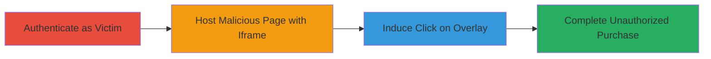

---
tags:
  - clickjacking
  - web
  - unauthorized-purchase
  - x-frame-options
  - yelp
type: attack_chain
tools: []
tactics:
  - '[[Initial Access]]'
  - '[[Execution]]'
verified: false
platforms:
  - Web
submitted: true
complexity: medium
created_at: '2023-10-01T00:00:00Z'
procedures:
  - '[[procedures/Authenticate-to-Yelp-as-Victim]]'
  - '[[procedures/Host-Malicious-Clickjacking-Page]]'
  - '[[procedures/Execute-Clickjacking-for-Unauthorized-Purchase]]'
step_count: 3
techniques:
  - '[[Exploit Public-Facing Application]]'
  - '[[User Execution]]'
updated_at: '2025-12-14T17:28:51.965Z'
description: >-
  A clickjacking attack exploiting the missing X-Frame-Options header on Yelp's
  checkout page to trick logged-in users into unauthorized purchases using saved
  credit cards.
skill_level: intermediate
impact_level: high
id: 2772cc3a-78dd-4a67-9898-75f9155a209a
validated: true
mitre_tactics:
  - '[[Initial Access]]'
  - '[[Execution]]'
mitre_techniques:
  - '[[Exploit Public-Facing Application]]'
  - '[[User Execution]]'
---
# Clickjacking Yelp Checkout for Unauthorized Credit Card Charges

Multi-stage attack chain demonstrating a complete clickjacking workflow to perform unauthorized purchases on Yelp.

## Chain Metrics Dashboard

| Metric | Value |
|--------|-------|
| Chain Status | Unverified |
| Total Steps | 3 |
| Execution Time | ~5 minutes |
| Skill Level | Intermediate |
| Complexity | Medium |
| Impact Level | High |

## Attack Flow Visualization



## Prerequisites & Requirements

### Required Tools

- Web browser (e.g., Chrome incognito mode)
- Web server to host malicious HTML (e.g., local Python server or hosting service)

### Target Environment

- Web platform
- Access to Yelp website (https://www.yelp.com)
- Victim must have a logged-in Yelp account with saved credit card details

### Initial Access Requirements

- Victim's Yelp credentials (for simulation; in real attack, social engineering to get victim to visit page while logged in)
- Network access to internet
- No prior access needed beyond tricking victim to visit attacker's site

## Detailed Attack Procedures

### Step 1: Authenticate to Yelp as Victim
procedure: [[procedures/Authenticate-to-Yelp-as-Victim]]

**Objective**: Ensure the victim's Yelp account is authenticated with saved payment information accessible for the checkout process.

**Instructions**: Open an incognito browser window and navigate to https://www.yelp.com. Enter the victim's credentials to log in. Verify that credit card details are saved in the account settings for seamless checkout.

**Expected Output**: Successful login confirmation and access to account dashboard with saved payment methods visible.

**Success Indicators**:
- Login successful without errors
- Saved credit cards listed in payment settings

### Step 2: Host Malicious Clickjacking Page
procedure: [[procedures/Host-Malicious-Clickjacking-Page]]

**Objective**: Create and host a webpage that embeds the vulnerable Yelp checkout endpoint in a hidden iframe with an overlaid clickable button.

**Instructions**: Create an HTML file with a transparent iframe embedding the Yelp checkout URL (e.g., https://www.yelp.com/checkout/deal/16OJ1G_Ev7STx0HELIDzyA?biz_id=Ydf5dgFsGhMSP61Ht7TekA&return_url=%2Fbiz%2Fbutcher-and-the-burger-chicago). Position a visible 'Purchase Now' button over the iframe to capture clicks. Host the page on a server accessible via HTTP/HTTPS.

Example HTML structure:

```html
<!DOCTYPE html>
<html>
<head>
    <title>Free Deal Alert!</title>
    <style>
        #frame { position: absolute; top: 0; left: 0; opacity: 0.0; width: 100%; height: 100%; }
        #overlay { position: absolute; top: 100px; left: 100px; z-index: 1; }
    </style>
</head>
<body>
    <h1>Click to Claim Your Free Deal!</h1>
    <iframe id="frame" src="https://www.yelp.com/checkout/deal/16OJ1G_Ev7STx0HELIDzyA?biz_id=Ydf5dgFsGhMSP61Ht7TekA&return_url=%2Fbiz%2Fbutcher-and-the-burger-chicago"></iframe>
    <button id="overlay" onclick="document.getElementById('frame').contentWindow.postMessage({action: 'click'}, '*');">Purchase Now</button>
</body>
</html>
```

Serve the file using a simple web server, e.g., `python -m http.server 8000` in the directory.

**Expected Output**: Malicious page loads with hidden iframe and visible button; no X-Frame-Options header blocks embedding (confirm via browser dev tools).

**Success Indicators**:
- Iframe loads Yelp checkout without framing errors
- Button click propagates to iframe (test locally)

### Step 3: Execute Clickjacking for Unauthorized Purchase
procedure: [[procedures/Execute-Clickjacking-for-Unauthorized-Purchase]]

**Objective**: Trick the logged-in victim into visiting the malicious page and clicking the overlay button, triggering the hidden purchase.

**Instructions**: Direct the victim (who is already logged into Yelp in their browser) to the hosted malicious page via phishing email, social engineering, or direct link. The victim clicks the visible 'Purchase Now' button, which simulates a click on the hidden iframe's checkout button, completing the transaction with saved credit card details.

**Expected Output**: Yelp checkout processes the purchase invisibly; confirmation email or account transaction history shows the $450 charge for the unwanted deal.

**Success Indicators**:
- Unauthorized charge appears in victim's Yelp account
- No user awareness of the actual purchase action

## Attack Chain Summary

### Key Achievements

1. Exploited missing X-Frame-Options header to frame sensitive checkout page
2. Tricked user into unauthorized $450 purchase without direct interaction with Yelp
3. Demonstrated potential for monetary loss and trust erosion in e-commerce platforms

## Technique & Tactic Coverage

### MITRE ATT&CK Techniques

- [[Exploit Public-Facing Application]]
- [[User Execution]]

### MITRE ATT&CK Tactics

- [[Initial Access]]
- [[Execution]]

---
*Last updated: 2023-10-01T00:00:00Z*
