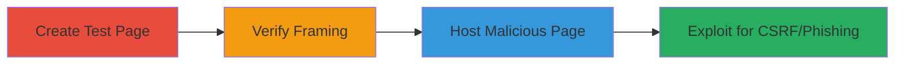

# Clickjacking and CSRF Exploitation on Mavenlink Login Page

Multi-stage attack chain demonstrating a complete attack workflow exploiting the absence of X-Frame-Options headers on https://app.mavenlink.com/login, enabling clickjacking to overlay malicious content and facilitate CSRF or phishing attacks.

## Chain Metrics Dashboard

| Metric | Value |
|--------|-------|
| Chain Status | Unverified |
| Total Steps | 3 |
| Execution Time | ~5 minutes |
| Skill Level | Intermediate |
| Complexity | Medium |
| Impact Level | High |

## Attack Flow Visualization

## Prerequisites & Requirements

### Required Tools

- Web browser (e.g., Chrome, Firefox)
- Local web server (e.g., Python's http.server for hosting)

### Target Environment

- Target: Web application at https://app.mavenlink.com/login
- Required services/ports: HTTPS on port 443
- Network access requirements: Internet access to load the target page

### Initial Access Requirements

- No credentials required
- Attacker controls a domain or local server for hosting malicious HTML
- No prior access needed

## Detailed Attack Procedures

### Step 1: Create Test Page
procedure: [[procedures/Create-Clickjacking-Test-Page]]

**Objective**: Develop an HTML page to test if the login page can be framed in an iframe.

**Instructions**: Create a simple HTML file with an iframe embedding the target login page, styled to overlay semi-transparent content demonstrating the vulnerability.

**Expected Output**: An HTML file (e.g., pen-test-for-clickjacking.html) that loads the target in a framable iframe.

**Success Indicators**:
- HTML file created without errors
- Iframe source set to https://app.mavenlink.com/login

### Step 2: Verify Susceptibility
procedure: [[procedures/Verify-Clickjacking-Susceptibility]]

**Objective**: Load the test HTML in a browser to confirm the login page can be framed.

**Instructions**: Open the HTML file in a web browser and observe if the login page appears in the iframe overlaid on vulnerability indicator text.

**Expected Output**: The Mavenlink login form visible and interactive within the semi-transparent iframe.

**Success Indicators**:
- No frame-busting errors or blocks
- Login page loads fully in the iframe

### Step 3: Host and Exploit
procedure: [[procedures/Host-Malicious-Clickjacking-Page]]

**Objective**: Deploy the malicious HTML on an attacker-controlled site to trick users into interacting with the framed login, enabling CSRF or credential capture.

**Instructions**: Host the HTML on a server and lure users (e.g., via email or social engineering) to visit the page, where overlaid fields capture inputs or force submissions.

**Expected Output**: Users visit the site, interact with the invisible/framed form, submitting data to the legitimate endpoint.

**Success Indicators**:
- Page hosted and accessible
- User interactions result in form submissions to Mavenlink

## Attack Chain Summary

### Key Achievements

1. Confirmed clickjacking vulnerability due to missing X-Frame-Options
2. Demonstrated potential for CSRF by forcing unauthorized actions
3. Enabled phishing for credential theft via UI redressing

## Technique & Tactic Coverage

### MITRE ATT&CK Techniques

- [[Drive-by Compromise]] Drive-by Compromise
- [[Exploit Public-Facing Application]] Exploit Public-Facing Application

### MITRE ATT&CK Tactics

- [[Initial Access]] Initial Access

---
*Last updated: 2023-10-01T00:00:00Z*
