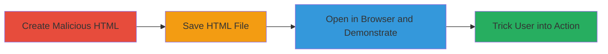

---
tags:
  - clickjacking
  - ui-redressing
  - iframe
  - csp
  - web-vulnerability
  - acronis
type: attack_chain
tools: []
tactics:
  - '[[Initial Access]]'
verified: false
platforms:
  - Web
submitted: true
complexity: low
created_at: '2023-10-01T00:00:00Z'
procedures:
  - '[[procedures/Create-Malicious-HTML-for-Clickjacking-PoC]]'
  - '[[procedures/Save-Clickjacking-HTML-File]]'
  - '[[procedures/Demonstrate-Clickjacking-by-Opening-HTML-in-Browser]]'
step_count: 3
techniques:
  - '[[Drive-by Compromise]]'
updated_at: '2025-12-14T17:28:12.823Z'
description: >-
  A multi-stage demonstration of clickjacking vulnerability on the Acronis CAS
  login page, allowing attackers to overlay invisible elements and trick users
  into unintended actions like account deactivation.
skill_level: beginner
impact_level: high
id: 9ed39ee7-f25e-4f1f-806f-bb0f12ded2e3
validated: true
mitre_tactics:
  - '[[Initial Access]]'
mitre_techniques:
  - '[[Drive-by Compromise]]'
---
# Clickjacking on Acronis CAS Login Page to Trick Users into Account Deactivation

Multi-stage attack chain demonstrating a complete attack workflow for exploiting clickjacking on the Acronis CAS login page.

## Chain Metrics Dashboard

| Metric | Value |
|--------|-------|
| Chain Status | Unverified |
| Total Steps | 3 |
| Execution Time | ~2 minutes |
| Skill Level | Beginner |
| Complexity | Low |
| Impact Level | High |

## Attack Flow Visualization

## Prerequisites & Requirements

### Required Tools

- Text editor (e.g., Notepad, VS Code)
- Web browser (e.g., Chrome, Firefox)

### Target Environment

- Web platform
- Access to https://cas.acronis.com/ login page
- No special services or ports required beyond standard HTTP/HTTPS

### Initial Access Requirements

- No credentials needed for demonstration
- Ability to send malicious links to victims via email or other means
- Local file access for PoC creation

## Detailed Attack Procedures

### Step 1: Create Malicious HTML
procedure: [[procedures/Create-Malicious-HTML-for-Clickjacking-PoC]]

**Objective**: Generate an HTML file that embeds the target login page in an iframe without restrictions, setting up the overlay for clickjacking.

**Instructions**: Use a text editor to write the HTML code that iframes the Acronis CAS login page. The code includes a basic structure with the iframe sourcing https://cas.acronis.com/.

**Expected Output**: A raw HTML file content ready to save.

**Success Indicators**:
- HTML code contains the iframe embedding the target URL
- No errors in HTML syntax

### Step 2: Save HTML File
procedure: [[procedures/Save-Clickjacking-HTML-File]]

**Objective**: Persist the malicious HTML as a file that can be opened in a browser.

**Instructions**: Save the created HTML content with a .html extension in a local directory.

**Expected Output**: A file named something like demo.html.

**Success Indicators**:
- File is saved without errors
- File extension is .html

### Step 3: Demonstrate Clickjacking
procedure: [[procedures/Demonstrate-Clickjacking-by-Opening-HTML-in-Browser]]

**Objective**: Load the HTML to verify the iframe embeds the target without frame-busting protections, allowing potential overlays for tricking users.

**Instructions**: Open the saved HTML file in a web browser to observe the embedded login page.

**Expected Output**: The Acronis login page loads inside the iframe without restrictions.

**Success Indicators**:
- Target page embeds successfully in iframe
- No frame-ancestors or X-Frame-Options blocks the embedding

## Attack Chain Summary

### Key Achievements

1. Successful embedding of the login page in an external iframe, confirming the clickjacking vulnerability.
2. Demonstration of how an attacker can overlay invisible elements to capture clicks on sensitive actions like account deactivation.
3. Highlighted the absence of proper CSP headers, enabling real-world phishing attacks via malicious links.

## Technique & Tactic Coverage

### MITRE ATT&CK Techniques

- [[Drive-by Compromise]]

### MITRE ATT&CK Tactics

- [[Initial Access]]

---
*Last updated: 2023-10-01T00:00:00Z*
