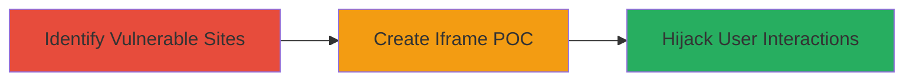

# Clickjacking on Bohemia Interactive Domains via Missing X-Frame-Options Header

Multi-stage attack chain demonstrating a complete attack workflow for exploiting Clickjacking (UI Redressing) on Bohemia Interactive a.s. domains. The chain identifies sites vulnerable to iframe embedding due to missing X-Frame-Options headers and creates a proof-of-concept to overlay malicious elements, tricking users into unintended actions like clicking hidden buttons or entering data.

## Chain Metrics Dashboard

| Metric | Value |
|--------|-------|
| Chain Status | Unverified |
| Total Steps | 2 |
| Execution Time | ~5 minutes |
| Skill Level | Beginner |
| Complexity | Low |
| Impact Level | Medium |

## Attack Flow Visualization



## Prerequisites & Requirements

### Required Tools

- Browser with developer tools (e.g., Chrome DevTools)
- Text editor for HTML POC

### Target Environment

- Web platform
- Publicly accessible HTTP/HTTPS sites
- No specific ports required beyond standard 80/443

### Initial Access Requirements

- Internet access to target domains
- No credentials needed
- Ability to host or locally serve a malicious HTML page

## Detailed Attack Procedures

### Step 1: Identify Vulnerable Sites
procedure: [[procedures/Identify-Clickjacking-Vulnerability]]

**Objective**: Scan target domains to confirm absence of X-Frame-Options header, identifying sites that can be embedded in iframes.

**Instructions**: Use [[commands/curl-check-headers]] to inspect HTTP response headers for multiple Bohemia Interactive URLs:

```bash
curl -I https://ylands.com/
```

Repeat for other targets like https://workshop.ylands.com/, https://dayz.com/, http://armamobileops.com/, https://minidayz.com/. Look for the absence of `X-Frame-Options` in the output.

**Expected Output**: HTTP headers without `X-Frame-Options: DENY` or `SAMEORIGIN`, confirming framming is allowed.

**Success Indicators**:
- No X-Frame-Options header present
- Sites load without framing restrictions

### Step 2: Demonstrate Clickjacking with Iframe POC
procedure: [[procedures/Demonstrate-Clickjacking-with-Iframe-POC]]

**Objective**: Create and test a malicious HTML page that embeds the vulnerable site in an iframe, overlaying invisible elements to hijack clicks.

**Instructions**: Create an HTML file with an iframe sourcing a vulnerable URL, such as https://ylands.com/. Add a transparent overlay div to trick users into clicking hidden elements.

Example POC structure:

```html
<!DOCTYPE html>
<html>
<head><title>Clickjacking POC</title></head>
<body>
  <iframe src="https://ylands.com/" width="800" height="600"></iframe>
  <div style="position: absolute; top: 100px; left: 100px; width: 100px; height: 50px; opacity: 0.1; z-index: 1;">
    <button onclick="alert('Click Hijacked!')">Fake Button</button>
  </div>
</body>
</html>
```

Serve the file locally (e.g., via Python: `python -m http.server 8000`) and open in a browser to verify the iframe loads and overlay functions.

**Expected Output**: Vulnerable site embeds successfully in iframe; overlay captures clicks without user awareness, demonstrating potential for actions like form submissions or data exfiltration.

**Success Indicators**:
- Iframe content loads visibly
- Overlay elements interact with iframe content, simulating hijacked actions

## Attack Chain Summary

### Key Achievements

1. Identified multiple Bohemia Interactive domains vulnerable to Clickjacking due to missing headers.
2. Created a functional POC demonstrating UI redressing and click hijacking.
3. Highlighted risks of unauthorized actions, such as revealing sensitive info or controlling user inputs.

## Technique & Tactic Coverage

### MITRE ATT&CK Techniques

- [[Drive-by Compromise]]

### MITRE ATT&CK Tactics

- [[Initial Access]]

---
*Last updated: 2023-10-01T00:00:00Z*
