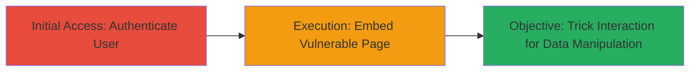

---
tags:
  - clickjacking
  - ui-redressing
  - iframe
  - web-vulnerability
type: attack_chain
tools: []
tactics:
  - '[[Initial Access]]'
verified: false
platforms:
  - Web
submitted: true
complexity: medium
created_at: '2023-10-01T00:00:00Z'
procedures:
  - '[[procedures/Authenticate-to-Crossclip-Application]]'
  - '[[procedures/Create-Malicious-Clickjacking-HTML-Page]]'
  - '[[procedures/Trick-Victim-into-Clickjacking-Interaction]]'
step_count: 3
techniques:
  - '[[Drive-by Compromise]]'
  - '[[JavaScript]]'
updated_at: '2025-12-14T17:28:05.095Z'
description: >-
  A clickjacking attack exploiting the lack of iframe protections on
  https://crossclip.com/clips to trick authenticated users into deleting their
  clips or changing privacy settings without awareness.
skill_level: intermediate
impact_level: high
id: 7ea95485-ff64-4cd4-8277-b8784974013b
validated: true
mitre_tactics:
  - '[[Initial Access]]'
mitre_techniques:
  - '[[Drive-by Compromise]]'
  - '[[JavaScript]]'
---
# Clickjacking on Crossclip Clips Page to Delete Clips or Alter Privacy Settings

Multi-stage attack chain demonstrating a complete clickjacking workflow on the Crossclip clips management page.

## Chain Metrics Dashboard

| Metric | Value |
|--------|-------|
| Chain Status | Unverified |
| Total Steps | 3 |
| Execution Time | ~5 minutes |
| Skill Level | Intermediate |
| Complexity | Medium |
| Impact Level | High |

## Attack Flow Visualization

## Prerequisites & Requirements

### Required Tools

- None (uses basic HTML and browser)

### Target Environment

- Web platform
- Target URL: https://crossclip.com/clips
- Authenticated session required for victim

### Initial Access Requirements

- Victim must be logged in to Crossclip
- Attacker needs a way to lure victim to malicious page (e.g., phishing link)
- No special network access; public web

## Detailed Attack Procedures

### Step 1: Authenticate to Crossclip Application
procedure: [[procedures/Authenticate-to-Crossclip-Application]]

**Objective**: Ensure access to the clips page for testing or verification; in real attack, victim performs this unknowingly.

**Instructions**: The victim logs in to https://crossclip.com to access their clips. For attacker testing, log in manually to verify the page loads in an iframe.

**Expected Output**: Successful login redirects to https://crossclip.com/clips, displaying user's clips.

**Success Indicators**:
- Clips page loads with user data visible
- Page can be embedded in an iframe without errors

### Step 2: Create Malicious Clickjacking HTML Page
procedure: [[procedures/Create-Malicious-Clickjacking-HTML-Page]]

**Objective**: Build a phishing page that embeds the vulnerable clips page in an iframe, overlaying transparent elements to capture clicks on sensitive buttons.

**Instructions**: Create an HTML file with an iframe sourcing https://crossclip.com/clips. Add overlay divs positioned over delete or privacy buttons. Host this on an attacker-controlled server.

**Expected Output**: Malicious HTML page loads the clips iframe invisibly or with deceptive UI, ready for victim interaction.

**Success Indicators**:
- Iframe embeds without frame-busting
- Overlays align with target buttons (e.g., delete clip or privacy toggle)

### Step 3: Trick Victim into Clickjacking Interaction
procedure: [[procedures/Trick-Victim-into-Clickjacking-Interaction]]

**Objective**: Lure the authenticated victim to the malicious page and induce clicks that perform unintended actions like deleting clips or changing privacy.

**Instructions**: Send a phishing link to the victim (e.g., disguised as a video share). When visited, the page prompts 1-2 clicks on overlaid elements, which propagate to the iframe's buttons, executing actions without confirmation.

**Expected Output**: Victim's clips are deleted or privacy settings altered (e.g., public to private) without direct awareness.

**Success Indicators**:
- Victim performs clicks on deceptive elements
- Attacker verifies changes via separate login or notification

## Attack Chain Summary

### Key Achievements

1. Successful embedding of unprotected clips page in iframe
2. Deception of user into unauthorized data modification
3. Potential data loss or exposure without user consent

## Technique & Tactic Coverage

### MITRE ATT&CK Techniques

- [[Drive-by Compromise]] Drive-by Compromise
- [[JavaScript]] JavaScript (for overlay manipulation)

### MITRE ATT&CK Tactics

- [[Initial Access]] Initial Access

---

*Last updated: 2023-10-01T00:00:00Z*
