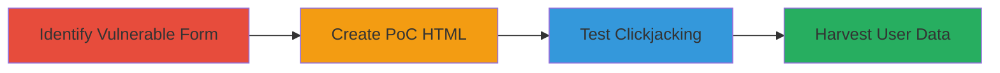

# Clickjacking on Legal Robot Beta Form to Harvest User Data

Multi-stage attack chain demonstrating a complete clickjacking workflow on the Legal Robot beta program submission form.

## Chain Metrics Dashboard

| Metric | Value |
|--------|-------|
| Chain Status | Unverified |
| Total Steps | 3 |
| Execution Time | ~5 minutes |
| Skill Level | Beginner |
| Complexity | Low |
| Impact Level | Medium |

## Attack Flow Visualization

## Prerequisites & Requirements

### Required Tools

- Web browser (e.g., Chrome, Firefox)
- Text editor (e.g., VS Code, Notepad++)

### Target Environment

- Web platform
- Publicly accessible website (https://www.legalrobot.com/)
- No specific services or ports required beyond standard HTTP/HTTPS (80/443)

### Initial Access Requirements

- Internet access
- No credentials needed
- Ability to host or locally serve HTML files

## Detailed Attack Procedures

### Step 1: Identify Vulnerable Form
procedure: [[procedures/Identify-Vulnerable-Web-Form-for-Clickjacking]]

**Objective**: Locate the beta program form on the target site and confirm lack of clickjacking protections like X-Frame-Options header.

**Instructions**: Navigate to https://www.legalrobot.com/ in a web browser and inspect the beta program application form. Use browser developer tools (F12) to check network requests and headers for the absence of X-Frame-Options or Content-Security-Policy frame-ancestors directives.

**Expected Output**: Confirmation that the form at https://www.legalrobot.com/ collects name, email, and company info without framing restrictions.

**Success Indicators**:
- Form identified collecting sensitive data
- No anti-framing headers present

### Step 2: Create Proof-of-Concept HTML
procedure: [[procedures/Create-Clickjacking-Proof-of-Concept-HTML]]

**Objective**: Build an HTML page that embeds the vulnerable form in an iframe with styling to overlay malicious elements semi-transparently.

**Instructions**: Use a text editor to create an HTML file with an iframe sourcing https://www.legalrobot.com/. Apply CSS styles: width: 800px, height: 500px, position: absolute, top: 0, left: 0, opacity: 0.5. Add overlay elements like a fake button to trick clicks into form submission.

**Expected Output**: An HTML file ready to load in a browser, displaying the framed site partially visible for overlay deception.

**Success Indicators**:
- Iframe loads the target form without errors
- Opacity allows partial visibility for testing

### Step 3: Test Clickjacking PoC
procedure: [[procedures/Test-Clickjacking-Proof-of-Concept]]

**Objective**: Load the PoC HTML and verify that users can be tricked into interacting with the hidden form, potentially submitting data.

**Instructions**: Open the HTML file in a web browser. Observe the semi-transparent iframe and simulate user interaction by clicking overlaid elements, which should trigger form actions on the target site. Capture screenshots showing the setup and interaction.

**Expected Output**: Browser displays the framed Legal Robot site with overlay, allowing deceptive clicks; evidence screenshots confirm exploitability.

**Success Indicators**:
- Form interactions occur via overlay without user awareness
- Screenshots validate the clickjacking setup

## Attack Chain Summary

### Key Achievements

1. Identified unprotected form on https://www.legalrobot.com/
2. Created and tested PoC demonstrating data harvesting potential
3. Highlighted impact of missing X-Frame-Options due to AWS S3 and CloudFlare limitations

## Technique & Tactic Coverage

### MITRE ATT&CK Techniques

- [[Exploit Public-Facing Application]]

### MITRE ATT&CK Tactics

- [[Initial Access]]

---
*Last updated: 2023-10-01T00:00:00Z*
