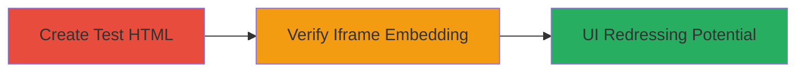

---
tags:
  - clickjacking
  - ui-redressing
  - x-frame-options
  - web-vulnerability
type: attack_chain
tools: []
tactics:
  - '[[Initial Access]]'
verified: false
platforms:
  - Web
submitted: true
complexity: low
created_at: '2024-01-01T00:00:00Z'
procedures:
  - '[[procedures/Create-HTML-File-for-Clickjacking-Test]]'
  - '[[procedures/Verify-Page-Framing-in-Browser]]'
step_count: 2
techniques:
  - '[[Exploit Public-Facing Application]]'
  - '[[Drive-by Compromise]]'
updated_at: '2025-12-14T17:28:12.328Z'
description: >-
  Exploits missing X-Frame-Options header on Legal Robot's email verification
  page to demonstrate UI redressing via iframe embedding, allowing potential
  tricking of users into unintended actions.
skill_level: beginner
impact_level: medium
id: 2dde7419-7e2c-4ba7-a6c5-0f03ea81bf07
validated: true
mitre_tactics:
  - '[[Initial Access]]'
mitre_techniques:
  - '[[Exploit Public-Facing Application]]'
  - '[[Drive-by Compromise]]'
---
# Clickjacking on Legal Robot Email Verification Page

Multi-stage attack chain demonstrating a complete attack workflow.

## Chain Metrics Dashboard

| Metric | Value |
|--------|-------|
| Chain Status | Unverified |
| Total Steps | 2 |
| Execution Time | ~2 minutes |
| Skill Level | Beginner |
| Complexity | Low |
| Impact Level | Medium |

## Attack Flow Visualization



## Prerequisites & Requirements

### Required Tools

- Web browser (e.g., Chrome, Firefox)

### Target Environment

- Web platform
- Access to the target URL: https://app.legalrobot-uat.com/pending-verification or https://app.legalrobot.com/pending-verification
- No special services or ports required beyond standard HTTP/HTTPS (ports 80/443)

### Initial Access Requirements

- Public internet access to the target domain
- Local file system access to create and open HTML files
- No credentials or prior access needed

## Detailed Attack Procedures

### Step 1: Create Test HTML File
procedure: [[procedures/Create-HTML-File-for-Clickjacking-Test]]

**Objective**: Generate a local HTML file that attempts to embed the target verification page in an iframe to test for framing restrictions.

**Instructions**: Use [[commands/create-clickjacking-test-html]] to create the test file:

```bash
cat > index.html << EOF
<!DOCTYPE html>
<html>
<body>
<iframe sandbox="allow-scripts allow-forms" src="https://app.legalrobot-uat.com/pending-verification" width="1000" height="600"></iframe>
</body>
</html>
EOF
```

**Expected Output**: A file named `index.html` is created in the current directory containing the iframe code.

**Success Indicators**:
- HTML file created successfully without errors
- File contents include the iframe targeting the Legal Robot URL

### Step 2: Verify Page Framing in Browser
procedure: [[procedures/Verify-Page-Framing-in-Browser]]

**Objective**: Load the HTML file in a browser to confirm if the target page renders inside the iframe, indicating vulnerability to clickjacking.

**Instructions**: Open the created `index.html` file directly in a web browser by double-clicking it or using the browser's file open dialog. Observe if the Legal Robot verification page loads within the iframe without any blocking errors (e.g., no console warnings about framing restrictions).

**Expected Output**: The verification page renders fully inside the iframe, allowing overlay potential for UI redressing attacks.

**Success Indicators**:
- Target page loads in iframe without restrictions
- No browser errors related to X-Frame-Options or CSP framing policies
- Page elements are visible and interactive within the iframe

## Attack Chain Summary

### Key Achievements

1. Successfully created a test HTML file embedding the target URL in an iframe.
2. Verified that the page loads without frame-busting protections, confirming clickjacking vulnerability.
3. Highlighted potential for UI redressing to trick users, with recommendations for higher impact on authenticated pages.

## Technique & Tactic Coverage

### MITRE ATT&CK Techniques

- [[Exploit Public-Facing Application]]
- [[Drive-by Compromise]]

### MITRE ATT&CK Tactics

- [[Initial Access]]

---
*Last updated: 2024-01-01T00:00:00Z*
