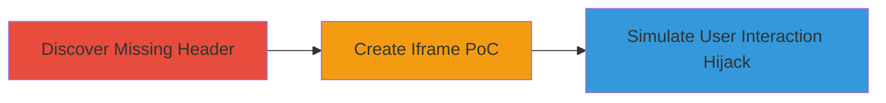

---
tags:
  - clickjacking
  - ui-redressing
  - x-frame-options
  - web-vulnerability
type: attack_chain
tools: []
tactics:
  - '[[Initial Access]]'
commands: []
platforms:
  - Web
complexity: low
procedures:
  - '[[procedures/Check-for-Missing-X-Frame-Options-Header]]'
  - '[[procedures/Create-Clickjacking-Proof-of-Concept]]'
  - '[[procedures/Demonstrate-Clickjacking-Impact]]'
step_count: 3
techniques:
  - '[[Drive-by Compromise]]'
description: >-
  Exploits the absence of X-Frame-Options header on app.lemlist.com to embed the
  site in iframes, enabling UI redressing attacks that trick users into
  performing actions like account takeover or deletion.
skill_level: intermediate
impact_level: high
id: ffc82979-66b6-44db-9ea1-564d69f9c226
created_at: '2025-12-14T17:28:12.654Z'
updated_at: '2025-12-14T17:28:12.654Z'
verified: false
validated: true
submitted: true
mitre_tactics:
  - '[[Initial Access]]'
mitre_techniques:
  - '[[Drive-by Compromise]]'
---
# Clickjacking on Lemlist App via Missing X-Frame-Options Header

Multi-stage attack chain demonstrating a complete clickjacking workflow on the Lemlist application.

## Chain Metrics Dashboard

| Metric | Value |
|--------|-------|
| Chain Status | Unverified |
| Total Steps | 3 |
| Execution Time | ~5 minutes |
| Skill Level | Intermediate |
| Complexity | Low |
| Impact Level | High |

## Attack Flow Visualization



## Prerequisites & Requirements

### Required Tools

- Web browser (e.g., Chrome with developer tools)
- Text editor for HTML files

### Target Environment

- Target: https://app.lemlist.com/
- Required services/ports: HTTP/HTTPS on port 443
- Network access requirements: Internet access to the target site

### Initial Access Requirements

- No credentials required for header check
- Local file access for PoC testing
- Ability to load local HTML files in browser

## Detailed Attack Procedures

### Step 1: Discover Missing X-Frame-Options Header
procedure: [[procedures/Check-for-Missing-X-Frame-Options-Header]]

**Objective**: Identify if the target site lacks frame-busting protections, allowing iframe embedding.

**Instructions**: Use browser developer tools to inspect HTTP response headers of the target URL. Navigate to https://app.lemlist.com/ and open the Network tab in DevTools (F12). Reload the page and examine the response headers for the main request.

**Expected Output**: Response headers list without "X-Frame-Options" present.

**Success Indicators**:
- No X-Frame-Options header found
- Site loads normally without framing restrictions

### Step 2: Create Clickjacking Proof-of-Concept
procedure: [[procedures/Create-Clickjacking-Proof-of-Concept]]

**Objective**: Build a local HTML page that successfully embeds the target site in an iframe to prove framing is possible.

**Instructions**: Create an HTML file with an iframe pointing to a specific Lemlist path, such as the user settings page. Save as poc.html and open via file:// protocol in the browser.

Example HTML content:

```html
<!DOCTYPE html>
<html>
<head><title>Clickjacking PoC</title></head>
<body>
<iframe src="https://app.lemlist.com/teams/tea_sgYr5dZr478x4FQ9K/settings/user/usr_Z3GZ4DDHLLyLyZHj5/users" height="550px" width="700px"></iframe>
</body>
</html>
```

Load the file in browser and verify the iframe renders the Lemlist content.

**Expected Output**: Target site visible inside the iframe without errors.

**Success Indicators**:
- Iframe loads without blocking
- Content from app.lemlist.com displays fully

### Step 3: Demonstrate Clickjacking Impact
procedure: [[procedures/Demonstrate-Clickjacking-Impact]]

**Objective**: Show how the framed site can be manipulated to capture user interactions for malicious actions.

**Instructions**: Modify the PoC HTML to overlay invisible iframes or transparent elements over clickable parts of the framed site. For example, position a fake button that aligns with a real delete button in the iframe. Test by simulating clicks and observing if actions propagate to the framed site.

Enhanced PoC snippet for overlay:

```html
<div style="position: relative;">
  <iframe src="https://app.lemlist.com/..." style="opacity: 0.5; position: absolute;"></iframe>
  <button style="position: absolute; top: 100px; left: 100px;">Fake Click Here</button>
</div>
```

Adjust positions to align fake elements with sensitive actions like password change forms.

**Expected Output**: Clicks on fake elements trigger unintended actions in the hidden iframe.

**Success Indicators**:
- User clicks hijacked to perform actions like account deletion
- Potential for keystroke capture in forms

## Attack Chain Summary

### Key Achievements

1. Confirmed vulnerability through header inspection
2. Built and tested functional iframe PoC
3. Illustrated high-impact scenarios like account takeover

## Technique & Tactic Coverage

### MITRE ATT&CK Techniques

- [[Drive-by Compromise]]

### MITRE ATT&CK Tactics

- [[Initial Access]]

---
*Last updated: 2023-10-01*
