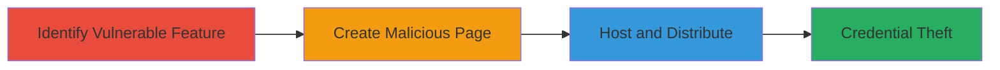

---
tags:
  - clickjacking
  - credential-theft
  - phishing
  - oauth
  - mailchimp
  - stripo
type: attack_chain
tools:
  - '[[tools/html2canvas]]'
  - '[[tools/sites-google-com]]'
tactics:
  - '[[Initial Access]]'
  - '[[Credential Access]]'
commands: []
platforms:
  - Web
complexity: medium
procedures:
  - '[[procedures/Identify-Vulnerable-MailChimp-Export-Feature-in-Stripo]]'
  - '[[procedures/Create-Malicious-HTML-Page-for-Clickjacking-PoC]]'
  - '[[procedures/Host-and-Distribute-Clickjacking-PoC-via-Social-Engineering]]'
step_count: 3
techniques:
  - '[[Drive-by Compromise]]'
  - '[[JavaScript]]'
description: >-
  Multi-stage clickjacking attack exploiting the lack of frame-busting
  protections on MailChimp's OAuth authorization page accessed through Stripo's
  export feature, enabling credential theft via a malicious phishing page.
skill_level: intermediate
impact_level: high
id: f8b2daea-44e1-4dd7-9f11-506a57086e5a
created_at: '2025-12-14T17:28:05.391Z'
updated_at: '2025-12-14T17:28:05.391Z'
verified: false
validated: true
submitted: true
mitre_tactics:
  - '[[Initial Access]]'
  - '[[Credential Access]]'
mitre_techniques:
  - '[[Drive-by Compromise]]'
  - '[[JavaScript]]'
---
# Clickjacking on MailChimp OAuth via Stripo Export to Steal Credentials

Multi-stage attack chain demonstrating a complete workflow to exploit clickjacking on MailChimp's OAuth page via Stripo's export feature, tricking users into entering credentials on a malicious page for unauthorized account access.

## Chain Metrics Dashboard

| Metric | Value |
|--------|-------|
| Chain Status | Unverified |
| Total Steps | 3 |
| Execution Time | ~15 minutes |
| Skill Level | Intermediate |
| Complexity | Medium |
| Impact Level | High |

## Attack Flow Visualization

## Prerequisites & Requirements

### Required Tools

- [[tools/html2canvas]]
- [[tools/sites-google-com]]

### Target Environment

- Web platform with access to Stripo (my.stripo.email) and MailChimp OAuth
- No specific services/ports beyond standard HTTPS (443)
- Internet access for hosting and distribution

### Initial Access Requirements

- No prior credentials needed
- Ability to craft and host HTML/JS pages
- Social engineering capability to distribute links to victims

## Detailed Attack Procedures

### Step 1: Identify Vulnerable Export Feature
procedure: [[procedures/Identify-Vulnerable-MailChimp-Export-Feature-in-Stripo]]

**Objective**: Locate the MailChimp export feature in Stripo that lacks frame protections, confirming the OAuth page can be iframed.

**Instructions**: Navigate to the MailChimp export page on my.stripo.email, which redirects to the vulnerable OAuth endpoint for credential entry. Inspect the page to verify embeddability in an iframe without busting.

**Expected Output**: Confirmation of the redirect to https://login.mailchimp.com/oauth2/authorize with parameters like client_id=350877244304 and redirect_uri=https%3A%2F%2Fmy.stripo.email%2Fcabinet%2Fexportservice%2Fv1%2Fmailchimpauth.html%3FaccountId%3D2085372.

**Success Indicators**:
- Page loads without X-Frame-Options or CSP frame-ancestors restrictions
- Iframe test embedding succeeds without errors

### Step 2: Create Malicious HTML Page for Clickjacking PoC
procedure: [[procedures/Create-Malicious-HTML-Page-for-Clickjacking-PoC]]

**Objective**: Build a phishing page with an invisible iframe overlaying the MailChimp auth form to capture user inputs via JavaScript.

**Instructions**: Create an HTML file embedding the OAuth URL in an iframe with large dimensions (width='1200' height='2500'). Add JavaScript using html2canvas to capture the form contents and prevent frame-busting with onbeforeunload and setInterval redirects.

**Expected Output**: A functional PoC HTML page where the iframe overlays a transparent layer, tricking users into entering credentials that are logged or exfiltrated.

**Success Indicators**:
- Iframe loads the auth page without detection
- JavaScript captures form interactions successfully
- No frame-busting occurs

### Step 3: Host and Distribute the PoC Page
procedure: [[procedures/Host-and-Distribute-Clickjacking-PoC-via-Social-Engineering]]

**Objective**: Deploy the malicious page and lure victims via phishing to steal their MailChimp credentials.

**Instructions**: Host the HTML on a free service like sites.google.com and send phishing links to targets, disguising it as a legitimate Stripo or MailChimp-related page. Monitor for credential exfiltration.

**Expected Output**: Victims visit the page, enter credentials in the overlaid iframe, which are captured and sent to the attacker, granting MailChimp account access.

**Success Indicators**:
- Page hosted and accessible via URL
- Victims interact with the fake form
- Credentials received by attacker

## Attack Chain Summary

### Key Achievements

1. Identified lack of frame protections on MailChimp OAuth via Stripo
2. Crafted a clickjacking PoC to overlay and capture credentials
3. Enabled unauthorized access to victim MailChimp accounts for email list theft or malicious campaigns

## Technique & Tactic Coverage

### MITRE ATT&CK Techniques

- [[Drive-by Compromise]]
- [[JavaScript]]

### MITRE ATT&CK Tactics

- [[Initial Access]]
- [[Credential Access]]

---

*Last updated: 2023-10-01T00:00:00Z*
