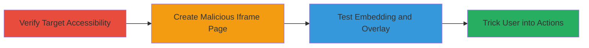

---
tags:
  - clickjacking
  - x-frame-options
  - nextcloud
  - ui-redressing
type: attack_chain
tools: []
tactics:
  - '[[Initial Access]]'
verified: false
platforms:
  - Web
submitted: true
complexity: medium
created_at: '2023-10-01T00:00:00Z'
procedures:
  - '[[procedures/Verify-Nextcloud-Login-Page-Accessibility]]'
  - '[[procedures/Create-Malicious-HTML-for-Iframe-Embedding]]'
  - '[[procedures/Test-Iframe-Embedding-for-Clickjacking]]'
step_count: 3
techniques:
  - '[[Drive-by Compromise]]'
updated_at: '2025-12-14T17:28:12.195Z'
description: >-
  Demonstrates exploitation of missing X-Frame-Options header on Nextcloud login
  page to enable clickjacking attacks, tricking users into unintended actions
  like credential submission.
skill_level: intermediate
impact_level: high
id: c230a63f-7317-459e-9cb9-876ba7e9e8f1
validated: true
mitre_tactics:
  - '[[Initial Access]]'
mitre_techniques:
  - '[[Drive-by Compromise]]'
---
# Clickjacking on Nextcloud Login Page via Missing X-Frame-Options Header

Multi-stage attack chain demonstrating a complete clickjacking workflow against Nextcloud's login page.

## Chain Metrics Dashboard

| Metric | Value |
|--------|-------|
| Chain Status | Unverified |
| Total Steps | 3 |
| Execution Time | ~5 minutes |
| Skill Level | Intermediate |
| Complexity | Medium |
| Impact Level | High |

## Attack Flow Visualization

## Prerequisites & Requirements

### Required Tools

- Web browser (e.g., Chrome, Firefox)
- Text editor for HTML creation

### Target Environment

- Web platform
- Publicly accessible Nextcloud login page (e.g., https://portal.nextcloud.com/login.php)
- No specific ports or services beyond standard HTTPS (443)

### Initial Access Requirements

- Internet access to the target URL
- Ability to host or locally serve a malicious HTML file
- No prior credentials needed

## Detailed Attack Procedures

### Step 1: Verify Target Accessibility
procedure: [[procedures/Verify-Nextcloud-Login-Page-Accessibility]]

**Objective**: Confirm the Nextcloud login page is accessible and lacks protective headers.

**Instructions**: Open the target URL in a browser to inspect the page and headers.

**Expected Output**: The login page loads without errors, and HTTP headers inspection shows no X-Frame-Options.

**Success Indicators**:
- Page renders successfully
- No X-Frame-Options header present in developer tools network tab

### Step 2: Create Malicious HTML for Iframe Embedding
procedure: [[procedures/Create-Malicious-HTML-for-Iframe-Embedding]]

**Objective**: Build a malicious page that embeds the target login in an iframe, allowing overlay for clickjacking.

**Instructions**: Use a text editor to create an HTML file with an iframe sourcing the Nextcloud login URL, applying sandbox attributes to enable functionality.

**Expected Output**: A local HTML file ready for loading in a browser.

**Success Indicators**:
- HTML file created without syntax errors
- Iframe source set to target URL with appropriate attributes

### Step 3: Test Iframe Embedding for Clickjacking
procedure: [[procedures/Test-Iframe-Embedding-for-Clickjacking]]

**Objective**: Load the malicious page and verify the iframe embeds the login without restrictions, enabling potential overlays.

**Instructions**: Open the HTML file in a browser and inspect the iframe rendering.

**Expected Output**: Nextcloud login page visible inside the iframe, with no framing restrictions.

**Success Indicators**:
- Iframe loads the login page fully
- Ability to interact with the embedded page (e.g., modals, forms)

## Attack Chain Summary

### Key Achievements

1. Confirmed vulnerability via header absence
2. Successfully embedded login page in iframe
3. Demonstrated potential for user trickery leading to credential theft or phishing

## Technique & Tactic Coverage

### MITRE ATT&CK Techniques

- [[Drive-by Compromise]]

### MITRE ATT&CK Tactics

- [[Initial Access]]

---
*Last updated: 2023-10-01T00:00:00Z*
