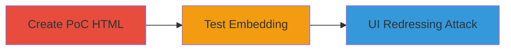

# Clickjacking on Pushwoosh Registration Page

Multi-stage attack chain demonstrating a complete attack workflow for exploiting Clickjacking on the Pushwoosh registration page.

## Chain Metrics Dashboard

| Metric | Value |
|--------|-------|
| Chain Status | Unverified |
| Total Steps | 2 |
| Execution Time | ~2 minutes |
| Skill Level | Intermediate |
| Complexity | Medium |
| Impact Level | Medium |

## Attack Flow Visualization



## Prerequisites & Requirements

### Required Tools

- Web browser (e.g., Chrome, Firefox)
- Text editor (e.g., VS Code, Notepad)

### Target Environment

- Target URL: https://go.pushwoosh.com/register
- Web platform with no frame protection headers

### Initial Access Requirements

- Public access to the target URL
- Local machine for hosting/testing the PoC

## Detailed Attack Procedures

### Step 1: Create PoC HTML File
procedure: [[procedures/Create-Clickjacking-POC-HTML-File]]

**Objective**: Generate a simple HTML file that embeds the vulnerable registration page in an iframe to bypass framing protections.

**Instructions**: Use a text editor to create an `index.html` file with the following content:

```html
<iframe sandbox="allow-scripts allow-forms" src="https://go.pushwoosh.com/register" width="1000" height="600"></iframe>
```

Save the file locally.

**Expected Output**: A valid HTML file ready for testing.

**Success Indicators**:
- HTML file created without syntax errors
- Iframe source points to the target URL

### Step 2: Test Iframe Embedding
procedure: [[procedures/Test-Iframe-Embedding-in-Browser]]

**Objective**: Load the HTML file in a browser to confirm the target page embeds without restrictions, enabling potential UI redressing.

**Instructions**: Open the `index.html` file in a modern web browser such as Chrome or Firefox. Observe if the Pushwoosh registration page renders fully inside the iframe.

**Expected Output**: The registration page loads and interacts normally within the iframe, indicating no X-Frame-Options or CSP frame-ancestors protections are enforced.

**Success Indicators**:
- Page embeds successfully without browser blocking
- Interactive elements (e.g., forms, buttons) are functional in the iframe

## Attack Chain Summary

### Key Achievements

1. Successful embedding of the vulnerable page in an iframe
2. Confirmation of Clickjacking susceptibility
3. Potential for overlaying invisible elements to trick user interactions

## Technique & Tactic Coverage

### MITRE ATT&CK Techniques

- [[Exploit Public-Facing Application]]

### MITRE ATT&CK Tactics

- [[Initial Access]]

---
*Last updated: 2023-10-01T12:00:00Z*
