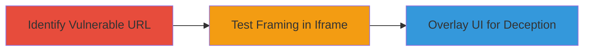

# Clickjacking on Sifchain Cryptoeconomics Subdomain to Trick Users into Sensitive UI Interactions

Multi-stage attack chain demonstrating a complete attack workflow for exploiting clickjacking on https://cryptoeconomics.sifchain.finance/ to enable UI redressing attacks that trick users into interacting with hidden sensitive elements.

## Chain Metrics Dashboard

| Metric | Value |
|--------|-------|
| Chain Status | Unverified |
| Total Steps | 2 |
| Execution Time | ~5 minutes |
| Skill Level | Beginner |
| Complexity | Low |
| Impact Level | Medium |

## Attack Flow Visualization

## Prerequisites & Requirements

### Required Tools

- [[tools/Lookout-Clickjacking-Test]]

### Target Environment

- Web platform
- Publicly accessible subdomain (e.g., https://cryptoeconomics.sifchain.finance/)
- No specific ports or services required beyond standard HTTPS (443)

### Initial Access Requirements

- Internet access to load the target URL
- No credentials needed
- Ability to host or access a test page for framing

## Detailed Attack Procedures

### Step 1: Identify Vulnerable URL
procedure: [[procedures/Identify-Vulnerable-Clickjacking-Target]]

**Objective**: Locate a sensitive URL on the target subdomain that lacks frame protections, such as one pointing to forms or interactive elements.

**Instructions**: Manually inspect the target site or use reconnaissance to find URLs with potential sensitive UI components. For this chain, copy the specific URL https://cryptoeconomics.sifchain.finance/#sif10jatqfd88m8s2uhtdtdl3txtayjtzsve2klyhh&type=lm, which leads to a sensitive section.

**Expected Output**: A confirmed URL that can be targeted for framing.

**Success Indicators**:
- URL identified with interactive elements (e.g., forms)
- No immediate frame-busting errors observed

### Step 2: Test Framing and Demonstrate Vulnerability
procedure: [[procedures/Demonstrate-Clickjacking-Using-Test-Page]]

**Objective**: Verify that the target site can be embedded in an iframe without restrictions, enabling overlay of deceptive UI elements to trick users.

**Instructions**: Use the [[tools/Lookout-Clickjacking-Test]] tool by loading the vulnerable URL into its iframe at https://www.lookout.net/test/clickjack.html. This demonstrates the site's susceptibility to being framed, allowing attackers to create a decoy page that hides and overlays elements.

**Expected Output**: The target site loads successfully within the iframe, with no blocking headers like X-Frame-Options preventing it.

**Success Indicators**:
- Site embeds without errors
- Overlay elements can be positioned over sensitive UI (e.g., password fields)

## Attack Chain Summary

### Key Achievements

1. Identified a framable sensitive URL on the Sifchain subdomain.
2. Confirmed lack of protections against clickjacking using a test tool.
3. Enabled potential for UI redressing attacks leading to data theft via tricked interactions.

## Technique & Tactic Coverage

### MITRE ATT&CK Techniques

- [[Exploit Public-Facing Application]]

### MITRE ATT&CK Tactics

- [[Initial Access]]

---
*Last updated: 2023-10-01T00:00:00Z*
