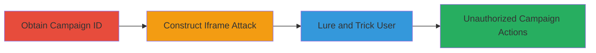

# Clickjacking on TikTok Ads Endpoint to Trick Users into Unauthorized Campaign Actions

Multi-stage attack chain demonstrating a complete clickjacking workflow targeting TikTok's Ads endpoint for whole page ads.

## Chain Metrics Dashboard

| Metric | Value |
|--------|-------|
| Chain Status | Unverified |
| Total Steps | 3 |
| Execution Time | ~5 minutes |
| Skill Level | Intermediate |
| Complexity | Medium |
| Impact Level | Medium |

## Attack Flow Visualization



## Prerequisites & Requirements

### Required Tools

- None (relies on basic web development tools like HTML editor)

### Target Environment

- Web platform
- TikTok Ads service
- No specific ports required (HTTPS/443 implied)

### Initial Access Requirements

- Access to a valid TikTok campaign ID (via enumeration or prior access)
- Ability to host a malicious webpage
- Target must be an authenticated TikTok Ads user

## Detailed Attack Procedures

### Step 1: Obtain Campaign ID
procedure: [[procedures/Obtain-TikTok-Campaign-ID]]

**Objective**: Acquire a valid campaign ID from TikTok Ads to target the vulnerable endpoint.

**Instructions**: Manually enumerate or obtain a campaign ID through legitimate access to TikTok Ads dashboard, or via social engineering if prior access is unavailable. No specific commands are needed, but inspect network requests in browser dev tools while managing campaigns to extract IDs from URLs or API responses.

**Expected Output**: A valid campaign ID (e.g., a numeric string like '123456789').

**Success Indicators**:
- Campaign ID retrieved and verified by accessing the endpoint directly.
- Endpoint responds without errors.

### Step 2: Construct Clickjacking Attack Using Iframe
procedure: [[procedures/Construct-Clickjacking-Iframe-for-TikTok-Ads]]

**Objective**: Build a malicious webpage that embeds the TikTok Ads endpoint in an iframe without frame-busting protections, overlaying invisible elements to hijack clicks.

**Instructions**: Create an HTML file with an iframe sourcing the vulnerable TikTok Ads endpoint URL including the campaign ID. Position the iframe off-screen or make it transparent, then overlay clickable elements (e.g., buttons) aligned with sensitive actions like 'Create Campaign' or 'Delete Campaign'. Host this page on a controlled domain.

Example HTML structure:

```html
<!DOCTYPE html>
<html>
<head><title>Click Here for Free Prize</title></head>
<body>
  <iframe src="https://ads.tiktok.com/campaigns/{CAMPAIGN_ID}" style="opacity:0.1; position:absolute; top:0; left:0; width:100%; height:100%;"></iframe>
  <button style="position:absolute; top:200px; left:300px; z-index:1;">Click for Prize!</button>
</body>
</html>
```

Replace `{CAMPAIGN_ID}` with the obtained ID. Test locally to ensure the iframe loads and overlays align with target actions.

**Expected Output**: A hosted malicious page where clicks on overlaid elements interact with the iframed TikTok content.

**Success Indicators**:
- Iframe loads the TikTok Ads page without X-Frame-Options blocking.
- Overlaid clicks trigger actions in the iframe (verified via dev tools).

### Step 3: Trick Victim into Interacting with the Page
procedure: [[procedures/Lure-Authenticated-User-to-Malicious-Clickjacking-Page]]

**Objective**: Socially engineer an authenticated TikTok user to visit and interact with the malicious page, causing unintended actions on their account.

**Instructions**: Distribute the malicious page URL via phishing emails, social media, or ads promising incentives (e.g., 'Win TikTok prizes by clicking here'). Ensure the victim is logged into TikTok Ads. Monitor for successful interactions via server logs if additional tracking is added (e.g., JavaScript logging clicks).

**Expected Output**: Victim performs unauthorized actions, such as creating or deleting campaigns, visible in their TikTok Ads dashboard.

**Success Indicators**:
- Victim visits the page while authenticated.
- Account disruption confirmed (e.g., new campaigns created).

## Attack Chain Summary

### Key Achievements

1. Exploitation of missing frame-busting headers in TikTok Ads.
2. Tricking users into sensitive actions without awareness.
3. Successful report and bounty via HackerOne, highlighting low-severity impact on account management.

## Technique & Tactic Coverage

### MITRE ATT&CK Techniques

- [[Drive-by Compromise]]

### MITRE ATT&CK Tactics

- [[Initial Access]]

---
*Last updated: 2023-10-01T00:00:00Z*
