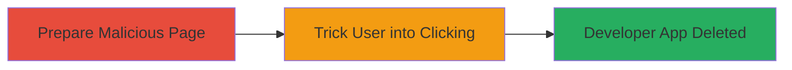

---
tags:
  - clickjacking
  - ui-redressing
  - tiktok
  - developer-app
  - social-engineering
type: attack_chain
tools: []
tactics:
  - '[[Initial Access]]'
verified: false
platforms:
  - Web
submitted: true
complexity: medium
created_at: '2023-10-01T00:00:00Z'
procedures:
  - >-
    [[procedures/Exploit-Clickjacking-to-Trick-User-into-Developer-App-Deletion]]
step_count: 1
techniques:
  - '[[Drive-by Compromise]]'
updated_at: '2025-12-14T17:28:12.840Z'
description: >-
  A clickjacking attack exploiting a vulnerable TikTok subdomain to overlay an
  invisible iframe, tricking authenticated users into deleting their Developer
  App via UI redressing.
skill_level: intermediate
impact_level: high
id: c231b3dd-f98d-4fa9-ba88-2a3165652f26
validated: true
mitre_tactics:
  - '[[Initial Access]]'
mitre_techniques:
  - '[[Drive-by Compromise]]'
---
# Clickjacking on TikTok Subdomain to Delete Developer App

Multi-stage attack chain demonstrating a complete attack workflow.

## Chain Metrics Dashboard

| Metric | Value |
|--------|-------|
| Chain Status | Unverified |
| Total Steps | 1 |
| Execution Time | ~5 minutes |
| Skill Level | Intermediate |
| Complexity | Medium |
| Impact Level | High |

## Attack Flow Visualization

## Prerequisites & Requirements

### Required Tools

- None (uses basic HTML/JS)

### Target Environment

- Web platform
- TikTok subdomain vulnerable to clickjacking (no X-Frame-Options)
- Authenticated user session on TikTok Developer portal

### Initial Access Requirements

- Ability to host a malicious webpage (e.g., via free hosting)
- Social engineering to lure victim to the page while authenticated on TikTok
- No prior credentials needed beyond victim's authentication

## Detailed Attack Procedures

### Step 1: Prepare and Host Malicious Clickjacking Page
procedure: [[procedures/Exploit-Clickjacking-to-Trick-User-into-Developer-App-Deletion]]

**Objective**: Create and host a webpage that embeds the vulnerable TikTok subdomain in an invisible iframe, overlaying it with a deceptive UI element to trick the user into clicking the delete button for their Developer App.

**Instructions**: Develop an HTML page with an iframe sourcing the TikTok Developer App management page. Position the delete button under a transparent overlay labeled innocuously, such as "Click to continue". Host the page on a server and distribute via phishing or social engineering to authenticated users.

**Expected Output**: A hosted webpage where clicking the overlay triggers the delete action on the embedded TikTok page.

**Success Indicators**:
- Iframe loads without frame-busting errors
- Overlay click performs the unintended delete action
- Victim's Developer App is deleted upon confirmation

## Attack Chain Summary

### Key Achievements

1. Successful embedding of TikTok subdomain via lack of X-Frame-Options
2. Tricked authenticated user into deleting Developer App through UI redressing
3. Demonstrated low-severity impact with potential for account disruption

## Technique & Tactic Coverage

### MITRE ATT&CK Techniques

- [[Drive-by Compromise]]

### MITRE ATT&CK Tactics

- [[Initial Access]]

---
*Last updated: 2023-10-01T00:00:00Z*
