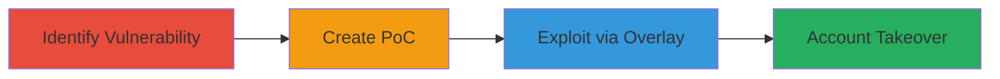

---
tags:
  - clickjacking
  - ui-redressing
  - account-takeover
  - web-vulnerability
type: attack_chain
tools: []
tactics:
  - '[[Initial Access]]'
verified: false
platforms:
  - Web
submitted: true
complexity: medium
created_at: '2023-10-01T00:00:00Z'
procedures:
  - '[[procedures/Identify-Clickjacking-Vulnerability-on-Login-Page]]'
  - '[[procedures/Create-Clickjacking-Proof-of-Concept]]'
  - '[[procedures/Demonstrate-Clickjacking-Exploitation-via-UI-Overlay]]'
step_count: 3
techniques:
  - '[[Drive-by Compromise]]'
  - '[[Exploit Public-Facing Application]]'
updated_at: '2025-12-14T17:28:04.787Z'
description: >-
  A multi-step attack demonstrating clickjacking (UI redressing) on the UPchieve
  login page, allowing an attacker to overlay malicious UI elements to trick
  users into submitting credentials or performing sensitive actions.
skill_level: intermediate
impact_level: high
id: 9a8563dc-4171-431f-bf90-5a1e93576101
validated: true
mitre_tactics:
  - '[[Initial Access]]'
mitre_techniques:
  - '[[Drive-by Compromise]]'
  - '[[Exploit Public-Facing Application]]'
---
# Clickjacking on UPchieve Login Page Leading to Account Takeover

Multi-stage attack chain demonstrating a complete clickjacking workflow on the UPchieve login page at https://hackers.upchieve.org/login, where the absence of frame-busting protections allows embedding in an iframe and UI overlay to trick users into unintended actions like credential submission.

## Chain Metrics Dashboard

| Metric | Value |
|--------|-------|
| Chain Status | Unverified |
| Total Steps | 3 |
| Execution Time | ~5 minutes |
| Skill Level | Intermediate |
| Complexity | Medium |
| Impact Level | High |

## Attack Flow Visualization

## Prerequisites & Requirements

### Required Tools

- Web browser (e.g., Chrome, Firefox)
- Text editor for HTML/CSS

### Target Environment

- Web platform
- Publicly accessible login page at https://hackers.upchieve.org/login
- No authentication required for testing frameability

### Initial Access Requirements

- Internet access
- No prior credentials needed
- Attacker controls a web server or local file to host PoC

## Detailed Attack Procedures

### Step 1: Identify Clickjacking Vulnerability
procedure: [[procedures/Identify-Clickjacking-Vulnerability-on-Login-Page]]

**Objective**: Confirm the login page can be embedded in an iframe due to missing protections like X-Frame-Options.

**Instructions**: Open a web browser and attempt to load the target URL in an iframe using a simple HTML test file. Create a basic HTML file with an iframe src set to https://hackers.upchieve.org/login and dimensions 1000x600. Load the file in your browser to verify if the page renders without restrictions.

**Expected Output**: The login page loads fully within the iframe without any frame-busting errors or blank pages.

**Success Indicators**:
- Page embeds successfully
- No browser console errors related to framing restrictions

### Step 2: Create Clickjacking Proof-of-Concept
procedure: [[procedures/Create-Clickjacking-Proof-of-Concept]]

**Objective**: Build an HTML PoC that embeds the vulnerable page and overlays a malicious UI element to simulate tricking the user.

**Instructions**: Use a text editor to create an HTML file. Embed the login page in an iframe with size 1000x550. Add a semi-transparent overlay div covering the page, and position a fake button at left:53%, bottom:39% with dimensions 30px height, 130px width, and background color #789. Ensure the overlay is clickable to demonstrate potential interaction hijacking.

**Expected Output**: A local HTML file that, when opened, shows the login form behind the overlay with the fake button aligned over sensitive elements like the submit button.

**Success Indicators**:
- Overlay aligns correctly over login form elements
- Clicking the fake button interacts with the underlying iframe content

### Step 3: Demonstrate Clickjacking Exploitation
procedure: [[procedures/Demonstrate-Clickjacking-Exploitation-via-UI-Overlay]]

**Objective**: Simulate user interaction to show how the overlay can induce clicks on the login form, potentially leading to credential submission or account takeover.

**Instructions**: Open the PoC HTML file in a browser. Observe how the overlaid button tricks a user into clicking what appears to be a benign action but submits to the login form. Test by aligning the overlay over the username/password fields and submit button to mimic entering attacker-controlled credentials.

**Expected Output**: User clicks on the overlay result in unintended form submission in the iframe, visible via network requests or form data capture in browser dev tools.

**Success Indicators**:
- Clicks on overlay trigger actions in the embedded login page
- Potential for credential theft or unauthorized login confirmed

## Attack Chain Summary

### Key Achievements

1. Confirmed lack of X-Frame-Options or CSP frame-ancestors on the login page
2. Developed a functional PoC demonstrating UI overlay for click hijacking
3. Illustrated path to account takeover via tricked user interactions

## Technique & Tactic Coverage

### MITRE ATT&CK Techniques

- [[Drive-by Compromise]]
- [[Exploit Public-Facing Application]]

### MITRE ATT&CK Tactics

- [[Initial Access]]

---

*Last updated: 2023-10-01T00:00:00Z*
