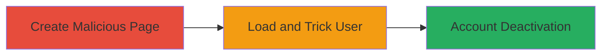

# Clickjacking on UPchieve Profile Page Leading to Account Deactivation

Multi-stage attack chain demonstrating a complete clickjacking workflow to force unintended actions on the UPchieve profile page.

## Chain Metrics Dashboard

| Metric | Value |
|--------|-------|
| Chain Status | Unverified |
| Total Steps | 2 |
| Execution Time | ~5 minutes |
| Skill Level | Intermediate |
| Complexity | Medium |
| Impact Level | High |

## Attack Flow Visualization

## Prerequisites & Requirements

### Required Tools

- [[tools/SimpleScreenRecorder]]

### Target Environment

- Web platform
- Access to UPchieve profile page (https://app.upchieve.org/profile or https://hackers.upchieve.org/profile)
- Authenticated session to the target site

### Initial Access Requirements

- Valid user credentials for UPchieve
- Local browser or attacker-controlled hosting for the malicious HTML
- No special network access beyond internet connectivity

## Detailed Attack Procedures

### Step 1: Create Malicious Clickjacking HTML
procedure: [[procedures/Create-Malicious-Clickjacking-HTML]]

**Objective**: Build an HTML page that embeds the target profile in an iframe and overlays invisible instructions to guide clicks toward account deactivation.

**Instructions**: Develop the HTML file with an iframe sourcing the profile URL and position absolute divs for click guides (e.g., 'Click 1' at specific coordinates). Ensure divs have pointer-events: none to avoid interference.

**Expected Output**: A functional HTML file that loads the profile page and displays overlaid click instructions.

**Success Indicators**:
- Iframe loads the UPchieve profile without errors
- Overlay divs appear at correct positions (e.g., edit button, toggle status)

### Step 2: Execute Clickjacking Attack in Browser
procedure: [[procedures/Execute-Clickjacking-Attack-in-Browser]]

**Objective**: Load the malicious page in a browser while authenticated to UPchieve, tricking the user into following overlays to complete account deactivation.

**Instructions**: Save the HTML file locally or host it, then open in a browser with an active UPchieve session. Use screen recording to capture the PoC. Guide the user to click overlays leading to edit profile, toggle status, and confirm deactivation.

**Expected Output**: Successful account deactivation via tricked clicks, confirmed by profile status change.

**Success Indicators**:
- User performs multi-step actions (edit, toggle, confirm) without noticing the frame
- Account is deactivated as intended

## Attack Chain Summary

### Key Achievements

1. Embedded UPchieve profile in an unrestricted iframe
2. Overlaid UI elements to force sensitive actions like account deactivation
3. Demonstrated high-impact account compromise via UI redressing

## Technique & Tactic Coverage

### MITRE ATT&CK Techniques

- [[Drive-by Compromise]]
- [[Exploit Public-Facing Application]]

### MITRE ATT&CK Tactics

- [[Initial Access]]

---

*Last updated: 2023-10-01T00:00:00Z*
