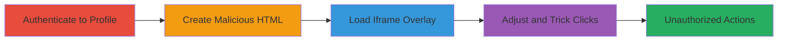

---
tags:
  - clickjacking
  - iframe
  - x-frame-options
  - account-takeover
  - web-vulnerability
type: attack_chain
tools: []
tactics:
  - '[[Initial Access]]'
verified: false
platforms:
  - Web
submitted: true
complexity: medium
created_at: '2024-01-01T12:00:00Z'
procedures:
  - '[[procedures/Authenticate-to-UPchieve-Profile]]'
  - '[[procedures/Create-Malicious-Clickjacking-HTML]]'
  - '[[procedures/Load-and-Observe-Iframe-Overlay]]'
  - '[[procedures/Adjust-Iframe-for-Clickjacking-Exploitation]]'
step_count: 4
techniques:
  - '[[Drive-by Compromise]]'
updated_at: '2025-12-14T17:28:44.954Z'
description: >-
  A clickjacking attack exploiting the lack of X-Frame-Options headers on the
  UPchieve profile page, allowing attackers to overlay invisible iframes and
  trick logged-in users into performing unauthorized actions like profile
  changes.
skill_level: intermediate
impact_level: high
id: ff9e4e3f-2d99-4c67-92af-d3eae6463dfd
validated: true
mitre_tactics:
  - '[[Initial Access]]'
mitre_techniques:
  - '[[Drive-by Compromise]]'
---
# Clickjacking on UPchieve Profile Page Leading to Unauthorized Account Modifications

Multi-stage attack chain demonstrating a complete clickjacking workflow on the UPchieve platform.

## Chain Metrics Dashboard

| Metric | Value |
|--------|-------|
| Chain Status | Unverified |
| Total Steps | 4 |
| Execution Time | ~5 minutes |
| Skill Level | Intermediate |
| Complexity | Medium |
| Impact Level | High |

## Attack Flow Visualization

## Prerequisites & Requirements

### Required Tools

- None (uses basic HTML file creation)

### Target Environment

- Web platform
- Target URL: https://app.upchieve.org/profile
- Victim must be logged in to UPchieve

### Initial Access Requirements

- Attacker needs to host or deliver a malicious HTML file to the victim
- Victim requires an active session on the target site
- No special credentials for attacker beyond social engineering to get victim to open the page

## Detailed Attack Procedures

### Step 1: Authenticate to Profile
procedure: [[procedures/Authenticate-to-UPchieve-Profile]]

**Objective**: Ensure the victim is logged in and can access the vulnerable profile page.

**Instructions**: The victim navigates to the UPchieve application and logs in with their credentials to reach the profile page at https://app.upchieve.org/profile.

**Expected Output**: Successful login, displaying the user's profile information.

**Success Indicators**:
- Profile page loads without errors
- User session is active

### Step 2: Create Malicious Clickjacking HTML
procedure: [[procedures/Create-Malicious-Clickjacking-HTML]]

**Objective**: Develop a malicious webpage that embeds the target profile in an iframe for overlay manipulation.

**Instructions**: Create an HTML file (e.g., iframe.html) that includes an iframe sourcing the profile URL. Initially set the iframe to a small, positioned size to overlay elements on the attacker's page.

**Expected Output**: A functional HTML file ready for delivery to the victim.

**Success Indicators**:
- Iframe loads the profile page when opened in a browser
- No framing restrictions are enforced due to missing headers

### Step 3: Load and Observe Iframe Overlay
procedure: [[procedures/Load-and-Observe-Iframe-Overlay]]

**Objective**: Have the victim open the malicious page while logged in, displaying the embedded iframe.

**Instructions**: Deliver the HTML file to the victim (e.g., via email or link). The victim opens it in the same browser session where they are logged into UPchieve. Observe the small iframe window showing the profile page overlaid on the attacker's content.

**Expected Output**: Iframe renders the profile page invisibly or semi-transparently over the malicious page.

**Success Indicators**:
- Profile page embeds successfully in the iframe
- Victim interacts with the overlaid page without noticing

### Step 4: Adjust Iframe for Clickjacking Exploitation
procedure: [[procedures/Adjust-Iframe-for-Clickjacking-Exploitation]]

**Objective**: Manipulate the iframe to trick the victim into clicking elements that perform unauthorized actions.

**Instructions**: Dynamically resize and reposition the iframe using JavaScript or CSS to make it transparent or aligned over decoy elements. Guide the victim to click what appears to be benign actions, but which target profile modification buttons.

**Expected Output**: Victim performs actions like changing profile details or exposing information without awareness.

**Success Indicators**:
- Unauthorized profile changes occur
- Sensitive data is accessed or modified

## Attack Chain Summary

### Key Achievements

1. Successful embedding of the vulnerable profile page in an iframe due to missing X-Frame-Options.
2. Tricking the victim into unauthorized account actions via UI overlay.
3. Potential exposure of sensitive information or account takeover.

## Technique & Tactic Coverage

### MITRE ATT&CK Techniques

- [[Drive-by Compromise]]

### MITRE ATT&CK Tactics

- [[Initial Access]]

---

*Last updated: 2024-01-01T12:00:00Z*
