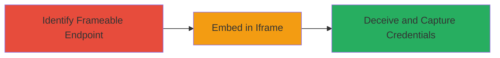

# Clickjacking on Unprotected Login Page to Capture User Credentials

Multi-stage attack chain demonstrating a complete clickjacking workflow to steal login credentials by framing an unprotected login page.

## Chain Metrics Dashboard

| Metric | Value |
|--------|-------|
| Chain Status | Unverified |
| Total Steps | 3 |
| Execution Time | ~5 minutes |
| Skill Level | Beginner |
| Complexity | Low |
| Impact Level | Medium |

## Attack Flow Visualization



## Prerequisites & Requirements

### Required Tools

- Web browser (e.g., Chrome Developer Tools)
- Text editor for HTML

### Target Environment

- Web application with login page lacking X-Frame-Options or CSP frame-ancestors
- Attacker-controlled domain or local server for hosting the malicious page

### Initial Access Requirements

- Public access to the target login URL
- No credentials needed for discovery phase
- Ability to host a simple HTML page

## Detailed Attack Procedures

### Step 1: Identify Frameable Login Endpoints
procedure: [[procedures/Identify-Frameable-Login-Endpoints]]

**Objective**: Locate unprotected login pages that can be embedded in iframes due to missing frame-busting protections.

**Instructions**: Use [[commands/curl-check-headers]] to inspect response headers for the target login URL:

```bash
curl -I https://hackers.upchieve.org/login
```

Then test frameability by creating a simple HTML file with an iframe and opening it in a browser to see if the page loads without restrictions.

**Expected Output**: Headers show no X-Frame-Options or CSP frame-ancestors; iframe embeds the page successfully.

**Success Indicators**:
- Absence of frame-busting headers confirmed
- Login page renders inside iframe without errors

### Step 2: Embed Login Page in Attacker-Controlled Iframe
procedure: [[procedures/Embed-Login-Page-in-Attacker-Controlled-Iframe]]

**Objective**: Create a malicious page that frames the login endpoint, setting up the clickjacking overlay.

**Instructions**: Write an HTML file on an attacker-controlled site (e.g., local server or hosted domain) embedding the login page:

```html
<!DOCTYPE html>
<html>
<head><title>Fake Site</title></head>
<body>
  <iframe src="https://hackers.upchieve.org/login" style="opacity:0.5; position:absolute; top:0; left:0; width:100%; height:100%;"></iframe>
  <button>Click Here to Login</button>
</body>
</html>
```

Host this file and access it via browser to verify the iframe loads the login page.

**Expected Output**: Framed login page visible or semi-transparent, overlaid with deceptive elements like buttons.

**Success Indicators**:
- Iframe loads without browser blocking
- Overlays align to trick clicks into the framed form

### Step 3: Deceive Users to Capture Credentials via Clickjacking
procedure: [[procedures/Deceive-Users-to-Capture-Credentials-via-Clickjacking]]

**Objective**: Trick users into interacting with the framed login, capturing submitted credentials on the attacker's site.

**Instructions**: Enhance the malicious page with JavaScript to capture form submissions or keypresses from the iframe (note: cross-origin restrictions may require proxying or additional exploits). Direct traffic to the malicious page via phishing links.

**Expected Output**: User enters email/password in the invisible/overlayed frame; data is logged or exfiltrated to attacker.

**Success Indicators**:
- User credentials captured (e.g., via server logs)
- Successful login attempt on target site from victim's perspective

## Attack Chain Summary

### Key Achievements

1. Identified vulnerable login endpoint without frame protections
2. Successfully embedded and overlaid the page for deception
3. Enabled credential theft mimicking a phishing attack

## Technique & Tactic Coverage

### MITRE ATT&CK Techniques

- [[Exploit Public-Facing Application]]

### MITRE ATT&CK Tactics

- [[Initial Access]]

---
*Last updated: 2023-10-01T12:00:00Z*
