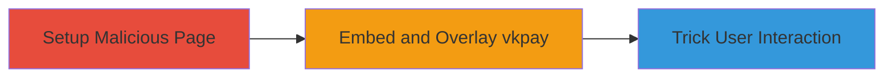

# Clickjacking on VK.com vkpay Feature to Manipulate User Interactions

Multi-stage attack chain demonstrating a complete attack workflow.

## Chain Metrics Dashboard

| Metric | Value |
|--------|-------|
| Chain Status | Unverified |
| Total Steps | 1 |
| Execution Time | ~5 minutes |
| Skill Level | Intermediate |
| Complexity | Medium |
| Impact Level | Medium |

## Attack Flow Visualization

## Prerequisites & Requirements

### Required Tools

- Web browser for testing (e.g., Chrome Developer Tools)

### Target Environment

- Web platform
- Access to VK.com vkpay feature (publicly accessible)
- Local web server to host malicious page

### Initial Access Requirements

- No credentials required
- Internet access to load VK.com
- Ability to host a simple HTML page

## Detailed Attack Procedures

### Step 1: Demonstrate Clickjacking Attack
procedure: [[procedures/Demonstrate-Clickjacking-on-vkpay]]

**Objective**: Embed the vkpay interface in an iframe on a malicious page and overlay invisible elements to capture user clicks on sensitive actions, such as authorizing a payment.

**Instructions**: Create a local HTML file that loads the vkpay page in an iframe without frame-busting protections. Position transparent overlay elements over the legitimate buttons to redirect clicks to malicious actions. Serve the page locally and open it in a browser while logged into VK.com to simulate user interaction.

**Expected Output**: The vkpay interface loads in the iframe, and clicking on seemingly benign overlaid elements triggers unintended actions on the real vkpay page.

**Success Indicators**:
- vkpay page embeds successfully without errors
- Overlay elements capture and redirect clicks
- User is tricked into performing an action (e.g., payment confirmation) without noticing the manipulation

## Attack Chain Summary

### Key Achievements

1. Successful embedding of vkpay in an iframe due to missing X-Frame-Options or frame-busting scripts
2. Manipulation of user interface to induce clicks on hidden elements
3. Potential for unauthorized actions like payment processing, leading to financial impact

## Technique & Tactic Coverage

### MITRE ATT&CK Techniques

- [[Drive-by Compromise]]

### MITRE ATT&CK Tactics

- [[Initial Access]]

---
*Last updated: 2023-10-01T00:00:00Z*
