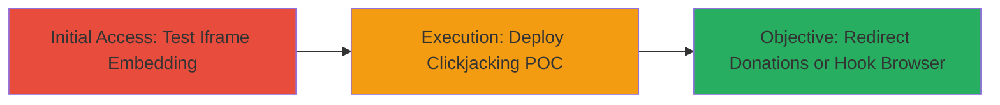

---
tags:
  - clickjacking
  - web
  - wordpress
  - paypal
  - beef
type: attack_chain
tools:
  - '[[tools/BeEF]]'
tactics:
  - '[[Initial Access]]'
verified: false
platforms:
  - Web
submitted: true
complexity: medium
created_at: '2023-10-01T00:00:00Z'
procedures:
  - '[[procedures/Embed-Target-Page-in-Iframe-to-Test-Clickjacking]]'
  - '[[procedures/Create-Clickjacking-POC-to-Redirect-Donations]]'
step_count: 2
techniques:
  - '[[Drive-by Compromise]]'
  - '[[JavaScript]]'
updated_at: '2025-12-14T17:28:12.982Z'
description: >-
  Multi-stage attack exploiting clickjacking vulnerability on the WordPress
  Foundation donation page to embed it in an iframe and trick users into
  redirecting donations to an attacker's PayPal account, with potential for
  browser hooking using BeEF.
skill_level: intermediate
impact_level: high
id: 901e6706-14e7-4e2b-bf7c-07d078a73cd8
validated: true
mitre_tactics:
  - '[[Initial Access]]'
mitre_techniques:
  - '[[Drive-by Compromise]]'
  - '[[JavaScript]]'
---
# Clickjacking on WordPress Donation Page to Redirect Donations via PayPal

Multi-stage attack chain demonstrating a complete clickjacking workflow on the WordPress Foundation donation page, allowing attackers to steal intended donations by redirecting them to their own PayPal accounts or hook browsers for further exploitation.

## Chain Metrics Dashboard

| Metric | Value |
|--------|-------|
| Chain Status | Unverified |
| Total Steps | 2 |
| Execution Time | ~5 minutes |
| Skill Level | Intermediate |
| Complexity | Medium |
| Impact Level | High |

## Attack Flow Visualization

## Prerequisites & Requirements

### Required Tools

- [[tools/BeEF]]
- Web browser for testing
- Local web server (e.g., Python's http.server)

### Target Environment

- Web platform
- Target URL: https://wordpressfoundation.org/donate/
- No specific ports or services beyond HTTP/HTTPS

### Initial Access Requirements

- Public access to the target donation page
- Ability to host a malicious HTML page externally
- No credentials needed

## Detailed Attack Procedures

### Step 1: Test Clickjacking Vulnerability
procedure: [[procedures/Embed-Target-Page-in-Iframe-to-Test-Clickjacking]]

**Objective**: Verify if the target page can be embedded in an iframe without frame-busting protections, confirming the clickjacking vulnerability.

**Instructions**: Create a simple HTML file to embed the donation page and load it in a browser to check for successful rendering.

**Expected Output**: The donation page loads fully within the iframe without errors or blocks.

**Success Indicators**:
- Iframe content renders completely
- No CSP or X-Frame-Options errors in browser console

### Step 2: Demonstrate Exploitation
procedure: [[procedures/Create-Clickjacking-POC-to-Redirect-Donations]]

**Objective**: Build and deploy a proof-of-concept page that overlays invisible elements to trick users into clicking actions that redirect donations to the attacker's PayPal.

**Instructions**: Develop an HTML page with an overlaid iframe and transparent elements positioned over the target 'give once' button, then host it to simulate victim interaction.

**Expected Output**: Victim click triggers a redirect to the attacker's PayPal payment request.

**Success Indicators**:
- Click on overlay redirects to attacker's PayPal link
- Potential integration with BeEF shows browser hooked

## Attack Chain Summary

### Key Achievements

1. Confirmed clickjacking vulnerability due to missing frame protections
2. Created exploitable POC to steal donations via PayPal redirection
3. Enabled further browser control using BeEF for information gathering

## Technique & Tactic Coverage

### MITRE ATT&CK Techniques

- [[Drive-by Compromise]]
- [[JavaScript]]

### MITRE ATT&CK Tactics

- [[Initial Access]]

---

*Last updated: 2023-10-01T00:00:00Z*
