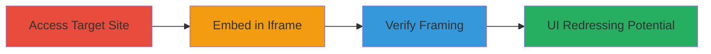

# Clickjacking on WordPress Plugin Directory via Missing X-Frame-Options

Multi-stage attack chain demonstrating a complete attack workflow for exploiting clickjacking on mercantile.wordpress.org.

## Chain Metrics Dashboard

| Metric | Value |
|--------|-------|
| Chain Status | Unverified |
| Total Steps | 3 |
| Execution Time | ~2 minutes |
| Skill Level | Beginner |
| Complexity | Low |
| Impact Level | Low |

## Attack Flow Visualization

## Prerequisites & Requirements

### Required Tools

- Web browser (e.g., Chrome, Firefox)

### Target Environment

- Web platform
- WordPress-based site without X-Frame-Options header
- No specific ports or services required beyond HTTP/HTTPS

### Initial Access Requirements

- Public internet access to https://mercantile.wordpress.org/
- Local file system access to create and open HTML files
- No credentials or prior access needed

## Detailed Attack Procedures

### Step 1: Access Target Website
procedure: [[procedures/Access-WordPress-Plugin-Directory-Site]]

**Objective**: Confirm accessibility of the target site and inspect for framing protections.

**Instructions**: Open the target URL in a browser to verify it loads without errors. Use browser developer tools to inspect HTTP response headers for the absence of X-Frame-Options.

**Expected Output**: Site loads successfully; response headers lack X-Frame-Options, indicating potential clickjacking risk.

**Success Indicators**:
- Site is accessible and interactive
- No X-Frame-Options header present in network tab

### Step 2: Embed Target URL in Iframe
procedure: [[procedures/Create-HTML-Page-with-Iframe-Embedding]]

**Objective**: Construct a malicious HTML page that embeds the target site in an iframe to bypass framing restrictions.

**Instructions**: Create a local HTML file with an iframe element sourcing the target URL. Set attributes for visibility and size to overlay or hide elements as needed for UI redressing.

**Expected Output**: HTML file saved locally, ready for testing.

**Success Indicators**:
- Iframe code is syntactically correct
- File can be opened without errors

### Step 3: Load HTML and Observe Iframe
procedure: [[procedures/Verify-Clickjacking-by-Loading-HTML]]

**Objective**: Demonstrate successful embedding by loading the HTML page and confirming the target site appears in the iframe without restrictions.

**Instructions**: Open the created HTML file in a browser and interact with the embedded site to verify full functionality, proving clickjacking is possible.

**Expected Output**: Target site loads fully within the iframe, allowing clicks and interactions as if on the original site.

**Success Indicators**:
- Iframe displays the target site without blocking
- User can perform actions like clicking links within the iframe

## Attack Chain Summary

### Key Achievements

1. Confirmed absence of X-Frame-Options on mercantile.wordpress.org
2. Successfully embedded the site in a cross-origin iframe
3. Demonstrated potential for UI redressing to trick users into unintended actions

## Technique & Tactic Coverage

### MITRE ATT&CK Techniques

- [[Drive-by Compromise]]

### MITRE ATT&CK Tactics

- [[Initial Access]]

---
*Last updated: 2023-10-01T00:00:00Z*
